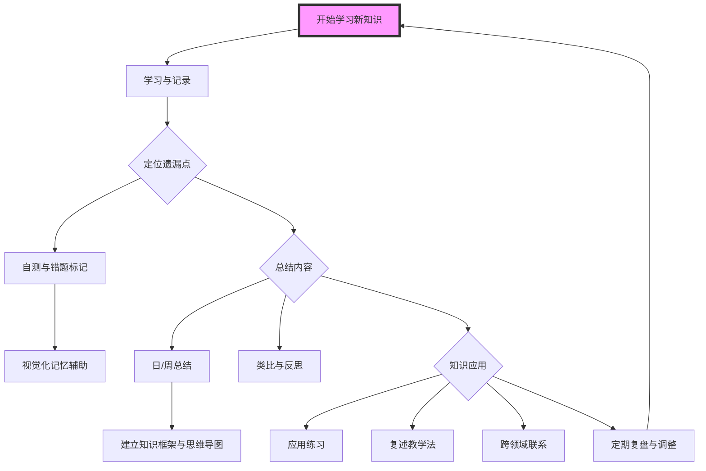

以下是一个使用 Markdown 的 Mermaid 语言绘制的学习工作流示例，包含**定位遗漏点**、**总结内容**和**知识应用**的流程：

### 解释

- **开始学习新知识**：开始整个学习过程，进入学习与记录阶段。
- **学习与记录**：对新知识点进行笔记记录。
- **定位遗漏点**：通过自测和错题标记找出遗漏点，并通过视觉化辅助来加强记忆。
- **总结内容**：日/周总结知识点，建立知识框架，并在总结中进行类比和反思。
- **知识应用**：通过应用练习、复述教学法、跨领域联系等方式练习和巩固知识。
- **定期复盘与调整**：每月复盘和调整策略，进入新的学习循环。

这个流程可以帮助你在学习过程中全面系统地进行笔记、复习和应用。

[[11121148talk]]

