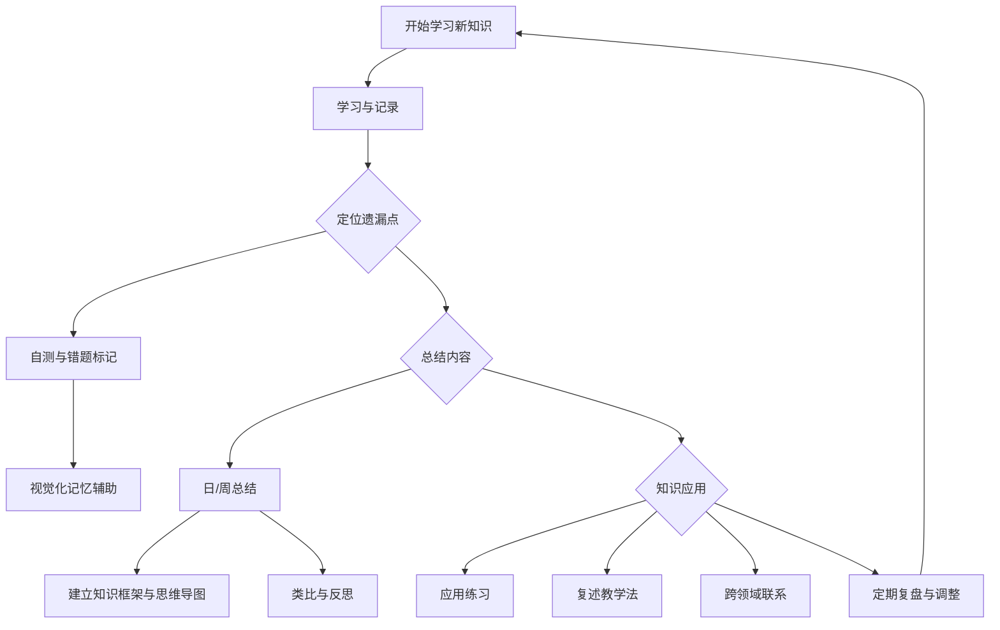

我会确认和优化这个学习工作流逻辑，确保步骤清晰且符合你的学习目标：

### 逻辑确认和优化

1. **开始学习新知识**：正确设置为学习的起点。

2. **学习与记录**：适当记录新知识，进入知识点标记阶段。

3. **定位遗漏点**：
   - 通过 **自测和错题标记** 定位容易遗忘或混淆的知识。
   - 使用 **视觉化记忆辅助** 帮助巩固和记忆，确保每个遗漏点都得以强化。

4. **总结内容**：
   - **日/周总结** 定期巩固学习成果。
   - **建立知识框架与思维导图** 帮助形成整体的知识结构。
   - **类比与反思** 为深度理解提供支持，通过类比将知识连接到其他内容。

5. **知识应用**：
   - **应用练习** 使得知识在实践中得到验证。
   - **复述教学法**（例如费曼学习法）用以检查自己的理解和表达能力。
   - **跨领域联系** 提高知识的迁移和灵活应用能力。

6. **定期复盘与调整**：
   - 每隔一段时间复盘、检查并更新笔记和学习策略，然后返回“开始学习新知识”的阶段，形成一个完整的学习循环。

### 总结

该流程图合理、完整地涵盖了从新知识学习、巩固记忆到应用和复盘的各个方面，确保知识点不仅被记住，还能灵活运用。同时，定期复盘与调整形成一个持续改进的学习闭环。