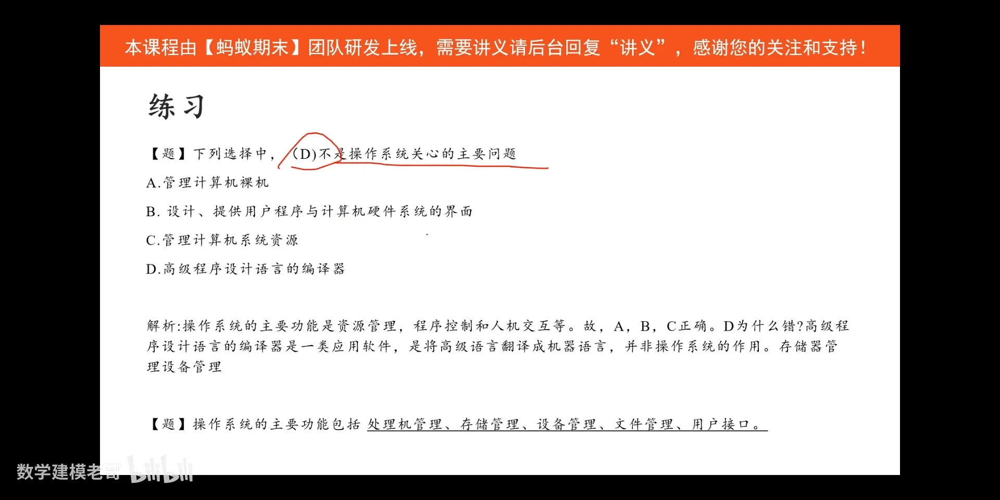
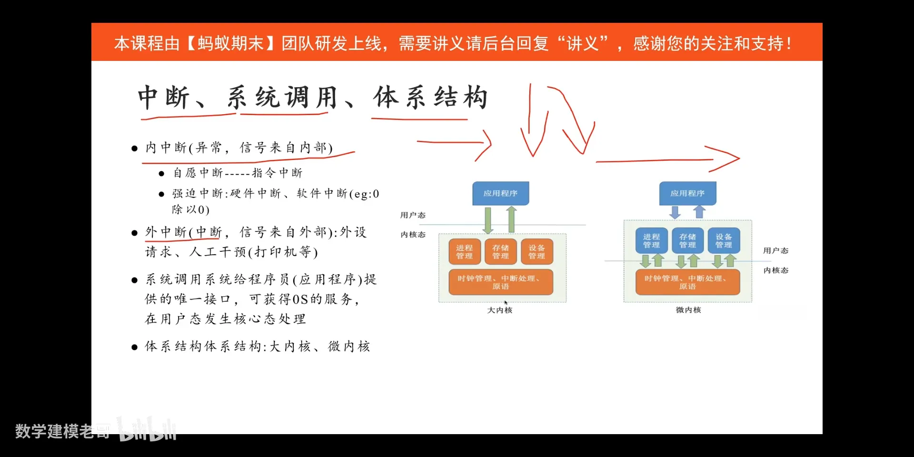
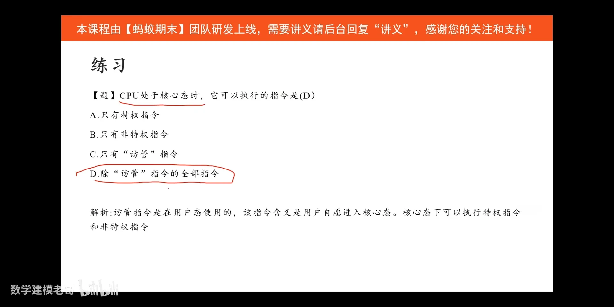

【《操作系统》4 小时期末不挂科！期末速成丨考前突击丨期末不挂科丨考点总结】 https://www.bilibili.com/video/BV1ju6TYHEKU/?share_source=copy_web&vd_source=07ea92b70407ff2a13a4ae38e23d7d4d

---

-  [15:26](https://www.bilibili.com/video/BV1ju6TYHEKU/?t=926.295417#t=15:26.30) 

-  [15:41](https://www.bilibili.com/video/BV1ju6TYHEKU/?t=941.701406#t=15:41.70) 

---
### 并发与并行

-  [17:55](https://www.bilibili.com/video/BV1ju6TYHEKU/?t=1075.482838#t=17:55.48) 

---
### 虚拟

-  [19:28](https://www.bilibili.com/video/BV1ju6TYHEKU/?t=1168.954073#t=19:28.95) 

---

### 操作系统的功能

-  [22:41](https://www.bilibili.com/video/BV1ju6TYHEKU/?t=1361.042867#t=22:41.04)

---

-  [24:16](https://www.bilibili.com/video/BV1ju6TYHEKU/?t=1456.89723#t=24:16.90) 

---

### 
-  [26:01](https://www.bilibili.com/video/BV1ju6TYHEKU/?t=1561.702271#t=26:01.70) 

---

### 
-  [29:32](https://www.bilibili.com/video/BV1ju6TYHEKU/?t=1772.283904#t=29:32.28) 

---

### 指令

-  [32:28](https://www.bilibili.com/video/BV1ju6TYHEKU/?t=1948.573749#t=32:28.57) 

---

### 处理机状态

-  [35:19](https://www.bilibili.com/video/BV1ju6TYHEKU/?t=2119.9553#t=35:19.96) 

---

### 原语

-  [36:07](https://www.bilibili.com/video/BV1ju6TYHEKU/?t=2167.665448#t=36:07.67) 

---

### 中断

-  [37:57](https://www.bilibili.com/video/BV1ju6TYHEKU/?t=2277.729242#t=37:57.73) 

---
### 练习

-  [40:51](https://www.bilibili.com/video/BV1ju6TYHEKU/?t=2451.051848#t=40:51.05) 

-  [41:28](https://www.bilibili.com/video/BV1ju6TYHEKU/?t=2488.611758#t=41:28.61) 

---

## 进程

-  [02:25](https://www.bilibili.com/video/BV1ju6TYHEKU/?t=145.870269#t=02:25.87) 

-  [03:03](https://www.bilibili.com/video/BV1ju6TYHEKU/?t=183.837735#t=03:03.84) 

### 进程的态度

-  [06:23](https://www.bilibili.com/video/BV1ju6TYHEKU/?t=383.741808#t=06:23.74) 
---
