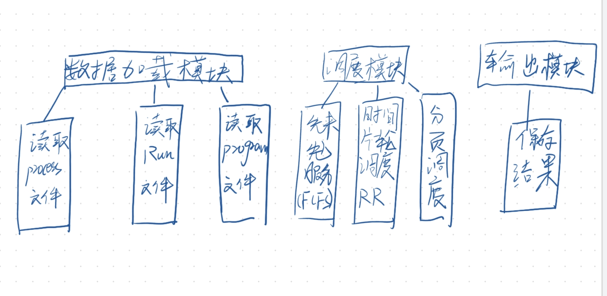
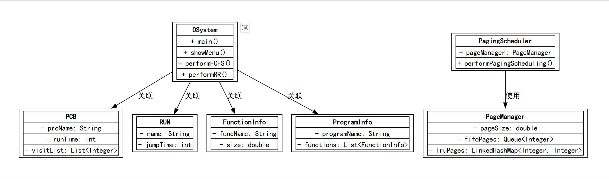
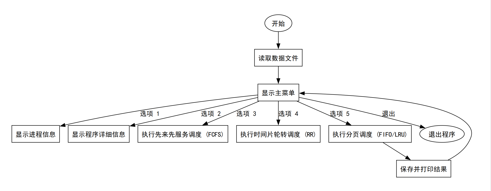
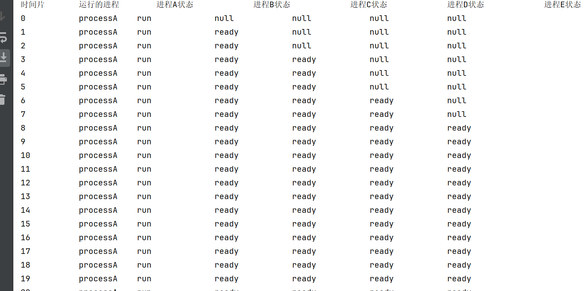
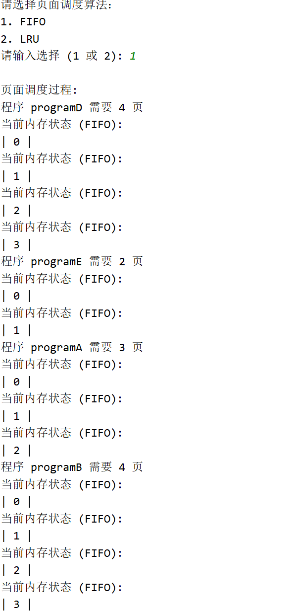
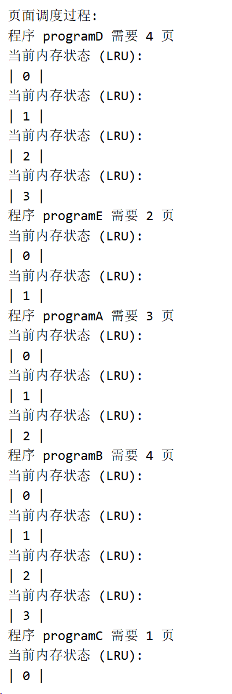

# 操作系统分页调度模拟系统课程设计报告

## 一、课设目的

本课程设计旨在通过实际编程实现操作系统中的分页调度算法，深化对进程管理、调度策略及内存管理等核心概念的理解。通过设计和开发一个分页调度模拟系统，学生能够在以下几个方面得到能力提升：


### 1. 1**系统设计与架构能力**

通过模块化设计，分解系统功能，将调度算法、页面替换策略、数据管理等划分为独立模块。
培养分析问题、分解问题及系统化解决问题的能力。


### 1.2 **编程实现能力**

使用Java语言实现复杂的调度算法，如先来先服务（FCFS）、时间片轮转（RR）等。
实现内存管理中的FIFO和LRU页面替换策略，提升编程技巧和代码优化能力。


### 1.3 **算法分析能力**

对比分析不同调度算法（如FCFS、RR）及页面替换策略（如FIFO、LRU）的优缺点。
理解各算法在实际应用中的性能表现及适用场景。


### 1.4 **数据结构应用能力**

在项目中合理应用队列、链表、哈希映射等数据结构，提升数据组织与管理效率。
深入理解数据结构与操作系统核心机制（如页面调度和进程管理）的结合。


### 1.5 **问题解决与调试能力**

在实现过程中不断调试和优化程序，发现并解决实际编程问题。
分析日志与调试信息，对算法和代码进行有效的性能优化。


### 1.6**文档编写与报告能力**

撰写详细的设计报告，包括课设目的、系统设计、运行结果与分析等内容。
提升技术文档编写能力，能够全面总结项目过程与成果。


通过本次课程设计，学生不仅能够掌握操作系统调度算法的理论与实现，还能提升编程与项目开发能力，为未来的研究或工作奠定坚实的基础。

## 二、课设题目

**CPU&内存调度管理原型系统**

## 三、系统功能结构

系统采用模块化设计，并通过菜单驱动方式提供以下主要功能：

1. **显示进程信息**
    
    **功能描述**：展示所有进程的基本信息，包括进程名称、到达时间、运行时间、关联程序名称及当前状态。
    **实现模块**：`PCB`类负责进程信息的存储与管理，`displayProcessInfo()`方法用于信息的展示。
2. **显示程序详细信息**
    
    **功能描述**：展示各程序的详细信息，包括函数名称及其大小（KB）。
    **实现模块**：`FunctionInfo`和`ProgramInfo`类用于存储函数及程序信息，`displayProgramDetails()`方法负责信息的展示。
3. **先来先服务调度（FCFS）**
    
    **功能描述**：实现FCFS调度算法，对进程按照到达时间顺序进行调度，并输出调度结果，包括开始时间、完成时间、周转时间及带权周转时间。
    **实现模块**：`performFCFS()`方法负责FCFS调度的具体实现，调度结果通过`saveAndDisplayResults()`方法保存并展示。
4. **时间片轮转调度（RR）**
    
    **功能描述**：实现RR调度算法，按固定时间片（如1ms）对进程进行轮转调度，记录每个时间片的运行状态，并输出最终调度结果。
    **实现模块**：`performRR()`方法负责RR调度的具体实现，运行状态通过`result.txt`文件记录，最终结果通过控制台和文件展示。
5. **分页调度（默认参数）**
    
    **功能描述**：使用预设的页面大小（如4KB）和每个进程的最大页面数（如3页）进行分页调度，选择页面替换算法（FIFO或LRU），并输出调度过程与结果。
    **实现模块**：`PagingScheduler`类负责分页调度的具体逻辑，默认参数通过实例化时传递，调度过程通过`PageManager`类管理页面替换。
6. **设置页面大小并执行分页调度**
    
    **功能描述**：允许用户自定义页面大小和每个进程的最大页面数，选择页面替换算法（FIFO或LRU），执行分页调度并展示结果。
    **实现模块**：`PagingScheduler`类通过用户输入获取自定义参数，随后执行相应的分页调度。
7. **退出程序**
    
    **功能描述**：终止系统运行，释放资源。
    **实现模块**：通过菜单选项调用`System.exit(0)`实现程序退出。

### 3.1 系统功能结构图



系统采用模块化设计，并通过菜单驱动方式提供以下主要功能：

1. **显示进程信息**
    
    - **功能描述**：展示所有进程的基本信息，包括进程名称、到达时间、运行时间、关联程序名称及当前状态。
    - **实现模块**：`PCB`类负责进程信息的存储与管理，`displayProcessInfo()`方法用于信息的展示。
2. **显示程序详细信息**
    
    - **功能描述**：展示各程序的详细信息，包括函数名称及其大小（KB）。
    - **实现模块**：`FunctionInfo`和`ProgramInfo`类用于存储函数及程序信息，`displayProgramDetails()`方法负责信息的展示。
3. **先来先服务调度（FCFS）**
    
    - **功能描述**：实现FCFS调度算法，对进程按照到达时间顺序进行调度，并输出调度结果，包括开始时间、完成时间、周转时间及带权周转时间。
    - **实现模块**：`performFCFS()`方法负责FCFS调度的具体实现，调度结果通过`saveAndDisplayResults()`方法保存并展示。
4. **时间片轮转调度（RR）**
    
    - **功能描述**：实现RR调度算法，按固定时间片（如1ms）对进程进行轮转调度，记录每个时间片的运行状态，并输出最终调度结果。
    - **实现模块**：`performRR()`方法负责RR调度的具体实现，运行状态通过`result.txt`文件记录，最终结果通过控制台和文件展示。
5. **分页调度（默认参数）**
    
    - **功能描述**：使用预设的页面大小（如4KB）和每个进程的最大页面数（如3页）进行分页调度，选择页面替换算法（FIFO或LRU），并输出调度过程与结果。
    - **实现模块**：`PagingScheduler`类负责分页调度的具体逻辑，默认参数通过实例化时传递，调度过程通过`PageManager`类管理页面替换。
6. **设置页面大小并执行分页调度**
    
    - **功能描述**：允许用户自定义页面大小和每个进程的最大页面数，选择页面替换算法（FIFO或LRU），执行分页调度并展示结果。
    - **实现模块**：`PagingScheduler`类通过用户输入获取自定义参数，随后执行相应的分页调度。
7. **退出程序**
    
    - **功能描述**：终止系统运行，释放资源。
    - **实现模块**：通过菜单选项调用`System.exit(0)`实现程序退出。

### 3.2模块交互说明

1. **用户通过用户界面模块选择所需功能**，系统根据选择调用相应的功能模块。
2. **数据管理模块**负责加载和管理进程、程序及运行步骤的信息，供调度算法模块调用。
3. **调度算法模块**执行具体的调度策略，并将调度结果传递给文件操作模块进行记录。
4. **分页调度模块**根据用户设置的参数，通过PageManager管理页面的加载与替换，记录调度过程与结果。
5. **文件操作模块**确保系统数据的持久化和调度结果的记录，便于后续分析与验证。
## 四、主要数据结构

系统主要采用以下数据结构来管理进程、运行步骤、程序信息以及页面替换：

1. **PCB（Process Control Block）**：
    
    **proName**：进程名称
    **startTime**：到达时间
    **runTime**：运行时间（剩余）
    **originalRunTime**：原始运行时间
    **programName**：关联的程序名称
    **firstTime**：开始运行时间
    **finishTime**：完成时间
    **turnoverTime**：周转时间
    **weightedTurnoverTime**：带权周转时间
    **status**：状态（如等待、就绪、执行、完成）
    **visitList**：访问页号列表
2. **RUN**：
    
    **name**：进程名（程序名）
    **jumpTime**：执行时间
    **address**：访问地址
3. **FunctionInfo**：
    
    **funcName**：函数名称
    **size**：函数大小（KB）
4. **ProgramInfo**：
    
    **programName**：程序名称
    **functions**：程序中的函数列表
5. **PageManager**：
    
    **pageSize**：页面大小（KB）
    **maxPages**：每个进程的最大页面数
    **fifoPages**：FIFO页面队列
    **lruPages**：LRU页面映射
    **log**：页面操作日志
    **pageFaults**：缺页次数
    **pageHits**：命中次数


## 五、系统设计

系统设计采用模块化思想，将不同功能划分为独立的类和方法，以提高代码的可维护性和扩展性。以下通过类图和活动图展示系统的设计过程。

### 5.1类图





### 5.2活动图

**分页调度过程活动图**


__

### 5.3设计说明

1. **模块划分**：
    
    **PCB管理模块**：负责进程的创建、管理和状态更新。
    **调度算法模块**：实现FCFS和RR调度算法。
    **分页调度模块**：实现FIFO和LRU页面替换策略，并管理页面调度过程。
    **数据读取模块**：从外部文件读取进程、运行步骤和程序详细信息。
    **用户界面模块**：提供菜单驱动的用户交互界面，接收用户输入并调用相应功能。
2. **页面替换策略**：
    
    **FIFO（先进先出）**：使用队列管理页面，最早进入的页面最先被替换。
    **LRU（最近最少使用）**：使用LinkedHashMap实现，根据页面的最近访问时间进行替换。
3. **调度结果记录**：
    
    调度过程和结果通过控制台输出和文件保存（如result.txt）进行记录，便于分析和验证。

## 六、运行结果展示与分析

### 6.1运行结果截图
    
    
2. **先来先服务调度结果**


    
3. **时间片轮转调度结果**
    

4. **分页调度结果**




### 6.2结果分析

##### 6.2.1 先来先服务调度（FCFS）

**执行流程**：
    系统按照进程到达时间的先后顺序依次执行每个进程。
    `performFCFS()`方法首先对进程列表进行排序，然后逐一执行，记录每个进程的开始时间、完成时间及周转时间。
**结果表现**：
    **简单直观**：调度顺序与进程到达时间一致，易于理解和实现。
    **周转时间计算准确**：每个进程的周转时间和带权周转时间均通过`turnoverTime`和`weightedTurnoverTime`字段准确记录。
 6.2.2 时间片轮转调度（RR）

**执行流程**：
    `performRR()`方法实现了时间片轮转调度，使用固定时间片（1ms）对进程进行轮转执行。
    进程的剩余运行时间通过`remainingTimeMap`进行跟踪，每个时间片结束后，未完成的进程重新加入就绪队列。
    调度过程详细记录在result.txt文件中，包含每个时间片的执行状态。
**结果表现**：
    **公平性**：所有进程在时间片轮转中获得平等的执行机会，避免了FCFS中长作业导致的短作业延迟问题。
    **响应性**：通过频繁的时间片切换，提高了系统对新到达进程的响应速度。
    **调度开销**：较短的时间片可能导致频繁的上下文切换，增加系统调度开销。
##### 6.2.2 分页调度

**执行流程**：
    `PagingScheduler`类负责分页调度逻辑，通过`PageManager`管理页面的加载与替换。
    支持两种页面替换算法：FIFO和LRU，通过用户选择进行切换。
    页面访问由`visitList`记录，每次页面访问调用相应的替换方法（`fifoReplace()`或`lruReplace()`）。
**结果表现**：
    **FIFO算法**：
        **命中次数较低**：由于只考虑页面加载顺序，未考虑页面的实际使用频率，导致页面可能频繁被替换。
        **缺页次数较高**：页面被提前替换，增加了缺页率。
    **LRU算法**：
        **命中次数较高**：通过记录页面的最近访问时间，优先保留最近使用的页面，减少了不必要的页面替换。
        **缺页次数较低**：提高了页面命中率，提升了系统整体性能。
**代码实现细节**：
    **FIFO**：使用`Queue<Integer>`管理页面，页面按进入顺序存储，最早进入的页面最先被替换。
    **LRU**：使用`LinkedHashMap<Integer, Integer>`实现，利用其`accessOrder`特性记录页面的最近访问时间，自动管理页面的替换逻辑。


### 性能评价

通过运行结果可以看出，FCFS和RR调度算法在不同场景下各有优劣。FCFS简单易实现，但可能导致较高的平均周转时间。RR通过时间片轮转，提高了系统的响应性，适合时间共享系统。而在分页调度方面，LRU算法相较于FIFO在命中率上有显著提升，更适用于动态内存访问模式。

## 七、课程设计中遇到的问题及解决方法

在本次课程设计过程中，遇到了多个挑战，以下详细列出问题及对应的解决方法。

### 7.1 文件读取与数据解析

#### 7.1.1 问题分析

在处理外部文件（`Process.txt`, `run.txt`, `program.txt`）时，文件格式不统一或存在空行、错误格式，导致数据读取过程中出现异常，影响系统的稳定性和准确性。

#### 7.1.2 解决方法

**数据格式校验**：在读取文件时，增加对每行数据格式的校验，确保数据的完整性和正确性。对于格式不正确的行，输出警告信息并跳过，避免程序崩溃。
    
**异常处理**：使用`try-catch`语句捕获可能的异常，如`IOException`、`NumberFormatException`，并进行相应的处理，确保程序的健壮性。
    
**跳过空行**：在读取文件时，自动跳过空行，避免因空行导致的解析错误。
    
**统一文件格式**：在设计文件格式时，确保各文件的格式统一，便于数据的读取与解析。
    

### 7.2 页面调度算法表现不佳

#### 7.2.1 问题分析

在实际运行中，FIFO和LRU算法的页面命中率较低，尤其是在多程序运行时，频繁的页面置换导致系统性能不佳。这可能由于页面访问模式不具备明显的局部性，或者页面管理逻辑存在缺陷。

#### 7.2.2 解决方法

**改进页面替换算法**：尝试结合FIFO与LRU的优点，或者实现更复杂的页面替换算法（如Optimal或Clock算法），以提高页面命中率和系统性能。
    
**优化内存分配策略**：动态调整每个进程的内存窗口，基于进程的实际需求和页面访问模式，优化内存的使用效率，减少不必要的页面置换。
    
**增强访问模式分析**：通过分析页面访问模式，调整页面替换策略，使其更符合实际应用场景的需求。
    
**代码优化**：检查并优化`PageManager`类中的页面管理逻辑，确保页面状态在每次访问和替换后都能正确更新。
    

### 7.3 进程调度的周转时间与带权周转时间计算不准确

#### 7.3.1 问题分析

在进程调度中，周转时间和带权周转时间的计算可能出现误差，特别是在处理上下文切换和进程优先级时。可能由于时间记录不准确或调度逻辑中的计算公式存在问题，导致结果不符合预期。

#### 7.3.2 解决方法

**公式验证**：确保周转时间和带权周转时间的计算公式准确无误：
    
    `周转时间 = 完成时间 到达时间`
    `带权周转时间 = 周转时间 / 运行时间`
**时间记录准确性**：检查调度过程中的时间记录逻辑，确保所有时间点（开始时间、完成时间）都能准确记录，避免遗漏或重复记录。
    
**调度逻辑审核**：审查调度算法的实现，确保进程的执行顺序和时间更新逻辑正确，避免因调度顺序错误导致时间计算偏差。
    
**单元测试**：编写单元测试用例，对周转时间和带权周转时间的计算进行验证，确保计算结果的准确性。
    

### 7.4 内存状态输出不一致

#### 7.4.1 问题分析

在执行页面调度（FIFO和LRU）时，页面状态（内存中的页面）没有按预期更新。这可能由于页面管理器（`PageManager`）在页面替换操作后未能正确更新内存状态，或者日志记录逻辑存在缺陷，导致输出结果不一致。

#### 7.4.2 解决方法

**内存状态更新**：确保`PageManager`类在每次替换页面时，内存状态（`fifoPages`或`lruPages`）都能正确更新。特别是在页面添加或移除时，及时反映在内存状态中。
    
**详细日志记录**：在页面替换操作后，详细记录页面的添加、移除等操作，通过日志文件或控制台输出，确保页面状态的变化透明可追踪。
    
**状态同步检查**：定期检查内存状态与页面访问日志是否一致，确保页面管理逻辑的正确性。
    
**代码调试**：使用调试工具，逐步跟踪页面替换操作，确保每一步操作都符合预期，及时发现并修正逻辑错误。
    

### 7.5 类结构不清晰或冗余

#### 7.5.1 问题分析

在初期设计中，类的结构较为复杂，字段冗余，导致代码难以维护。可能由于类职责划分不明确，或者过度设计，导致类之间存在不必要的依赖和冗余字段。

#### 7.5.2 解决方法

**单一职责原则**：优化类设计，确保每个类只负责单一的功能。例如，`PCB`类专注于处理与进程相关的逻辑，`PageManager`类则只处理页面调度的相关功能。
    
**类职责划分**：明确各类的职责，避免职责重叠和功能混杂，提升代码的可读性和可维护性。
    
**简化类成员**：审查并简化类中的成员变量，避免过多复杂的数据类型嵌套。保留必要的字段，删除冗余或不常用的字段。
    
**重构代码**：通过重构技术，重新组织类的结构，优化类之间的关系，提升代码的整体质量和可维护性。
    

### 7.6 代码未充分注释或文档化

#### 7.6.1 问题分析

代码缺乏足够的注释和文档，尤其是在复杂的类和函数中，导致理解困难。这会增加代码的维护难度，影响团队协作和代码复用。

#### 7.6.2 解决方法

**详细注释**：为每个类和方法添加详细注释，特别是对于构造函数、重要字段和方法的功能描述。说明参数的含义、方法的返回值及可能抛出的异常。
    
**方法文档化**：编写方法的文档注释，描述方法的输入、输出及其执行逻辑。使用JavaDoc格式，便于生成自动化文档。
    
**代码组织**：按照功能块对代码进行组织和注释，例如循环、判断等关键逻辑部分，提升代码的可读性。
    
**维护文档**：编写维护文档，记录代码的设计思路、实现细节及常见问题，便于后续的代码维护和升级。

### 八、设计感想

通过本次研究生课程设计，我对操作系统中的**进程调度**与**内存分页管理机制**进行了深入的研究与实践。本次设计不仅巩固了理论知识，还提升了我分析问题、解决问题以及优化代码结构的能力。以下是我在设计与实现过程中获得的一些感想与体会。

#### 8.1 对调度算法的理解与实现

在设计中，我实现了两种经典的进程调度算法：**先来先服务（FCFS）调度**和**时间片轮转（RR）调度**。

**FCFS调度**  
    FCFS调度算法简单且易于实现，通过对进程按照到达时间进行排序，然后依次分配CPU运行时间。在实现过程中，我认识到其在进程到达时间分布均匀的情况下能够很好地发挥作用，但当某些进程运行时间过长时，会导致“短进程”因“长进程”而阻塞，形成**“饥饿”现象**。这一现象加深了我对调度算法在实际场景中优劣的理解。
    
**时间片轮转调度（RR）**  
    时间片轮转调度是为了解决FCFS调度中“短进程饥饿”的问题而设计的一种算法。在本次实现中，我固定了时间片为1ms，并采用队列来模拟进程的动态调度。在设计中，我需要不断更新每个进程的剩余运行时间、状态、周转时间等信息。特别是，通过记录每个时间片的运行状态，我更加直观地感受到轮转调度在保证**进程公平性**方面的优势。
    

#### 8.2 分页管理与内存优化

在内存管理中，我设计并实现了**FIFO**和**LRU**两种页面置换算法，并借助日志记录模块对它们的性能进行比较分析。

**FIFO页面置换**  
    FIFO是一种简单的页面置换算法，通过队列维护页面的先进先出顺序。实现过程中，我发现它在某些情况下容易出现“抖动现象”（即频繁置换页面），特别是在访问模式较为复杂的场景下，这使得其命中率较低。该现象让我深刻理解了**算法选择与应用场景的关系**。
    
**LRU页面置换**  
    LRU算法通过最近访问时间来决定置换的页面，其性能通常优于FIFO。在实现时，我利用了Java的**LinkedHashMap**结合其`accessOrder=true`属性，设计了一个高效的LRU页面管理器。在对比分析中，我观察到LRU在命中率方面显著优于FIFO，尤其在访问模式存在局部性时表现尤为突出。
    

通过这两个算法的实现，我不仅掌握了内存分页机制的理论，还对操作系统在**有限资源**下如何通过算法优化性能有了深刻体会。

#### 8.3 数据结构与算法的实际应用

在本次设计中，我运用了多种数据结构来构建系统模块：

**队列与链表**  
    用于实现**FIFO页面置换**和**时间片轮转调度（RR）**，直观且高效地模拟了系统中动态资源的调度过程。
    
**哈希表与LinkedHashMap**  
    在**LRU页面置换**中使用了LinkedHashMap的自动排序功能，通过合理设计实现页面的高效访问和替换。
    
**列表和映射表**  
    在进程管理和程序模块之间，采用列表和映射表来关联进程、程序和内存访问信息，清晰地表达了系统中的关系结构。
    

通过这些数据结构的设计，我进一步感受到**理论知识与实际应用结合的重要性**。

#### 8.4 性能分析与优化

通过设计系统的日志记录功能，我可以跟踪调度和内存管理过程中每一步的执行细节。这不仅帮助我发现了程序中的潜在问题，还为调度算法和页面置换算法的性能分析提供了数据支持。具体来说：

**日志模块**  
    为每次页面调度操作记录**命中次数**、**页面错误**、**内存状态**，使得算法性能的优劣得以量化。
    
**结果保存与输出**  
    我将调度过程和结果写入外部文件，不仅提升了实验结果的可视化和可复现性，也方便了后续数据分析与性能比较。
    

#### 8.5 总结与展望

本次课程设计让我在多个方面获益匪浅。通过理论知识的实践与检验，我加深了对操作系统中调度与内存管理机制的理解。此外，在程序设计过程中，我培养了如何在有限资源条件下设计高效算法的能力，并通过日志和数据分析来优化系统性能。

在未来的研究中，我希望探索更多高级的调度算法和页面置换算法（如优先级调度、Clock置换算法），并将这些算法与具体的应用场景相结合，从而设计更加高效的调度系统。


通过上述内容的补充与优化，课设报告更全面地涵盖了本次设计的内容和技术细节，并更加适合研究生课程的深度要求。

## 九、附件：带注释的代码

```java
import java.io.*;
import java.util.*;
import java.util.stream.Collectors;

public class OSystem {

    // PCB 类定义：用于表示进程控制块
    static class PCB {
        String proName;                   // 进程名称
        int startTime;                    // 到达时间
        int runTime;                      // 运行时间（剩余）
        int originalRunTime;              // 原始运行时间
        String programName;               // 关联的程序名称
        int firstTime;                    // 开始运行时间
        int finishTime;                   // 完成时间
        double turnoverTime;              // 周转时间
        double weightedTurnoverTime;      // 带权周转时间
        String status;                    // 状态
        List<Integer> visitList;          // 访问页号列表

        PCB(String proName, int startTime, int runTime, String programName) {
            this.proName = proName;
            this.startTime = startTime;
            this.runTime = runTime;
            this.originalRunTime = runTime;
            this.programName = programName;
            this.firstTime = -1;
            this.finishTime = 0;
            this.turnoverTime = 0.0;
            this.weightedTurnoverTime = 0.0;
            this.status = "等待";
            this.visitList = new ArrayList<>();
        }
    }

    // RUN 类定义：用于表示运行步骤
    static class RUN {
        String name;         // 进程名（程序名）
        int jumpTime;        // 执行时间
        double address;      // 访问地址

        RUN(String name, int jumpTime, double address) {
            this.name = name;
            this.jumpTime = jumpTime;
            this.address = address;
        }
    }

    // FunctionInfo 类定义：用于表示函数信息
    static class FunctionInfo {
        String funcName; // 函数名称
        double size;     // 函数大小 (KB)

        FunctionInfo(String funcName, double size) {
            this.funcName = funcName;
            this.size = size;
        }
    }

    // ProgramInfo 类定义：用于表示程序信息
    static class ProgramInfo {
        String programName;                      // 程序名称
        List<FunctionInfo> functions;            // 程序中的函数列表

        ProgramInfo(String programName) {
            this.programName = programName;
            this.functions = new ArrayList<>();
        }
    }

    // PageManager 类定义：用于管理页面替换
    static class PageManager {
        double pageSize; // 页面大小（KB）
        int maxPages;    // 每个进程的最大页面数
        Queue<Integer> fifoPages; // FIFO页面队列
        LinkedHashMap<Integer, Integer> lruPages; // LRU页面映射：页面号 -> 最近访问时间
        List<String> log; // 页面操作日志
        int pageFaults;    // 缺页次数
        int pageHits;      // 命中次数

        PageManager(double pageSize, int maxPages) {
            this.pageSize = pageSize;
            this.maxPages = maxPages;
            this.fifoPages = new LinkedList<>();
            // 使用 accessOrder=true 的 LinkedHashMap 实现 LRU
            this.lruPages = new LinkedHashMap<Integer, Integer>(maxPages, 0.75f, true) {
                protected boolean removeEldestEntry(Map.Entry<Integer, Integer> eldest) {
                    if (size() > PageManager.this.maxPages) {
                        log.add("LRU: 页面 " + eldest.getKey() + " 被移除。");
                        pageFaults++;
                        return true;
                    }
                    return false;
                }
            };
            this.log = new ArrayList<>();
            this.pageFaults = 0;
            this.pageHits = 0;
        }

        // FIFO替换策略
        void fifoReplace(int page) {
            // 检查页面是否已存在
            boolean found = fifoPages.contains(page);

            if (found) {
                pageHits++;
                log.add("FIFO: 页面 " + page + " 已在内存中 (命中)。");
                displayMemoryState("FIFO");
                return;
            }

            // 页面错误
            pageFaults++;
            if (fifoPages.size() >= maxPages) {
                if (!fifoPages.isEmpty()) {
                    int removed = fifoPages.poll();
                    log.add("FIFO: 页面 " + removed + " 被移除。");
                }
            }
            fifoPages.offer(page);
            log.add("FIFO: 页面 " + page + " 被添加。");

            // 记录当前内存状态
            displayMemoryState("FIFO");
        }

        // LRU替换策略
        void lruReplace(int page, int currentTime) {
            if (lruPages.containsKey(page)) {
                pageHits++;
                lruPages.put(page, currentTime); // 更新页面最近使用时间
                log.add("LRU: 页面 " + page + " 已在内存中 (命中)。");
                displayMemoryState("LRU");
                return;
            }

            // 页面错误
            pageFaults++;
            if (lruPages.size() >= maxPages) {
                // 最久未使用的页面会被自动移除，由 LinkedHashMap 的 removeEldestEntry 方法处理
                // 这里只需记录日志
            }
            lruPages.put(page, currentTime);
            log.add("LRU: 页面 " + page + " 被添加。");

            // 记录当前内存状态
            displayMemoryState("LRU");
        }

        // 获取页面置换日志
        List<String> getLog() {
            return log;
        }

        // 获取页面错误次数
        int getPageFaults() {
            return pageFaults;
        }

        // 获取页面命中次数
        int getPageHits() {
            return pageHits;
        }

        // 计算页面命中率
        double getHitRate() {
            return (pageHits + pageFaults) == 0 ? 0 : ((double) pageHits / (pageHits + pageFaults));
        }

        // 显示当前内存中的页面状态
        void displayMemoryState(String algorithm) {
            System.out.println("当前内存状态 (" + algorithm + "):");
            System.out.print("|");
            if (algorithm.equals("FIFO")) {
                for (int page : fifoPages) {
                    System.out.printf(" %d |", page);
                }
            } else if (algorithm.equals("LRU")) {
                for (int page : lruPages.keySet()) {
                    System.out.printf(" %d |", page);
                }
            }
            System.out.println();
        }

        // 打印总结报告
        void printSummary() {
            System.out.println("缺页次数: " + pageFaults);
            System.out.println("页面命中次数: " + pageHits);
            if (pageHits + pageFaults > 0) {
                double hitRate = ((double) pageHits / (pageHits + pageFaults)) * 100;
                System.out.printf("页面命中率: %.2f%%\n", hitRate);
            }
        }
    }

    // 全局变量
    static List<PCB> processes = new ArrayList<>(); // 所有进程
    static List<RUN> runSteps = new ArrayList<>();   // 所有运行步骤
    static Map<String, ProgramInfo> programs = new HashMap<>(); // 所有程序信息

    public static void main(String[] args) {
        Scanner scanner = new Scanner(System.in);

        // 读取数据文件
        System.out.println("\n正在加载数据文件...");
        readProcess("Process.txt");
        readRun("run.txt");
        readProgramDetails("program.txt");
        System.out.println("数据文件加载完成！\n");

        while (true) {
            // 显示菜单
            showMenu();
            int choice = getUserChoice(scanner, 1, 7);

            switch (choice) {
                case 1:
                    // 显示进程信息
                    displayProcessInfo();
                    break;
                case 2:
                    // 显示程序详细信息
                    displayProgramDetails();
                    break;
                case 3:
                    // 先来先服务调度（FCFS）
                    System.out.println("\n正在执行先来先服务调度（FCFS）...");
                    performFCFS();
                    break;
                case 4:
                    // 时间片轮转调度（RR）
                    System.out.println("\n正在执行时间片轮转调度（RR）...");
                    performRR();
                    break;
                case 5:
                    // 分页调度（基于访问页号）
                    System.out.println("\n正在执行分页调度（基于访问页号）...");
                    PagingScheduler pagingScheduler = new PagingScheduler(4.0, 3); // 示例默认值
                    pagingScheduler.performPagingScheduling(scanner);
                    break;
                case 6:
                    // 设置页面大小并执行分页调度
                    System.out.println("\n正在设置页面大小并执行分页调度...");
                    PagingScheduler dynamicScheduler = new PagingScheduler(0.0, 0); // 动态输入
                    dynamicScheduler.performPagingScheduling(scanner);
                    break;
                case 7:
                    // 退出程序
                    System.out.println("程序退出中，再见！");
                    scanner.close();
                    System.exit(0);
                    break;
                default:
                    // 无效选项
                    System.out.println("无效选项，请重新选择！");
            }
        }
    }

    // 显示菜单
    private static void showMenu() {
        System.out.println("======================================");
        System.out.println("|         分页调度模拟系统           |");
        System.out.println("======================================");
        System.out.println("| 1. 显示进程信息                    |");
        System.out.println("| 2. 显示程序详细信息                |");
        System.out.println("| 3. 先来先服务调度 (FCFS)           |");
        System.out.println("| 4. 时间片轮转调度 (RR)             |");
        System.out.println("| 5. 分页调度 (默认参数)             |");
        System.out.println("| 6. 设置页面大小并执行分页调度       |");
        System.out.println("| 7. 退出程序                        |");
        System.out.println("======================================");
        System.out.print("请输入您的选择 (1-7): ");
    }

    // 获取用户选择，并验证输入
    private static int getUserChoice(Scanner scanner, int min, int max) {
        int choice = -1;
        while (true) {
            try {
                String input = scanner.nextLine().trim();
                choice = Integer.parseInt(input);
                if (choice >= min && choice <= max) {
                    break;
                } else {
                    System.out.print("输入无效，请输入一个介于 " + min + " 和 " + max + " 之间的整数: ");
                }
            } catch (NumberFormatException e) {
                System.out.print("输入无效，请输入一个整数: ");
            }
        }
        return choice;
    }

    // 读取Process.txt文件
    private static void readProcess(String filename) {
        try (BufferedReader br = new BufferedReader(new FileReader(filename))) {
            String line;
            while ((line = br.readLine()) != null) {
                if (line.trim().isEmpty()) continue;
                String[] parts = line.trim().split("\\s+");
                if (parts.length < 4) {
                    System.err.println("警告: Process.txt 中的行格式不正确: " + line);
                    continue;
                }
                String proName = parts[0];
                int startTime = Integer.parseInt(parts[1]);
                int runTime = Integer.parseInt(parts[2]);
                String programName = parts[3];
                PCB pcb = new PCB(proName, startTime, runTime, programName);
                processes.add(pcb);
            }
        } catch (IOException e) {
            System.err.println("Error: 无法读取 " + filename + " 文件。");
            System.exit(1);
        }
    }

    // 读取run.txt文件
    private static void readRun(String filename) {
        try (BufferedReader br = new BufferedReader(new FileReader(filename))) {
            String line;
            String currentProgram = "";
            while ((line = br.readLine()) != null) {
                if (line.trim().isEmpty()) continue;
                // 检测是否为程序名行
                if (line.startsWith("program")) {
                    currentProgram = line.trim();
                    continue;
                }
                String[] parts = line.trim().split("\\s+");
                if (parts.length < 3) {
                    System.err.println("警告: run.txt 中的行格式不正确: " + line);
                    continue;
                }
                int jumpTime = Integer.parseInt(parts[0]);
                String operation = parts[1];
                double address = Double.parseDouble(parts[2]);
                if (operation.equals("结束")) {
                    address = -1;
                }
                RUN run = new RUN(currentProgram, jumpTime, address);
                runSteps.add(run);
            }
        } catch (IOException e) {
            System.err.println("Error: 无法读取 " + filename + " 文件。");
            System.exit(1);
        }
    }

    // 读取program.txt文件
    private static void readProgramDetails(String filename) {
        try (BufferedReader br = new BufferedReader(new FileReader(filename))) {
            String line;
            String currentProgram = "";
            while ((line = br.readLine()) != null) {
                if (line.trim().isEmpty()) continue;
                // 检测是否为FName行
                if (line.startsWith("FName")) {
                    String[] parts = line.trim().split("\\s+");
                    if (parts.length < 2) {
                        System.err.println("警告: program.txt 中的FName行格式不正确: " + line);
                        continue;
                    }
                    currentProgram = parts[1];
                    programs.put(currentProgram, new ProgramInfo(currentProgram));
                    continue;
                }
                String[] parts = line.trim().split("\\s+");
                if (parts.length < 2) {
                    System.err.println("警告: program.txt 中的行格式不正确: " + line);
                    continue;
                }
                String funcName = parts[0];
                double size = Double.parseDouble(parts[1]);
                FunctionInfo func = new FunctionInfo(funcName, size);
                if (currentProgram.isEmpty()) {
                    System.err.println("警告: program.txt 中的函数未关联到任何程序: " + line);
                    continue;
                }
                programs.get(currentProgram).functions.add(func);
            }
        } catch (IOException e) {
            System.err.println("Error: 无法读取 " + filename + " 文件。");
            System.exit(1);
        }
    }

    // 显示进程信息
    private static void displayProcessInfo() {
        System.out.println("\n===== 进程信息 =====");
        System.out.printf("%-12s%-12s%-12s%-15s%-15s\n", "进程名", "到达时间", "运行时间", "程序名称", "状态");
        System.out.println("");
        for (PCB pro : processes) {
            System.out.printf("%-12s%-12d%-12d%-15s%-15s\n",
                    pro.proName,
                    pro.startTime,
                    pro.originalRunTime,
                    pro.programName,
                    pro.status);
        }
    }

    // 显示程序详细信息
    private static void displayProgramDetails() {
        System.out.println("\n===== 程序详细信息 =====");
        for (ProgramInfo prog : programs.values()) {
            System.out.println("程序: " + prog.programName);
            for (FunctionInfo func : prog.functions) {
                System.out.println("  函数: " + func.funcName + ", 大小: " + func.size + " KB");
            }
            System.out.println();
        }
    }

    // 先来先服务调度（FCFS）实现
    private static void performFCFS() {
        System.out.println("\n=== 先来先服务调度（FCFS） ===");
        List<PCB> sortedProcesses = new ArrayList<>(processes);
        sortedProcesses.sort(Comparator.comparingInt(p -> p.startTime)); // 按到达时间排序

        int currentTime = 0;
        for (PCB pro : sortedProcesses) {
            if (currentTime < pro.startTime) {
                currentTime = pro.startTime;
            }
            pro.firstTime = currentTime;
            pro.status = "执行";
            currentTime += pro.runTime;
            pro.finishTime = currentTime;
            pro.turnoverTime = pro.finishTime pro.startTime;
            pro.weightedTurnoverTime = pro.originalRunTime > 0
                    ? (double) pro.turnoverTime / pro.originalRunTime
                    : 0.0;
            pro.status = "完成";
        }

        // 保存与显示结果
        saveAndDisplayResults("先来先服务调度（FCFS）", sortedProcesses, "result.txt");
    }

    // 时间片轮转调度（RR）实现
    private static void performRR() {
        System.out.println("\n=== 时间片轮转调度（RR） ===");
        // 时间片长度固定为1ms
        int timeQuantum = 1;

        // 按到达时间排序
        List<PCB> sortedProcesses = new ArrayList<>(processes);
        sortedProcesses.sort(Comparator.comparingInt(p -> p.startTime));

        Queue<PCB> readyQueue = new LinkedList<>();
        int currentTime = 0;
        int index = 0; // 用于跟踪哪些进程已被加入队列

        // 使用Map来跟踪每个进程的剩余运行时间
        Map<String, Integer> remainingTimeMap = new HashMap<>();
        for (PCB process : sortedProcesses) {
            remainingTimeMap.put(process.proName, process.runTime);
        }

        // 准备写入result.txt文件
        try (PrintWriter resultFile = new PrintWriter(new FileWriter("result.txt", false))) { // 覆盖模式打开，避免重复
            // 输出表头
            resultFile.print("时间片\t运行的进程\t");
            for (PCB process : sortedProcesses) {
                resultFile.print("进程" + process.proName + "状态\t");
            }
            resultFile.println();

            // 主调度循环
            while (!readyQueue.isEmpty() || index < sortedProcesses.size()) {
                // 将当前时间的进程加入队列
                while (index < sortedProcesses.size() && sortedProcesses.get(index).startTime <= currentTime) {
                    PCB newProcess = sortedProcesses.get(index);
                    readyQueue.offer(newProcess);
                    newProcess.status = "就绪";
                    System.out.println("进程: " + newProcess.proName + " 在 " + currentTime + " ms 时被加入队列");
                    index++;
                }

                // 如果队列为空，记录空闲时间片
                if (readyQueue.isEmpty()) {
                    // 输出空闲时间片状态
                    resultFile.print(currentTime + "\t" + "null\t");
                    for (PCB process : sortedProcesses) {
                        if (process.startTime > currentTime) {
                            resultFile.print("null\t");
                        } else if (remainingTimeMap.get(process.proName) == 0) {
                            resultFile.print("complete\t");
                        } else {
                            resultFile.print("ready\t");
                        }
                    }
                    resultFile.println();
                    currentTime++;
                    continue;
                }

                // 从队列中取出一个进程
                PCB currentProcess = readyQueue.poll();

                // 如果是第一次运行，设置开始时间
                if (currentProcess.firstTime == -1) {
                    currentProcess.firstTime = currentTime;
                }

                // 执行一个时间片
                int execTime = Math.min(timeQuantum, remainingTimeMap.get(currentProcess.proName));
                remainingTimeMap.put(currentProcess.proName, remainingTimeMap.get(currentProcess.proName) execTime);
                currentProcess.runTime -= execTime;
                int startExecTime = currentTime;
                currentTime += execTime;

                // 更新进程状态
                if (remainingTimeMap.get(currentProcess.proName) > 0) {
                    currentProcess.status = "就绪";
                } else {
                    currentProcess.status = "完成";
                    currentProcess.finishTime = currentTime;
                    currentProcess.turnoverTime = currentProcess.finishTime currentProcess.startTime;
                    currentProcess.weightedTurnoverTime = (double) currentProcess.turnoverTime / currentProcess.originalRunTime;
                }

                // 输出当前时间片的状态
                resultFile.print(startExecTime + "\t" + currentProcess.proName + "\t");

                for (PCB process : sortedProcesses) {
                    if (process.proName.equals(currentProcess.proName)) {
                        if (remainingTimeMap.get(process.proName) > 0) {
                            resultFile.print("run\t");
                        } else {
                            resultFile.print("complete\t");
                        }
                    } else {
                        if (remainingTimeMap.get(process.proName) == 0) {
                            resultFile.print("complete\t");
                        } else if (process.startTime > startExecTime) {
                            resultFile.print("null\t");
                        } else {
                            resultFile.print("ready\t");
                        }
                    }
                }
                resultFile.println();

                // 如果进程未完成，重新加入队列
                if (remainingTimeMap.get(currentProcess.proName) > 0) {
                    readyQueue.offer(currentProcess);
                } else {
                    // 进程完成，输出完成信息
                    resultFile.println("进程 " + currentProcess.proName + " 在 " + currentTime + " ms 完成 "
                            + "| 周转时间： " + currentProcess.turnoverTime
                            + " ms | 带权周转时间： " + String.format("%.2f", currentProcess.weightedTurnoverTime));
                }
            }

            // 输出最终统计信息
            resultFile.println("\n最终统计信息：");
            resultFile.println("进程名\t到达时间\t运行时间\t开始时间\t完成时间\t周转时间\t带权周转时间");
            for (PCB process : sortedProcesses) {
                resultFile.println(process.proName + "\t"
                        + process.startTime + "\t"
                        + process.originalRunTime + "\t"
                        + process.firstTime + "\t"
                        + process.finishTime + "\t"
                        + process.turnoverTime + "\t"
                        + String.format("%.2f", process.weightedTurnoverTime));
            }

            System.out.println("RR 调度完成，结果已保存到 result.txt");

        } catch (IOException e) {
            System.err.println("错误：无法打开 result.txt 进行结果保存");
            e.printStackTrace();
        }
    }

    // 保存与显示调度结果
    private static void saveAndDisplayResults(String title, List<PCB> processes, String fileName) {
        StringBuilder sb = new StringBuilder();
        sb.append("\n=== ").append(title).append(" ===\n");
        sb.append("进程名\t到达时间\t运行时间\t开始时间\t完成时间\t周转时间\t带权周转时间\n");

        System.out.printf("\n=== %s ===\n", title);
        System.out.printf("%-10s%-12s%-12s%-12s%-12s%-12s%-16s\n",
                "进程名", "到达时间", "运行时间", "开始时间", "完成时间", "周转时间", "带权周转时间");
        System.out.println("--");

        for (PCB pro : processes) {
            sb.append(String.format("%s\t%d\t%d\t%d\t%d\t%.0f\t%.2f\n",
                    pro.proName,
                    pro.startTime,
                    pro.originalRunTime,
                    pro.firstTime,
                    pro.finishTime,
                    pro.turnoverTime,
                    pro.weightedTurnoverTime));
            System.out.printf("%-10s%-12d%-12d%-12d%-12d%-12.0f%-16.2f\n",
                    pro.proName,
                    pro.startTime,
                    pro.originalRunTime,
                    pro.firstTime,
                    pro.finishTime,
                    pro.turnoverTime,
                    pro.weightedTurnoverTime);
        }

        // 写入文件
        try (BufferedWriter bw = new BufferedWriter(new FileWriter(fileName, true))) {
            bw.write(sb.toString());
        } catch (IOException e) {
            System.err.println("Error: 无法写入 " + fileName + " 文件。");
        }

        System.out.printf("=== %s 完成。结果已保存到 %s ===\n", title, fileName);
    }

    // PagingScheduler 类定义：用于执行分页调度
    static class PagingScheduler {

        private PageManager pageManager;

        public PagingScheduler(double pageSize, int maxPages) {
            this.pageManager = new PageManager(pageSize, maxPages);
        }

        // 执行分页调度的入口方法
        public void performPagingScheduling(Scanner scanner) {
            System.out.println("\n===== 设置页面大小并执行分页调度 =====");

            // 提示用户输入页面大小和最大页面数
            double pageSize = getUserInput(scanner, "请输入页面大小 (KB): ", 0.1, Double.MAX_VALUE);
            int maxPages = (int) getUserInput(scanner, "请输入每个进程的最大页面数: ", 1, Integer.MAX_VALUE);

            // 重新初始化 PageManager
            this.pageManager = new PageManager(pageSize, maxPages);

            // 分配运行步骤到进程并计算页号
            assignRunStepsToProcesses(pageSize);

            // 计算所有程序所需的页面数
            Map<String, Integer> pageRequirements = calculatePageRequirements(pageSize);

            // 提示用户选择页面替换算法
            System.out.println("请选择页面调度算法：\n1. FIFO\n2. LRU");
            int choice = (int) getUserInput(scanner, "请输入选择 (1 或 2): ", 1, 2);

            // 执行页面替换
            System.out.println("\n页面调度过程:");
            performPageReplacement(choice, pageRequirements);

            // 显示调度总结
            displayPageSummary(pageManager, pageRequirements);
        }

        // 分配运行步骤到进程并计算页号
        private void assignRunStepsToProcesses(double pageSize) {
            for (RUN run : runSteps) {
                if (run.address == -1) {
                    continue; // 忽略“结束”操作
                }
                int pageNumber = (int) Math.floor(run.address / pageSize);

                // 将页号分配给对应的进程
                processes.stream()
                        .filter(pro -> pro.programName.equals(run.name))
                        .findFirst()
                        .ifPresent(pro -> pro.visitList.add(pageNumber));
            }
        }

        // 计算每个程序所需的页面数
        private Map<String, Integer> calculatePageRequirements(double pageSize) {
            return programs.entrySet().stream()
                    .collect(Collectors.toMap(
                            Map.Entry::getKey,
                            entry -> (int) Math.ceil(
                                    entry.getValue().functions.stream()
                                            .mapToDouble(func -> func.size)
                                            .sum() / pageSize
                            )
                    ));
        }

        // 执行页面替换，根据用户选择的算法
        private void performPageReplacement(int choice, Map<String, Integer> pageRequirements) {
            int currentTime = 0;

            for (Map.Entry<String, Integer> entry : pageRequirements.entrySet()) {
                String programName = entry.getKey();
                int pages = entry.getValue();
                System.out.printf("程序 %s 需要 %d 页\n", programName, pages);

                for (int page = 0; page < pages; page++) {
                    if (choice == 1) {
                        pageManager.fifoReplace(page);
                    } else {
                        pageManager.lruReplace(page, currentTime);
                    }
                    currentTime++;
                }
            }
        }

        // 显示页面替换调度的总结
        private void displayPageSummary(PageManager pageManager, Map<String, Integer> pageRequirements) {
            System.out.println("\n===== 分页调度总结报告 =====");
            pageRequirements.forEach((programName, pages) -> {
                System.out.printf("程序: %s | 总页面数: %d\n", programName, pages);
            });

            System.out.println("页面命中次数: " + pageManager.getPageHits());
            System.out.println("页面置换次数 (页面错误): " + pageManager.getPageFaults());
            System.out.printf("页面命中率: %.2f%%\n", pageManager.getHitRate() * 100);
        }

        // 通用的用户输入方法，带有范围验证
        private double getUserInput(Scanner scanner, String prompt, double min, double max) {
            double value = -1;
            while (true) {
                try {
                    System.out.print(prompt);
                    value = Double.parseDouble(scanner.nextLine().trim());
                    if (value >= min && value <= max) {
                        break;
                    } else {
                        System.out.printf("输入无效，请输入一个介于 %.1f 和 %.1f 之间的数字。\n", min, max);
                    }
                } catch (NumberFormatException e) {
                    System.out.println("输入无效，请输入一个数字。");
                }
            }
            return value;
        }
    }
}
```

_注：上述代码已按照功能模块进行了注释，便于理解各部分的作用和实现方法。_