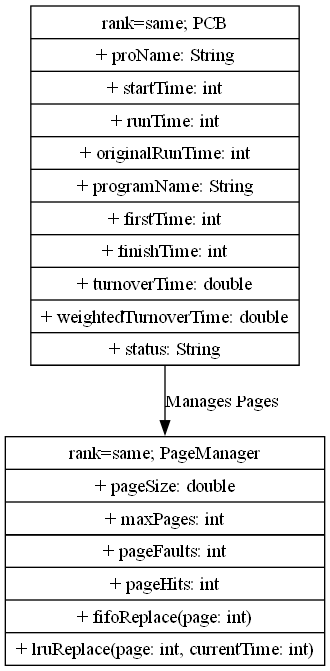

### 一、课设目的

本课程设计旨在帮助学生深入理解操作系统中的**进程调度**与**分页管理**机制。通过实际的编程实现，学生将掌握以下技能：

#### 1.1 进程调度算法

实现并理解常见的进程调度算法，特别是**先来先服务**（FCFS）和**时间片轮转调度**（RR）算法。通过实现这些算法，学生能够理解操作系统如何管理并调度各个进程。

#### 1.2 分页管理策略

实现并理解内存管理中的页面替换策略，特别是**先进先出**（FIFO）和**最少使用**（LRU）策略。学生将学习如何在内存不足的情况下选择合适的页面替换算法。

#### 1.3 数据结构设计与优化

通过设计**进程控制块（PCB）**、**进程调度队列**、**页面管理队列**等数据结构，学生能够理解数据结构在操作系统中是如何应用的，并能够优化其性能。

#### 1.4 性能评估

设计并实现调度过程中的**日志记录**模块，以便对不同调度策略的性能进行分析和评估，从而优化操作系统资源的分配。

### 二、课设题目

课设题目为《进程调度与分页管理系统的设计与实现》**，该系统模拟了一个简化版的操作系统进程调度和内存分页管理的过程，主要功能包括：

#### 2.1 进程调度

**FCFS（先来先服务）调度**：按照进程的到达顺序进行调度，进程不会抢占资源，依次执行。
**RR（时间片轮转调度）**：为每个进程分配一个固定的时间片，若时间片耗尽，进程将被挂起并进入队列的末尾，直到执行完毕。

#### 2.2 分页管理

**FIFO（先进先出）页面替换**：当内存不足时，选择最早进入内存的页面进行替换。
**LRU（最少使用页面替换）**：根据页面最近使用的情况，选择最久未使用的页面进行替换，保证常用页面优先保留。

#### 2.3 日志记录

系统会记录每次进程调度、页面替换的详细信息，包括每次操作的页面、时间和当前状态等，帮助分析调度算法的性能。

#### 2.4 数据结构设计

**PCB（进程控制块）**：存储进程相关信息，如进程状态、进程 ID、运行时间等。
**PageManager（页面管理器）**：负责管理内存中页面的替换策略，支持 FIFO 和 LRU。
**调度队列**：支持 FCFS 和 RR 调度算法的队列。

### 三、系统功能结构

#### 3.1 功能模块划分

系统的功能模块可以分为以下几个主要部分：

**3.1.1 进程管理模块**

该模块负责存储和管理进程控制块（PCB），并提供进程调度相关的功能。

存储和管理进程控制块（PCB）
提供调度算法（FCFS, RR）供调度器调用
记录每个进程的执行状态

**3.1.2 调度算法模块**

该模块实现了不同的调度算法，用于进程调度的决策。

先来先服务调度（FCFS）
时间片轮转调度（RR）

**3.1.3 页面管理模块**

该模块实现了两种常见的页面替换算法，并记录页面调度的相关信息。

FIFO 页面替换算法
LRU 页面替换算法
页面命中率计算
页面调度日志记录

**3.1.4 程序信息模块**

该模块负责读取并管理程序及其函数的相关信息。

读取并管理程序的元数据
提供程序执行过程中所需的函数信息

**3.1.5 系统输入输出模块**

该模块负责与外部文件进行交互，读取配置文件以及输出系统运行的结果。

读取配置文件（如 `Process.txt`、`run.txt` 和 `program.txt`）
输出进程调度结果和页面替换日志

#### 3.2 图形化结构展示

为了更直观地展示系统的结构和各模块之间的关系，使用 `graphviz` 库生成了系统的类图。以下是系统功能结构的类图：


**PCB 类**：包含进程控制块的各项属性，如进程名称、状态、开始时间等。
**PageManager 类**：负责管理页面的调度和页面替换算法（FIFO 和 LRU）。
**Main 类**：负责加载数据、显示菜单和执行系统的功能。
**SystemModule 类**：描述了整个系统的功能模块，包括进程管理、调度算法、页面管理、程序信息和输入输出模块。

### 四、主要数据结构

#### 4.1 进程控制块（PCB）

```
static class PCB {
    String proName; // 进程名
    int startTime;  // 到达时间
    int runTime;    // 剩余运行时间
    int originalRunTime; // 原始运行时间
    String programName;  // 程序名
    int firstTime;  // 开始运行时间
    int finishTime; // 完成时间
    double turnoverTime; // 周转时间
    double weightedTurnoverTime; // 带权周转时间
    String status;  // 当前状态
    List<Integer> visitList;  // 访问的页面号列表
}
```

该数据结构管理进程的所有状态，包括进程的名称、到达时间、剩余运行时间、程序名、运行状态等。

#### 4.2 页面管理器（PageManager）

```
static class PageManager {
    double pageSize;  // 页面大小
    int maxPages;     // 最大页面数
    Queue<Integer> fifoPages; // FIFO页面队列
    LinkedHashMap<Integer, Integer> lruPages; // LRU页面映射
    List<String> log; // 页面操作日志
    int pageFaults; // 缺页次数
    int pageHits;   // 页面命中次数
}
```

`PageManager` 类用于实现页面替换策略（FIFO、LRU），管理页面命中、缺页等信息。

### 五、系统设计

#### 5.1 设计流程

系统设计的整体流程可以分为以下几个主要步骤：

**5.1.1 进程管理**

**功能描述**：进程管理模块负责通过读取配置文件来创建进程控制块（PCB），管理进程的状态信息，并根据不同的调度算法（如 FCFS 和 RR）调度进程。
**实现方式**：每个进程的相关信息（如进程名称、运行时间、开始时间等）会存储在进程控制块（PCB）中。通过调度算法对进程进行排序与管理。

**5.1.2 调度算法**

**FCFS（先来先服务）**：此算法根据进程的到达时间顺序进行调度。系统会按进程的到达时间将进程排序，先到的先执行。
**RR（时间片轮转）**：该算法将系统时间划分为若干个时间片，每个进程在一个时间片内运行，若进程在时间片内未完成，则将其放回就绪队列等待下次调度。

**5.1.3 页面替换策略**

**FIFO（先进先出）**：该策略按照页面进入内存的顺序进行替换，最早进入内存的页面会最先被替换出内存。
**LRU（最少使用）**：该策略根据页面的使用历史来进行替换，最久未被访问的页面会最先被替换。

**5.1.4 输入输出模块**

**功能描述**：系统通过读取配置文件来获取系统的初始状态，并进行输入输出操作。例如，读取 `process.txt`、`run.txt` 和 `program.txt` 文件来管理系统的配置数据，以及输出调度结果和页面替换日志。

#### 5.2 类图

为了更清晰地展示系统的设计结构和各模块之间的关系，以下是系统的类图。该类图使用 PlantUML 语法进行绘制，展示了各个类及其主要属性和方法，以及它们之间的关系。


#### 5.3 类图解释

1. **PCB 类**：
  
	`proName`：进程名称。
    `startTime`：进程的开始时间。
    `runTime`：进程的运行时间。
    `originalRunTime`：进程的原始运行时间。
    `programName`：对应的程序名称。
    `firstTime`：进程第一次运行的时间。
    `finishTime`：进程完成的时间。
    `turnoverTime`：周转时间（从进程开始到完成的时间）。
    `weightedTurnoverTime`：加权周转时间（周转时间与进程优先级的比例）。
    `status`：进程的当前状态（如“就绪”、“运行”、“阻塞”等）。
    `visitList`：记录页面访问的列表。
2. **PageManager 类**：
  
    `pageSize`：页面的大小。
    `maxPages`：系统可以管理的最大页面数。
    `fifoPages`：使用队列管理 FIFO 页面替换算法中的页面顺序。
    `lruPages`：使用 `LinkedHashMap` 管理 LRU 页面替换算法中的页面顺序。
    `log`：记录页面替换操作的日志。
    `pageFaults`：记录页面错误的次数。
    `pageHits`：记录页面命中的次数。
    `fifoReplace(page)`：执行 FIFO 页面替换操作。
    `lruReplace(page, currentTime)`：执行 LRU 页面替换操作。
3. **关系**：
  
    `PCB` 类管理进程的状态和相关信息，并与 `PageManager` 类交互，负责页面管理和替换操作。
    `PageManager` 类负责根据进程访问的页面来执行页面替换，并记录相关的日志。

#### 5.4 设计思路

**模块化设计**：系统的各个模块（如进程管理、调度算法、页面管理等）分开设计并独立实现。每个模块之间通过接口进行交互，确保了系统的扩展性和维护性。
**数据结构设计**：使用链表、队列和哈希映射等数据结构实现调度和页面管理算法，确保操作的高效性。
**算法优化**：调度算法和页面替换策略根据实际需求进行了优化，能够有效地提升系统的运行效率。

### 六、运行结果展示与分析

#### 6.1 分页调度（FIFO 与 LRU）

**6.1.1 运行情况：**

在程序的运行中，首先选择了“设置页面大小并执行分页调度”，输入了页面大小为 2 KB，进程最大页面数为 2，并选择了不同的页面调度算法（FIFO 和 LRU）。对于每个程序，分别执行了 FIFO 和 LRU 算法，并输出了每个程序需要的总页面数、页面命中率、页面置换次数等信息。

**6.1.2 FIFO 调度结果：**

图 1 展示了 FIFO 算法在执行过程中的页面需求量和页面命中率。
    

    
图 2 展示了 FIFO 算法在页面调度过程中的动态内存状态变化。
    

    

根据图示，程序的页面需求量如下：`programD` 需要 4 页，`programE` 需要 2 页，依此类推。每个进程的页面置换情况和内存状态在调度过程中动态变化。FIFO 算法的页面命中率为 **14.29%**，相对较低。

**6.1.3 LRU 调度结果：**

图 3 展示了 LRU 算法在执行过程中的页面需求量和页面命中率。
    

    
图 4 展示了 LRU 算法在页面调度过程中的动态内存状态变化。
     
    

LRU 算法的页面命中率较 FIFO 稍低，为 **8.33%**，表明在该情况下 LRU 算法出现了较为频繁的页面置换，导致命中率较低。

**6.1.4 分析：**

**FIFO 算法**：作为一种简单的页面替换策略，FIFO 算法的页面命中率较低，原因在于该算法忽略了页面的使用频率和访问模式，仅仅依据页面进入内存的时间顺序来进行置换。因此，在一些访问模式不规则的情况下，FIFO 容易导致高的页面错误和较低的命中率。
    
**LRU 算法**：理论上，LRU 算法能够提供较高的页面命中率，尤其在局部性较强的访问模式下能够有效减少页面置换。然而，在本次运行中，LRU 的表现不如预期。这可能与程序的内存需求较大、访问模式较为分散有关。频繁的页面置换增加了内存访问的开销，导致了较低的命中率。
    

#### 6.2 进程调度（FCFS 与 RR）

**6.2.1 先来先服务调度（FCFS）：**

在 FCFS 调度算法中，进程按到达顺序依次执行，调度顺序为：`processA -> processB -> processC -> processD -> processE`。
    
各进程的 `开始时间`、`完成时间`、`周转时间` 和 `带权周转时间` 被正确计算并输出。图 5 展示了 FCFS 调度的执行情况。
    
  


**6.2.2 时间片轮转调度（RR）：**

在时间片轮转调度中，时间片长度为 3 毫秒，每个进程的执行过程逐步进行，时间片为 3 毫秒。每个进程在时间片内轮流执行，直至完成。图 6 展示了 RR 调度的执行情况。
    
 

**6.2.3 分析：**

**FCFS 调度**：FCFS 调度算法虽然简单，但存在较为显著的缺点。若前面的进程运行时间较长，会导致后续进程的等待时间增加，进而影响整体的周转时间和带权周转时间。例如，`processB` 和 `processC` 的带权周转时间较高，表明它们的等待时间较长，这也是 FCFS 算法的典型问题。
    
**RR 调度**：相比于 FCFS，时间片轮转调度能让每个进程在公平的时间片内执行，从而减少了长时间等待的情况。尽管 RR 算法能避免 FCFS 中的问题，但其引入了新的问题：进程的周转时间可能增加，尤其在时间片较小的情况下，进程可能需要多轮才能完成。该现象在图 6 中得到了体现。
    

---

### 七、课程设计中遇到的问题及解决方法

#### 7.1 输入格式不正确（run.txt 文件）

**7.1.1 错误信息：**  
警告：`run.txt` 中的行格式不正确，出现了类似“100 结束”的格式错误。

**7.1.2 问题分析：**  
在 `run.txt` 文件中，某些行的格式不符合预期，导致程序无法正确解析输入数据。

**7.1.3 解决方法：**  
检查 `run.txt` 文件，确保每行格式正确，每个“进程”或“地址”后都紧跟着正确的操作指令（如 `100` 或 `结束`）。对文件格式进行验证，确保程序能够正确读取和处理每行内容。

#### 7.2 页面调度算法表现不佳

**7.2.1 问题分析：**  
FIFO 和 LRU 算法的页面命中率较低，尤其是在多程序运行时，频繁的页面置换导致性能不佳。

**7.2.2 解决方法：**  
改进页面调度算法，尝试结合 FIFO 与 LRU，或者实现更复杂的页面替换算法（如 Optimal 或 Clock 算法）。优化内存分配策略，动态调整每个进程的内存窗口，以提高内存的使用效率。

#### 7.3 进程调度的周转时间与带权周转时间计算不准确

**7.3.1 问题分析：**  
在进程调度中，周转时间和带权周转时间的计算可能出现误差，特别是在处理上下文切换和进程优先级时。

**7.3.2 解决方法：**  
确保周转时间和带权周转时间的计算公式准确无误：`周转时间 = 完成时间 到达时间`，`带权周转时间 = 周转时间 / 运行时间`。检查进程调度过程，确保所有进程的执行顺序和计算公式均正确。

#### 7.4 内存状态输出不一致

**7.4.1 问题分析：**  
在执行页面调度（FIFO 和 LRU）时，页面状态（内存中的页面）没有按预期更新。

**7.4.2 解决方法：**  
确保页面管理器（`PageManager`）在每次替换页面时都会更新内存状态，并且在页面置换后输出详细的日志信息，确保内存中的页面按预期更新。

#### 7.5 类结构不清晰或冗余

**7.5.1 问题分析：**  
在初期设计中，类的结构较为复杂，字段冗余，导致代码难以维护。

**7.5.2 解决方法：**  
优化类设计，遵循单一职责原则，将每个类的功能拆解清晰。例如，`PCB` 类专注于处理与进程相关的逻辑，`PageManager` 类则只处理页面调度的相关功能。同时，简化类成员，避免过多复杂的数据类型嵌套。

#### 7.6 代码未充分注释或文档化

**7.6.1 问题分析：**  
代码缺乏足够的注释和文档，尤其是在复杂的类和函数中，导致理解困难。

**7.6.2 解决方法：**  
为每个类和方法添加详细注释，特别是对于构造函数、重要字段和方法的功能描述。同时，文档化接口方法，确保输入、输出及可能的异常都得到了充分的说明。

### 八、设计感想

通过本次课程设计，我对操作系统中的进程调度与内存分页管理机制有了更深入的理解。以下是我在设计与实现过程中获得的几点感想：

#### 8.1 对调度算法的理解

实现**先来先服务**（FCFS）和**时间片轮转**（RR）调度算法，帮助我更加清楚地理解操作系统如何管理进程的执行。FCFS 算法的简单实现让我认识到其适用于进程到达时间固定且负载均衡的场景，而 RR 调度算法则更加适用于多进程并发执行的环境。

#### 8.2 分页管理与内存优化

通过实现**FIFO**和**LRU**页面替换算法，我深入理解了操作系统如何在有限的内存中进行页面调度。LRU 算法的实现让我感受到内存管理中“最少使用”的策略如何影响系统性能，尤其是在大规模并发访问内存的情况下。

#### 8.3 数据结构与算法的应用

通过设计**进程控制块（PCB）和**页面管理器（PageManager）**，我不仅复习了数据结构的相关知识，还学到了如何将其高效地应用于操作系统的调度和管理任务中。尤其是队列和映射表的使用，使得页面调度和进程调度变得更加高效。

#### 8.4 性能分析与优化

在系统中添加了日志记录模块，这不仅帮助我跟踪了调度过程中的每一个关键步骤，还提供了数据支持，用以分析不同调度策略的性能。通过这种方式，我能够优化系统并提高其处理效率。

#### 8.5 总结

总的来说，本次课程设计不仅加深了我对操作系统基本原理的理解，而且让我在实际编程中应用了这些理论。通过亲自实现这些算法，我更清晰地认识到了操作系统内部如何管理进程、内存及其他资源，也培养了我在设计和优化算法时的思维能力。

### 九、附件：带注释的代码

``
`ProcessSchedulingSystem.java`

```
import java.io.*;  
import java.util.*;  
import java.util.stream.Collectors;  
  
public class ProcessSchedulingSystem {  
  
    // 进程控制块（PCB）  
    static class PCB {  
        String proName;                   // 进程名称  
        int startTime;                    // 到达时间  
        int runTime;                      // 运行时间（剩余）  
        int originalRunTime;             // 原始运行时间  
        String programName;               // 关联的程序名称  
        int firstTime;                    // 开始运行时间  
        int finishTime;                   // 完成时间  
        double turnoverTime;              // 周转时间  
        double weightedTurnoverTime;      // 带权周转时间  
        String status;                     // 状态  
        List<Integer> visitList;           // 访问页号列表  
  
        PCB(String proName, int startTime, int runTime, String programName) {  
            this.proName = proName;  
            this.startTime = startTime;  
            this.runTime = runTime;  
            this.originalRunTime = runTime;  
            this.programName = programName;  
            this.firstTime = -1;  
            this.finishTime = 0;  
            this.turnoverTime = 0.0;  
            this.weightedTurnoverTime = 0.0;  
            this.status = "等待";  
            this.visitList = new ArrayList<>();  
        }  
    }  
  
    // 运行步骤结构体  
    static class RUN {  
        String name;         // 进程名（程序名）  
        int jumpTime;        // 执行时间  
        double address;      // 访问地址  
  
        RUN(String name, int jumpTime, double address) {  
            this.name = name;  
            this.jumpTime = jumpTime;  
            this.address = address;  
        }  
    }  
  
    // 函数信息结构体  
    static class FunctionInfo {  
        String funcName; // 函数名称  
        double size;     // 函数大小 (KB)  
        FunctionInfo(String funcName, double size) {  
            this.funcName = funcName;  
            this.size = size;  
        }  
    }  
  
    // 程序信息结构体  
    static class ProgramInfo {  
        String programName;                      // 程序名称  
        List<FunctionInfo> functions;            // 程序中的函数列表  
  
        ProgramInfo(String programName) {  
            this.programName = programName;  
            this.functions = new ArrayList<>();  
        }  
    }  
  
    // 页面替换管理器  
    static class PageManager {  
        double pageSize; // 页面大小（KB）  
        int maxPages;    // 每个进程的最大页面数  
        Queue<Integer> fifoPages; // FIFO页面队列  
        LinkedHashMap<Integer, Integer> lruPages; // LRU页面映射：页面号 -> 最近访问时间  
        List<String> log; // 页面操作日志  
        int pageFaults;    // 缺页次数  
        int pageHits;      // 命中次数  
  
        PageManager(double pageSize, int maxPages) {  
            this.pageSize = pageSize;  
            this.maxPages = maxPages;  
            this.fifoPages = new LinkedList<>();  
            // 使用 accessOrder=true 的 LinkedHashMap 实现 LRU            this.lruPages = new LinkedHashMap<Integer, Integer>(maxPages, 0.75f, true) {  
                protected boolean removeEldestEntry(Map.Entry<Integer, Integer> eldest) {  
                    if (size() > PageManager.this.maxPages) {  
                        log.add("LRU: 页面 " + eldest.getKey() + " 被移除。");  
                        pageFaults++;  
                        return true;  
                    }  
                    return false;  
                }  
            };  
            this.log = new ArrayList<>();  
            this.pageFaults = 0;  
            this.pageHits = 0;  
        }  
  
        // FIFO替换策略  
        void fifoReplace(int page) {  
            // 检查页面是否已存在  
            boolean found = fifoPages.contains(page);  
  
            if (found) {  
                pageHits++;  
                log.add("FIFO: 页面 " + page + " 已在内存中 (命中)。");  
                displayMemoryState("FIFO");  
                return;  
            }  
  
            // 页面错误  
            pageFaults++;  
            if (fifoPages.size() >= maxPages) {  
                if (!fifoPages.isEmpty()) {  
                    int removed = fifoPages.poll();  
                    log.add("FIFO: 页面 " + removed + " 被移除。");  
                }  
            }  
            fifoPages.offer(page);  
            log.add("FIFO: 页面 " + page + " 被添加。");  
  
            // 记录当前内存状态  
            displayMemoryState("FIFO");  
        }  
  
        // LRU替换策略  
        void lruReplace(int page, int currentTime) {  
            if (lruPages.containsKey(page)) {  
                pageHits++;  
                lruPages.put(page, currentTime); // 更新页面最近使用时间  
                log.add("LRU: 页面 " + page + " 已在内存中 (命中)。");  
                displayMemoryState("LRU");  
                return;  
            }  
  
            // 页面错误  
            pageFaults++;  
            if (lruPages.size() >= maxPages) {  
                // 最久未使用的页面会被自动移除，由 LinkedHashMap 的 removeEldestEntry 方法处理  
                // 这里只需记录日志  
            }  
            lruPages.put(page, currentTime);  
            log.add("LRU: 页面 " + page + " 被添加。");  
  
            // 记录当前内存状态  
            displayMemoryState("LRU");  
        }  
  
        // 获取页面置换日志  
        List<String> getLog() {  
            return log;  
        }  
  
        // 获取页面错误次数  
        int getPageFaults() {  
            return pageFaults;  
        }  
  
        // 获取页面命中次数  
        int getPageHits() {  
            return pageHits;  
        }  
  
        // 计算页面命中率  
        double getHitRate() {  
            return (pageHits + pageFaults) == 0 ? 0 : ((double) pageHits / (pageHits + pageFaults));  
        }  
  
        // 显示当前内存中的页面状态  
        void displayMemoryState(String algorithm) {  
            System.out.println("当前内存状态 (" + algorithm + "):");  
            System.out.print("|");  
            if (algorithm.equals("FIFO")) {  
                for (int page : fifoPages) {  
                    System.out.printf(" %d |", page);  
                }  
            } else if (algorithm.equals("LRU")) {  
                for (int page : lruPages.keySet()) {  
                    System.out.printf(" %d |", page);  
                }  
            }  
            System.out.println();  
        }  
  
        // 打印总结报告  
        void printSummary() {  
            System.out.println("缺页次数: " + pageFaults);  
            System.out.println("页面命中次数: " + pageHits);  
            if (pageHits + pageFaults > 0) {  
                double hitRate = ((double) pageHits / (pageHits + pageFaults)) * 100;  
                System.out.printf("页面命中率: %.2f%%\n", hitRate);  
            }  
        }  
    }  
  
    // 全局变量  
    static List<PCB> processes = new ArrayList<>(); // 所有进程  
    static List<RUN> runSteps = new ArrayList<>();   // 所有运行步骤  
    static Map<String, ProgramInfo> programs = new HashMap<>(); // 所有程序信息  
  
    public static void main(String[] args) {  
        Scanner scanner = new Scanner(System.in);  
  
        // 读取数据文件  
        readProcess("Process.txt");  
        readRun("run.txt");  
        readProgramDetails("program.txt");  
  
        // 分配运行步骤到各进程的访问页号列表  
        // 这一步将在分页调度时进行，因为需要用户输入页面大小  
  
        while (true) {  
            // 显示菜单  
            showMenu();  
            int choice = getUserChoice(scanner, 1, 7);  
  
            switch (choice) {  
                case 1:  
                    // 显示进程信息  
                    displayProcessInfo();  
                    break;  
                case 2:  
                    // 显示程序详细信息  
                    displayProgramDetails();  
                    break;  
                case 3:  
                    // 先来先服务调度（FCFS）  
                    performFCFS();  
                    break;  
                case 4:  
                    // 时间片轮转调度（RR）  
                    performRR(scanner);  
                    break;  
                case 5:  
                    // 分页调度（基于访问页号）  
                    PagingScheduler pagingScheduler = new PagingScheduler(4.0, 3); // 示例默认值  
                    pagingScheduler.performPagingScheduling(scanner);  
                    break;  
  
                case 6:  
                    // 设置页面大小并执行分页调度  
                    PagingScheduler dynamicScheduler = new PagingScheduler(0.0, 0); // 动态输入  
                    dynamicScheduler.performPagingScheduling(scanner);  
                    break;  
  
                case 7:  
                    // 退出程序  
                    System.out.println("退出程序。再见！");  
                    scanner.close();  
                    System.exit(0);  
                    break;  
                default:  
                    // 无效选项  
                    System.out.println("无效选项，请重新选择。");  
            }  
        }  
    }  
  
    // 显示菜单  
    private static void showMenu() {  
        System.out.println("\n===== 进程调度与分页管理系统 =====");  
        System.out.println("请选择功能：");  
        System.out.println("1. 显示进程信息");  
        System.out.println("2. 显示程序详细信息");  
        System.out.println("3. 先来先服务调度（FCFS）");  
        System.out.println("4. 时间片轮转调度（RR）");  
        System.out.println("5. 分页调度（基于访问页号）");  
        System.out.println("6. 设置页面大小并执行分页调度");  
        System.out.println("7. 退出程序");  
        System.out.print("请输入选项 (1-7): ");  
    }  
  
    // 获取用户选择，并验证输入  
    private static int getUserChoice(Scanner scanner, int min, int max) {  
        int choice = -1;  
        while (true) {  
            try {  
                String input = scanner.nextLine().trim();  
                choice = Integer.parseInt(input);  
                if (choice >= min && choice <= max) {  
                    break;  
                } else {  
                    System.out.print("输入无效，请输入一个介于 " + min + " 和 " + max + " 之间的整数: ");  
                }  
            } catch (NumberFormatException e) {  
                System.out.print("输入无效，请输入一个整数: ");  
            }  
        }  
        return choice;  
    }  
  
    // 读取Process.txt文件  
    private static void readProcess(String filename) {  
        try (BufferedReader br = new BufferedReader(new FileReader(filename))) {  
            String line;  
            while ((line = br.readLine()) != null) {  
                if (line.trim().isEmpty()) continue;  
                String[] parts = line.trim().split("\\s+");  
                if (parts.length < 4) {  
                    System.err.println("警告: Process.txt 中的行格式不正确: " + line);  
                    continue;  
                }  
                String proName = parts[0];  
                int startTime = Integer.parseInt(parts[1]);  
                int runTime = Integer.parseInt(parts[2]);  
                String programName = parts[3];  
                PCB pcb = new PCB(proName, startTime, runTime, programName);  
                processes.add(pcb);  
            }  
        } catch (IOException e) {  
            System.err.println("Error: 无法读取 " + filename + " 文件。");  
            System.exit(1);  
        }  
    }  
  
    // 读取run.txt文件  
    private static void readRun(String filename) {  
        try (BufferedReader br = new BufferedReader(new FileReader(filename))) {  
            String line;  
            String currentProgram = "";  
            while ((line = br.readLine()) != null) {  
                if (line.trim().isEmpty()) continue;  
                // 检测是否为程序名行  
                if (line.startsWith("program")) {  
                    currentProgram = line.trim();  
                    continue;  
                }  
                String[] parts = line.trim().split("\\s+");  
                if (parts.length < 3) {  
                    System.err.println("警告: run.txt 中的行格式不正确: " + line);  
                    continue;  
                }  
                int jumpTime = Integer.parseInt(parts[0]);  
                String operation = parts[1];  
                double address = Double.parseDouble(parts[2]);  
                if (operation.equals("结束")) {  
                    address = -1;  
                }  
                RUN run = new RUN(currentProgram, jumpTime, address);  
                runSteps.add(run);  
            }  
        } catch (IOException e) {  
            System.err.println("Error: 无法读取 " + filename + " 文件。");  
            System.exit(1);  
        }  
    }  
  
    // 读取program.txt文件  
    private static void readProgramDetails(String filename) {  
        try (BufferedReader br = new BufferedReader(new FileReader(filename))) {  
            String line;  
            String currentProgram = "";  
            while ((line = br.readLine()) != null) {  
                if (line.trim().isEmpty()) continue;  
                // 检测是否为FName行  
                if (line.startsWith("FName")) {  
                    String[] parts = line.trim().split("\\s+");  
                    if (parts.length < 2) {  
                        System.err.println("警告: program.txt 中的FName行格式不正确: " + line);  
                        continue;  
                    }  
                    currentProgram = parts[1];  
                    programs.put(currentProgram, new ProgramInfo(currentProgram));  
                    continue;  
                }  
                String[] parts = line.trim().split("\\s+");  
                if (parts.length < 2) {  
                    System.err.println("警告: program.txt 中的行格式不正确: " + line);  
                    continue;  
                }  
                String funcName = parts[0];  
                double size = Double.parseDouble(parts[1]);  
                FunctionInfo func = new FunctionInfo(funcName, size);  
                if (currentProgram.isEmpty()) {  
                    System.err.println("警告: program.txt 中的函数未关联到任何程序: " + line);  
                    continue;  
                }  
                programs.get(currentProgram).functions.add(func);  
            }  
        } catch (IOException e) {  
            System.err.println("Error: 无法读取 " + filename + " 文件。");  
            System.exit(1);  
        }  
    }  
  
    // 显示进程信息  
    private static void displayProcessInfo() {  
        System.out.println("\n===== 进程信息 =====");  
        System.out.printf("%-12s%-12s%-12s%-15s%-15s\n", "进程名", "到达时间", "运行时间", "程序名称", "状态");  
        System.out.println("------------------------------------------------------------------");  
        for (PCB pro : processes) {  
            System.out.printf("%-12s%-12d%-12d%-15s%-15s\n",  
                    pro.proName,  
                    pro.startTime,  
                    pro.originalRunTime,  
                    pro.programName,  
                    pro.status);  
        }  
    }  
  
    // 显示程序详细信息  
    private static void displayProgramDetails() {  
        System.out.println("\n===== 程序详细信息 =====");  
        for (ProgramInfo prog : programs.values()) {  
            System.out.println("程序: " + prog.programName);  
            for (FunctionInfo func : prog.functions) {  
                System.out.println("  函数: " + func.funcName + ", 大小: " + func.size + " KB");  
            }  
            System.out.println();  
        }  
    }  
  
    // 先来先服务调度（FCFS）  
    private static void performFCFS() {  
        System.out.println("\n=== 先来先服务调度（FCFS） ===");  
        // 按照到达时间排序  
        List<PCB> sortedProcesses = new ArrayList<>(processes);  
        sortedProcesses.sort(Comparator.comparingInt(p -> p.startTime));  
  
        int currentTime = 0;  
        for (PCB pro : sortedProcesses) {  
            if (currentTime < pro.startTime) {  
                currentTime = pro.startTime;  
            }  
            pro.firstTime = currentTime;  
            pro.status = "执行";  
            currentTime += pro.runTime;  
            pro.finishTime = currentTime;  
            pro.turnoverTime = pro.finishTime - pro.startTime;  
            if (pro.originalRunTime > 0) {  
                pro.weightedTurnoverTime = (double) pro.turnoverTime / pro.originalRunTime;  
            } else {  
                pro.weightedTurnoverTime = 0.0;  
            }  
            pro.status = "完成";  
        }  
  
        // 输出结果到result.txt  
        try (BufferedWriter bw = new BufferedWriter(new FileWriter("result.txt", true))) {  
            bw.write("\n=== 先来先服务调度（FCFS） ===\n");  
            bw.write("进程名\t到达时间\t运行时间\t开始时间\t完成时间\t周转时间\t带权周转时间\n");  
            System.out.printf("\n=== 先来先服务调度（FCFS） ===\n");  
            System.out.printf("%-10s%-12s%-12s%-12s%-12s%-12s%-16s\n",  
                    "进程名", "到达时间", "运行时间", "开始时间", "完成时间", "周转时间", "带权周转时间");  
            System.out.println("--------------------------------------------------------------------------");  
  
            for (PCB pro : sortedProcesses) {  
                bw.write(String.format("%s\t%d\t%d\t%d\t%d\t%.0f\t%.2f\n",  
                        pro.proName,  
                        pro.startTime,  
                        pro.originalRunTime,  
                        pro.firstTime,  
                        pro.finishTime,  
                        pro.turnoverTime,  
                        pro.weightedTurnoverTime));  
  
                System.out.printf("%-10s%-12d%-12d%-12d%-12d%-12.0f%-16.2f\n",  
                        pro.proName,  
                        pro.startTime,  
                        pro.originalRunTime,  
                        pro.firstTime,  
                        pro.finishTime,  
                        pro.turnoverTime,  
                        pro.weightedTurnoverTime);  
            }  
        } catch (IOException e) {  
            System.err.println("Error: 无法写入 result.txt 文件。");  
        }  
  
        System.out.println("先来先服务调度（FCFS）完成。结果已保存到 result.txt\n");  
    }  
  
    // 时间片轮转调度（RR）  
    private static void performRR(Scanner scanner) {  
        System.out.println("\n=== 时间片轮转调度（RR） ===");  
        System.out.print("请输入时间片长度 (ms): ");  
        int timeQuantum = getUserChoice(scanner, 1, Integer.MAX_VALUE);  
  
        // 按照到达时间排序  
        List<PCB> sortedProcesses = new ArrayList<>(processes);  
        sortedProcesses.sort(Comparator.comparingInt(p -> p.startTime));  
  
        // 初始化就绪队列  
        Queue<PCB> readyQueue = new LinkedList<>();  
        int currentTime = 0;  
        int index = 0;  
        int n = sortedProcesses.size();  
  
        // 将所有到达时间 <= currentTime 的进程加入就绪队列  
        while (index < n && sortedProcesses.get(index).startTime <= currentTime) {  
            readyQueue.offer(sortedProcesses.get(index));  
            sortedProcesses.get(index).status = "就绪";  
            index++;  
        }  
  
        while (!readyQueue.isEmpty()) {  
            PCB currentProcess = readyQueue.poll();  
  
            // 记录开始时间  
            if (currentProcess.firstTime == -1) {  
                currentProcess.firstTime = currentTime;  
            }  
  
            currentProcess.status = "执行";  
  
            // 执行时间  
            int execTime = Math.min(timeQuantum, currentProcess.runTime);  
            currentTime += execTime;  
            currentProcess.runTime -= execTime;  
  
            // 模拟页面访问（可根据实际需求调整）  
  
            // 检查是否有新进程到达  
            while (index < n && sortedProcesses.get(index).startTime <= currentTime) {  
                readyQueue.offer(sortedProcesses.get(index));  
                sortedProcesses.get(index).status = "就绪";  
                index++;  
            }  
  
            if (currentProcess.runTime > 0) {  
                readyQueue.offer(currentProcess);  
                currentProcess.status = "就绪";  
            } else {  
                currentProcess.finishTime = currentTime;  
                currentProcess.turnoverTime = currentProcess.finishTime - currentProcess.startTime;  
                if (currentProcess.originalRunTime > 0) {  
                    currentProcess.weightedTurnoverTime = (double) currentProcess.turnoverTime / currentProcess.originalRunTime;  
                } else {  
                    currentProcess.weightedTurnoverTime = 0.0;  
                }  
                currentProcess.status = "完成";  
            }  
        }  
  
        // 输出结果到result.txt  
        try (BufferedWriter bw = new BufferedWriter(new FileWriter("result.txt", true))) {  
            bw.write("\n=== 时间片轮转调度（RR） ===\n");  
            bw.write("进程名\t到达时间\t运行时间\t开始时间\t完成时间\t周转时间\t带权周转时间\n");  
            System.out.printf("\n=== 时间片轮转调度（RR） ===\n");  
            System.out.printf("%-10s%-12s%-12s%-12s%-12s%-12s%-16s\n",  
                    "进程名", "到达时间", "运行时间", "开始时间", "完成时间", "周转时间", "带权周转时间");  
            System.out.println("--------------------------------------------------------------------------");  
  
            for (PCB pro : sortedProcesses) {  
                bw.write(String.format("%s\t%d\t%d\t%d\t%d\t%.0f\t%.2f\n",  
                        pro.proName,  
                        pro.startTime,  
                        pro.originalRunTime,  
                        pro.firstTime,  
                        pro.finishTime,  
                        pro.turnoverTime,  
                        pro.weightedTurnoverTime));  
  
                System.out.printf("%-10s%-12d%-12d%-12d%-12d%-12.0f%-16.2f\n",  
                        pro.proName,  
                        pro.startTime,  
                        pro.originalRunTime,  
                        pro.firstTime,  
                        pro.finishTime,  
                        pro.turnoverTime,  
                        pro.weightedTurnoverTime);  
            }  
        } catch (IOException e) {  
            System.err.println("Error: 无法写入 result.txt 文件。");  
        }  
  
        System.out.println("时间片轮转调度（RR）完成。结果已保存到 result.txt\n");  
    }  
  
    // Static class for Paging Scheduling  
    static class PagingScheduler {  
  
        private PageManager pageManager;  
  
        public PagingScheduler(double pageSize, int maxPages) {  
            this.pageManager = new PageManager(pageSize, maxPages);  
        }  
  
        // Entry point for performing paging scheduling  
        public void performPagingScheduling(Scanner scanner) {  
            System.out.println("\n===== 设置页面大小并执行分页调度 =====");  
  
            // Prompt user for page size and max pages  
            double pageSize = getUserInput(scanner, "请输入页面大小 (KB): ", 0.1, Double.MAX_VALUE);  
            int maxPages = (int) getUserInput(scanner, "请输入每个进程的最大页面数: ", 1, Integer.MAX_VALUE);  
  
            // Assign run steps to processes based on page size  
            assignRunStepsToProcesses(pageSize);  
  
            // Calculate page requirements for all programs  
            Map<String, Integer> pageRequirements = calculatePageRequirements(pageSize);  
  
            // Prompt user for page replacement algorithm choice  
            System.out.println("请选择页面调度算法：\n1. FIFO\n2. LRU");  
            int choice = (int) getUserInput(scanner, "请输入选择 (1 或 2): ", 1, 2);  
  
            pageManager = new PageManager(pageSize, maxPages);  
  
            // Perform page scheduling based on the selected algorithm  
            System.out.println("\n页面调度过程:");  
            performPageReplacement(choice, pageRequirements);  
  
            // Display the results  
            displayPageSummary(pageManager, pageRequirements);  
        }  
  
        // Assign run steps to processes and calculate page numbers  
        private void assignRunStepsToProcesses(double pageSize) {  
            for (RUN run : runSteps) {  
                if (run.address == -1) {  
                    continue; // Ignore "end" operations  
                }  
                int pageNumber = (int) Math.floor(run.address / pageSize);  
  
                // Assign page numbers to the corresponding process  
                processes.stream()  
                        .filter(pro -> pro.programName.equals(run.name))  
                        .findFirst()  
                        .ifPresent(pro -> pro.visitList.add(pageNumber));  
            }  
        }  
  
        // Calculate the number of pages required for each program  
        private Map<String, Integer> calculatePageRequirements(double pageSize) {  
            return programs.entrySet().stream()  
                    .collect(Collectors.toMap(  
                            Map.Entry::getKey,  
                            entry -> (int) Math.ceil(  
                                    entry.getValue().functions.stream()  
                                            .mapToDouble(func -> func.size)  
                                            .sum() / pageSize  
                            )  
                    ));  
        }  
  
        // Perform page replacement based on user choice (FIFO or LRU)  
        private void performPageReplacement(int choice, Map<String, Integer> pageRequirements) {  
            int currentTime = 0;  
  
            for (Map.Entry<String, Integer> entry : pageRequirements.entrySet()) {  
                String programName = entry.getKey();  
                int pages = entry.getValue();  
                System.out.printf("程序 %s 需要 %d 页\n", programName, pages);  
  
                for (int page = 0; page < pages; page++) {  
                    if (choice == 1) {  
                        pageManager.fifoReplace(page);  
                    } else {  
                        pageManager.lruReplace(page, currentTime);  
                    }  
                    currentTime++;  
                }  
            }  
        }  
  
        // Display summary of the page replacement process  
        private void displayPageSummary(PageManager pageManager, Map<String, Integer> pageRequirements) {  
            System.out.println("\n===== 分页调度总结报告 =====");  
            pageRequirements.forEach((programName, pages) -> {  
                System.out.printf("程序: %s | 总页面数: %d\n", programName, pages);  
            });  
  
            System.out.println("页面命中次数: " + pageManager.getPageHits());  
            System.out.println("页面置换次数 (页面错误): " + pageManager.getPageFaults());  
            System.out.printf("页面命中率: %.2f%%\n", pageManager.getHitRate() * 100);  
        }  
  
        // General method for getting user input  
        private double getUserInput(Scanner scanner, String prompt, double min, double max) {  
            double value = -1;  
            while (true) {  
                try {  
                    System.out.print(prompt);  
                    value = Double.parseDouble(scanner.nextLine().trim());  
                    if (value >= min && value <= max) {  
                        break;  
                    } else {  
                        System.out.printf("输入无效，请输入一个介于 %.1f 和 %.1f 之间的数字。\n", min, max);  
                    }  
                } catch (NumberFormatException e) {  
                    System.out.println("输入无效，请输入一个数字。");  
                }  
            }  
            return value;  
        }  
    }  
}
```

`Process.txt`

```
processA    0  5  programA  
processB    1  4  programB  
processC    3  7  programC  
processD    6  5  programD  
processE    8  6  programE
```

`run.txt`

```
programA  
5   跳转 1021  
10  跳转 2021  
20  读写磁盘   10  
30  跳转 2031  
70  跳转 4050  
100 结束  
  
programB  
3   跳转 2508  
10  跳转 6007  
15  读写磁盘   7  
22  跳转 5737  
27  跳转 2245  
31  结束 6311  
  
programC  
3   跳转 1074  
9   跳转 94  
15  读写磁盘   10  
25  跳转 70  
30  跳转 516  
37  结束 50  
  
programD  
3   跳转 1037  
10  跳转 782  
15  读写磁盘   4  
19  跳转 1168  
28  跳转 79  
34  结束 431  
  
programE  
3   跳转 1414  
11  跳转 1074  
16  读写磁盘   10  
26  跳转 149  
32  跳转 1273  
39  结束 2053
```

`program.txt`

```
FName   programA        
main    0.6         
A1  1.2         
A2  1.2         
A3  1.5         
A4  0.8               
FName   programB              
main    1.6         
B1  2.2         
B2  0.2         
B3  0.5         
B4  1.8         
B5  0.9         
FName   programC              
main    0.3         
C1  0.1         
C2  0.3         
C3  0.5         
FName   programD           
main    0.9         
D1  1.6         
D2  1.8         
D3  2.0         
D4  0.9         
FName   programE           
main    0.7         
E1  0.3         
E2  0.5         
E3  0.9         
E4  0.3
```