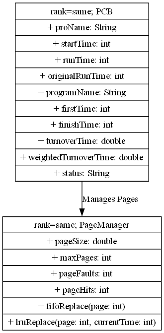

根据你的要求，以下是修改后的**系统设计**部分内容，经过格式化和整理，以符合学术论文的标准，并且更清晰地展示了系统设计的结构和流程。

### 五、系统设计

#### 5.1 设计流程

系统设计的整体流程可以分为以下几个主要步骤：

**5.1.1 进程管理**

**功能描述**：进程管理模块负责通过读取配置文件来创建进程控制块（PCB），管理进程的状态信息，并根据不同的调度算法（如FCFS和RR）调度进程。
**实现方式**：每个进程的相关信息（如进程名称、运行时间、开始时间等）会存储在进程控制块（PCB）中。通过调度算法对进程进行排序与管理。

**5.1.2 调度算法**

**FCFS（先来先服务）**：此算法根据进程的到达时间顺序进行调度。系统会按进程的到达时间将进程排序，先到的先执行。
**RR（时间片轮转）**：该算法将系统时间划分为若干个时间片，每个进程在一个时间片内运行，若进程在时间片内未完成，则将其放回就绪队列等待下次调度。

**5.1.3 页面替换策略**

**FIFO（先进先出）**：该策略按照页面进入内存的顺序进行替换，最早进入内存的页面会最先被替换出内存。
**LRU（最少使用）**：该策略根据页面的使用历史来进行替换，最久未被访问的页面会最先被替换。

**5.1.4 输入输出模块**

**功能描述**：系统通过读取配置文件来获取系统的初始状态，并进行输入输出操作。例如，读取 `process.txt`、`run.txt` 和 `program.txt` 文件来管理系统的配置数据，以及输出调度结果和页面替换日志。

#### 5.2 类图

为了更清晰地展示系统的设计结构和各模块之间的关系，以下是系统的类图。该类图使用 PlantUML 语法进行绘制，展示了各个类及其主要属性和方法，以及它们之间的关系。

#### 5.3 类图解释

1. **PCB类**：
    
	`proName`：进程名称。
    `startTime`：进程的开始时间。
    `runTime`：进程的运行时间。
    `originalRunTime`：进程的原始运行时间。
    `programName`：对应的程序名称。
    `firstTime`：进程第一次运行的时间。
    `finishTime`：进程完成的时间。
    `turnoverTime`：周转时间（从进程开始到完成的时间）。
    `weightedTurnoverTime`：加权周转时间（周转时间与进程优先级的比例）。
    `status`：进程的当前状态（如“就绪”、“运行”、“阻塞”等）。
    `visitList`：记录页面访问的列表。
2. **PageManager类**：
    
    `pageSize`：页面的大小。
    `maxPages`：系统可以管理的最大页面数。
    `fifoPages`：使用队列管理FIFO页面替换算法中的页面顺序。
    `lruPages`：使用 `LinkedHashMap` 管理LRU页面替换算法中的页面顺序。
    `log`：记录页面替换操作的日志。
    `pageFaults`：记录页面错误的次数。
    `pageHits`：记录页面命中的次数。
    `fifoReplace(page)`：执行FIFO页面替换操作。
    `lruReplace(page, currentTime)`：执行LRU页面替换操作。
3. **关系**：
    
    `PCB` 类管理进程的状态和相关信息，并与 `PageManager` 类交互，负责页面管理和替换操作。
    `PageManager` 类负责根据进程访问的页面来执行页面替换，并记录相关的日志。

#### 5.4 设计思路

**模块化设计**：系统的各个模块（如进程管理、调度算法、页面管理等）分开设计并独立实现。每个模块之间通过接口进行交互，确保了系统的扩展性和维护性。
**数据结构设计**：使用链表、队列和哈希映射等数据结构实现调度和页面管理算法，确保操作的高效性。
**算法优化**：调度算法和页面替换策略根据实际需求进行了优化，能够有效地提升系统的运行效率。

### 小结

本章节详细描述了系统的设计流程，包括进程管理、调度算法、页面替换策略、输入输出模块的设计思路。同时，类图展示了系统的主要类及其关系，并通过 PlantUML 工具生成了系统的类图。通过模块化和合理的设计，系统能够高效地完成各项任务，具有较高的可维护性和扩展性。