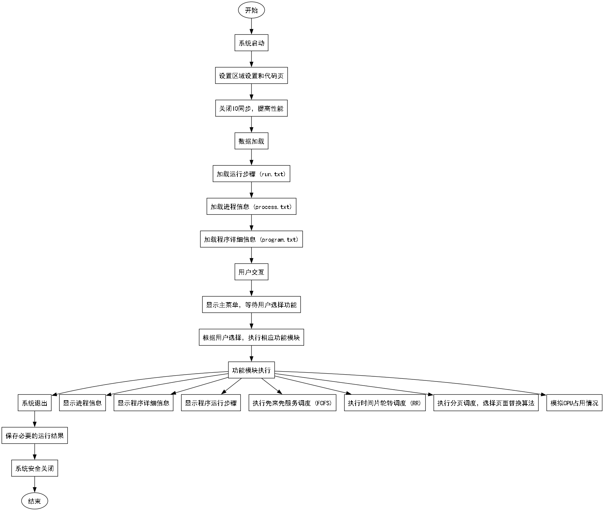

# 课程设计报告

## 一、课设目的

本课程设计旨在通过实际编程实现操作系统中关键的进程调度与内存管理机制，加深对操作系统原理的理解。具体目标包括：

### 1.1. 理解进程调度算法

通过实现先来先服务（FCFS）和时间片轮转（RR）等调度算法，掌握不同调度策略的优缺点及其适用场景。

### 1.2. 掌握分页内存管理

通过实现先进先出（FIFO）和最近最少使用（LRU）页面替换算法，理解内存分页机制及页面置换策略对系统性能的影响。

### 1.3. 提升编程能力

使用C++语言进行系统级编程，熟练运用数据结构如队列、映射等，提升代码设计与实现能力。

### 1.4. 培养问题解决能力

在开发过程中识别并解决实际问题，如页面冲突、数据文件解析错误等，增强调试和优化能力。

## 二、课设题目

**基于C++的进程调度与分页管理系统设计与实现**

## 三、系统功能结构

### 3.1. 进程信息管理

#### 3.1.1. 功能描述

本模块用于管理和显示系统中已加载的进程信息。具体功能包括：

1. 显示已加载的进程信息。
2. 包括进程名称、创建时间、运行时间、优先级及程序备注等详细信息。

#### 3.1.2. 相关对象与函数

**类**：`PCB`

**属性**：

`pName`: `std::string` — 进程名称，用于标识不同进程。
`pRemark`: `std::string` — 关联的程序名称，指明进程所运行的程序。
`pStatus`: `std::string` — 进程当前状态，如等待、运行、完成等。
`createTime`: `int` — 进程创建的时间。
`runTime`: `int` — 进程的总运行时间。
`grade`: `int` — 进程的优先级，影响调度顺序。
`startTime`: `int` — 进程开始执行的时间。
`completeTime`: `int` — 进程完成执行的时间。
`turnoverTime`: `int` — 进程的周转时间，即完成时间减去创建时间。
`weightedTurnoverTime`: `double` — 带权周转时间，用于评估进程执行效率。
`originalRunTime`: `int` — 记录进程的原始运行时间，用于计算带权周转时间。

**函数**：

`display_process_info()`: 显示进程信息。

### 3.2. 程序详细信息管理

#### 3.2.1. 功能描述

本模块负责管理和显示系统中已加载的程序详细信息。具体功能包括：

1. 显示已加载的程序详细信息。
2. 包括程序名称及其包含的功能和大小等信息。

#### 3.2.2. 相关对象与函数

**类**：`Program`

**属性**：

`program_name`: `std::string` — 程序名称。
`functions`: `std::list<std::pair<std::string, double>>` — 程序包含的功能及其大小。
`size`: `int` — 程序大小。

**函数**：

`display_program_details()`: 显示程序详细信息。

### 3.3. 程序运行步骤展示

#### 3.3.1. 功能描述

本模块用于展示各程序的运行步骤及对应的运行时间。具体功能包括：

1. 显示各程序的运行步骤。
2. 显示每个步骤对应的运行时间。

#### 3.3.2. 相关对象与函数

**类**：`RunStep`

**属性**：

`time`: `int` — 步骤执行的时间。
`operation`: `std::string` — 步骤执行的操作。
`parameter`: `int` — 操作的参数。

**函数**：

`display_run_steps()`: 显示程序运行步骤。

### 3.4. 进程调度算法

#### 3.4.1. 功能描述

本模块实现两种进程调度算法：

1. **先来先服务调度（FCFS）**：按照进程的创建时间依次调度执行。
2. **时间片轮转调度（RR）**：为每个进程分配固定的时间片，轮流执行。

#### 3.4.2. 相关对象与函数

**类**：`Scheduler`

**方法**：

`fcfs_schedule()`: 实现先来先服务调度算法。
`rr_schedule(int time_quantum)`: 实现时间片轮转调度算法。

### 3.5. 分页调度

#### 3.5.1. 功能描述

本模块负责分页调度的各项功能，包括：

1. **页面大小设置**：用户可设置页面的大小（KB）和每个进程的最大页面数。
2. **页面替换算法选择**：支持FIFO和LRU两种页面替换策略。
3. **分页调度执行**：根据选择的替换算法，为各程序分配页面并记录页面命中与置换情况。

#### 3.5.2. 相关对象与函数

**类**：`PageManager`

**属性**：

`pageSize`: `double` — 页面大小，以KB为单位。
`maxPages`: `int` — 每个进程允许的最大页面数。
`fifoPages`: `std::queue<int>` — 用于FIFO页面替换的队列，记录页面的加载顺序。
`lruPages`: `std::unordered_map<int, int>` — 用于LRU页面替换的映射，记录每个页面的最近访问时间。
`log`: `std::vector<std::string>` — 记录页面操作日志，便于调试和分析。
`pageFaults`: `int` — 页面错误次数，即页面未命中需要替换的次数。
`pageHits`: `int` — 页面命中次数，即页面已在内存中，无需替换的次数。

**方法**：

`fifo_replace(int page)`: 实现FIFO页面替换策略。
`lru_replace(int page, int currentTime)`: 实现LRU页面替换策略。
`print_summary()`: 打印分页调度总结报告。

**函数**：

`configure_paging()`: 设置页面大小和最大页面数。
`execute_paging()`: 执行分页调度。

### 3.6. CPU占用情况模拟

#### 3.6.1. 功能描述

本模块用于模拟CPU的运行情况，展示各程序的执行过程和时间分配。具体功能包括：

1. 模拟CPU的运行情况。
2. 展示各程序的执行过程和时间分配。

#### 3.6.2. 相关对象与函数

**类**：`CPUSimulator`

**属性**：

`current_time`: `int` — 当前时间。
`queue`: `std::queue<PCB>` — 进程队列。

**方法**：

`simulate()`: 执行CPU占用情况的模拟。

**函数**：

`simulate_cpu_usage()`: 调用CPU模拟器进行模拟。

### 3.7. 退出程序

#### 3.7.1. 功能描述

本模块负责系统的安全退出操作，确保必要的运行结果得到保存。具体功能包括：

1. 安全退出系统。
2. 保存必要的运行结果。

#### 3.7.2. 相关对象与函数

**函数**：

`exit_system()`: 执行系统退出操作，保存运行结果并关闭程序。

### 3.8. 功能结构图

该图通过层级关系展示了系统的主要功能模块及其子功能，系统主菜单作为顶层节点，连接到各个功能模块，进一步细化子功能。


## 四、主要数据结构

### 4.1. PCB类（进程控制块）

```
class PCB {
public:
    std::string pName;               // 进程名称
    std::string pRemark;             // 程序名称
    std::string pStatus;             // 进程状态
    int createTime;                  // 创建时间
    int runTime;                     // 运行时间
    int grade;                       // 优先级
    int startTime;                   // 开始时间
    int completeTime;                // 完成时间
    int turnoverTime;                // 周转时间
    double weightedTurnoverTime;     // 带权周转时间
    int originalRunTime;             // 原始运行时间

    PCB(std::string name, int create, int runtime, int priority, std::string remark)
        : pName(name), createTime(create), runTime(runtime), grade(priority),
        pRemark(remark), pStatus("Waiting"), startTime(-1), completeTime(0),
        turnoverTime(0), weightedTurnoverTime(0.0), originalRunTime(runtime) {}
};
```

**说明**：

**pName**：进程名称，用于标识不同进程。
**pRemark**：关联的程序名称，指明进程所运行的程序。
**pStatus**：进程当前状态，如等待、运行、完成等。
**createTime**：进程创建的时间。
**runTime**：进程的总运行时间。
**grade**：进程的优先级，影响调度顺序。
**startTime**：进程开始执行的时间。
**completeTime**：进程完成执行的时间。
**turnoverTime**：进程的周转时间，即完成时间减去创建时间。
**weightedTurnoverTime**：带权周转时间，用于评估进程执行效率。
**originalRunTime**：记录进程的原始运行时间，用于计算带权周转时间。

### 4.2. PageManager类（页面管理器）

```
class PageManager {
public:
    double pageSize;
    int maxPages;
    std::queue<int> fifoPages;                     // FIFO队列
    std::unordered_map<int, int> lruPages;        // LRU映射：页面及其最近访问时间
    std::vector<std::string> log;                  // 页面操作日志
    int pageFaults = 0;
    int pageHits = 0;

    PageManager(double size, int max) : pageSize(size), maxPages(max) {}

    // FIFO替换策略
    void fifoReplace(int page) {
        // 检查页面是否在内存中
        std::vector<int> fifoVec = queueToVector(fifoPages);
        if (std::find(fifoVec.begin(), fifoVec.end(), page) != fifoVec.end()) {
            pageHits++;
            log.push_back("FIFO: Page " + std::to_string(page) + " already in memory (hit).");
            return;
        }
        pageFaults++;
        if (fifoPages.size() >= maxPages) {
            if (fifoPages.empty()) {
                std::cerr << "Error: FIFO queue is empty, cannot remove page." << std::endl;
                log.push_back("FIFO: Error FIFO queue is empty, cannot remove page.");
                return;
            }
            int removed = fifoPages.front();
            fifoPages.pop();
            log.push_back("FIFO: Page " + std::to_string(removed) + " removed.");
        }
        fifoPages.push(page);
        log.push_back("FIFO: Page " + std::to_string(page) + " added.");
    }

    // LRU替换策略
    void lruReplace(int page, int currentTime) {
        if (lruPages.find(page) != lruPages.end()) {
            pageHits++;
            lruPages[page] = currentTime;
            log.push_back("LRU: Page " + std::to_string(page) + " already in memory (hit).");
            return;
        }
        pageFaults++;
        if (lruPages.size() >= maxPages) {
            int lruPage = getLRUPage();
            if (lruPage == -1) {
                std::cerr << "Error: No LRU page found to remove." << std::endl;
                log.push_back("LRU: Error No LRU page found to remove.");
                return;
            }
            lruPages.erase(lruPage);
            log.push_back("LRU: Page " + std::to_string(lruPage) + " removed.");
        }
        lruPages[page] = currentTime;
        log.push_back("LRU: Page " + std::to_string(page) + " added.");
    }

    void printSummary() {
        std::cout << "Page Faults: " << pageFaults << std::endl;
        std::cout << "Page Hits: " << pageHits << std::endl;
        if (pageHits + pageFaults > 0) {
            std::cout << "Hit Rate: " << std::fixed << std::setprecision(2) 
                      << ((static_cast<double>(pageHits) / (pageHits + pageFaults)) * 100) << "%" << std::endl;
        }
    }

private:
    // 将队列转换为向量
    std::vector<int> queueToVector(std::queue<int> q) {
        std::vector<int> result;
        while (!q.empty()) {
            result.push_back(q.front());
            q.pop();
        }
        return result;
    }

    // 获取最久未使用的页面
    int getLRUPage() {
        int lruPage = -1;
        int minTime = INT32_MAX;
        for (const auto& entry : lruPages) {
            if (entry.second < minTime) {
                minTime = entry.second;
                lruPage = entry.first;
            }
        }
        return lruPage;
    }
};
```

**说明**：

**pageSize**：页面大小，以KB为单位。
**maxPages**：每个进程允许的最大页面数。
**fifoPages**：用于FIFO页面替换的队列，记录页面的加载顺序。
**lruPages**：用于LRU页面替换的映射，记录每个页面的最近访问时间。
**log**：记录页面操作日志，便于调试和分析。
**pageFaults**：页面错误次数，即页面未命中需要替换的次数。
**pageHits**：页面命中次数，即页面已在内存中，无需替换的次数。

### 4.3. 其他数据结构

**std::vector processList**：存储所有加载的进程信息。
**std::map<std::string, int> runTimes**：记录每个程序的最大运行时间。
**std::map<std::string, std::map<std::string, double>> programs**：记录每个程序包含的功能及其大小。

## 五、系统设计

### 5.1. 类图

**PCB类**：表示进程控制块，包含进程的基本信息。
**PageManager类**：负责页面管理，包含FIFO和LRU页面替换策略。
**主函数**：负责加载数据文件、用户交互以及调用各功能模块。


### 5.2. 活动图

主要活动流程如下：

1. **系统启动:** 设置区域设置和代码页（Windows环境）。关闭IO同步，提高性能。
2. **数据加载:** 加载运行步骤（`run.txt`）。加载进程信息（`process.txt`）。加载程序详细信息（`program.txt`）。
3. **用户交互:** 显示主菜单，等待用户选择功能。根据用户选择，执行相应功能模块。
4. **功能模块执行:**
显示进程信息、程序详细信息、运行步骤。执行FCFS或RR调度算法。执行分页调度，选择页面替换算法。模拟CPU占用情况。
5. **系统退出:** 用户选择退出，系统安全关闭。



### 5.3. 功能实现流程

以分页调度功能为例，流程如下：

1. **计算页面需求:** 根据每个程序的功能大小，计算所需页面数。
2. **用户设置:** 用户输入每个进程的最大页面数。用户选择页面替换算法（FIFO或LRU）。
3. **页面替换:** 遍历每个程序的页面需求，依次调用对应的页面替换策略。记录页面命中和页面错误次数，生成日志。
4. **结果输出:** 打印页面置换日志。打印分页调度总结报告。


## 六、运行结果展示与分析

### 6.1. 分页调度执行日志


### 6.2. 分析

#### 6.2.1. 分页调度

**执行日志分析**：


**改进建议**：

为了提高页面命中率，应确保每个进程的页面编号独立管理，避免不同进程间的页面冲突。此外，可以优化页面替换算法，实现更智能的页面管理策略。

#### 6.2.2. 时间片轮转调度（RR）分析

**执行日志分析**：


时间片轮转调度（RR）在日志中展示了各个进程按照时间片2ms轮流执行的过程。具体分析如下：
**进程轮转执行**：所有进程按照队列顺序被依次调度，每次执行2ms。每个进程的剩余时间在每次执行后递减，直到运行时间耗尽。
**进程完成情况**：进程按照时间片轮转顺序执行，确保了调度的公平性。带权周转时间显示`AProgram`的带权周转时间最低，说明其完成较快。

**结果分析**：

**公平性**：RR调度保证了每个进程在合理的时间内获得CPU执行机会，避免了进程饿死的情况。
**响应时间**：由于时间片固定，进程的响应时间较为均衡，但较长的时间片可能导致某些进程的响应延迟增加。
 **带权周转时间**：带权周转时间反映了进程完成效率，`AProgram`的带权周转时间最低，说明其完成较快。

#### 6.2.3. 先来先服务调度（FCFS）分析

#### 6.2.3.1. 执行结果概述

在本次课程设计中，先来先服务调度算法（FCFS）已成功执行，调度结果已保存至 `result.txt` 文件中。以下为调度结果的具体数据：


#### 6.2.3.2. 性能评价

**优点：**

1. **实现简单**：FCFS算法易于实现和理解，适用于负载较轻或进程长度相近的系统。

2. **公平性**：所有进程按照到达顺序得到处理，避免了某些进程被长期忽视的情况。

**缺点：**

1. **队头阻塞效应**：如果队列前端有一个长作业，后续所有短作业都必须等待其完成，导致整体系统响应时间增加。

2. **不适用于实时系统**：由于缺乏响应时间保证，FCFS不适合需要快速响应的实时系统。

**具体分析基于本次执行结果：**

**AProgram** 完成时间与运行时间相等，带权周转时间为1.00，表现出良好的执行效率。

**后续进程（BProgram、CProgram、DProgram、EProgram）** 的周转时间显著高于其运行时间，带权周转时间较高，特别是 **EProgram** 达到了5.59。这表明，尽管 **AProgram** 得到了及时的处理，但后续进程由于前面进程的存在，导致其等待时间显著增加。

**平均周转时间** 为123.6ms，**平均带权周转时间** 为3.92，较高的带权周转时间表明系统的调度效率有待提升，尤其是在处理长度不一的进程时，FCFS表现出较大的劣势。

## 七、课程设计中遇到的问题及解决方法

### 7.1. 问题：字符编码问题导致程序名称和函数乱码

**问题描述**：

原始`run.txt`和`program.txt`文件中包含中文内容，导致在文件读取阶段，程序无法正确解析字符串。

**解决方法**：

1. **统一文件编码**：将所有数据文件统一保存为**UTF-8**编码，确保程序能够正确读取和解析中文字符。
2. **优化文件解析逻辑**：通过动态空格分割（使用`std::istringstream`）代替固定字节偏移解析，增强对不同格式输入文件的兼容性。
3. **移除多余的编码处理**：确保代码中处理BOM（Byte Order Mark）的逻辑正确无误，避免由于BOM引起的解析错误。

### 7.2. 问题：逻辑实现中的队列管理复杂度

**问题描述**：

在实现时间片轮转调度（RR）时，如何高效管理进程队列及剩余时间，成为实现的关键问题。

**解决方法**：

1. **使用高效数据结构**：采用`std::queue`实现进程队列，确保进程的先进先出（FIFO）调度顺序。
2. **使用映射记录剩余时间**：使用`std::unordered_map`保存每个进程的剩余时间，以O(1)的复杂度动态更新每个进程的运行状态，优化了调度性能。
3. **合理更新调度状态**：在每次执行完一个时间片后，及时更新进程的剩余时间，并根据剩余时间决定是否将进程重新入队。

### 7.3. 问题：结果数据不一致

**问题描述**：早期代码在RR调度中未正确记录`startTime`，导致计算结果偏差。

**解决方法**：

1. **正确记录`startTime`**：在每个进程首次被调度执行时，检查并更新其`startTime`，确保开始时间的准确记录。
2. **保证计算逻辑的完整性**：在进程完成时，正确计算`completeTime`、`turnoverTime`和`weightedTurnoverTime`，确保结果数据的一致性和准确性。

### 7.4. 问题：处理中英文混合的TXT文件解析错误

**问题描述**：

中文字符显示为乱码，如“程序名 ProgramA”被错误显示为“绋嬪簭鍚?ProgramA”。
解析运行步骤行失败，提示“在程序名之前发现运行步骤”等警告。
使用了已弃用的`std::codecvt_utf8`，在C++17中被标记为弃用，导致编译警告或错误。
类型转换警告（C2444），可能是从`double`转换为`int`的隐式转换导致。

**解决方法**：

1. **字符编码统一**：将`run.txt`和`program.txt`文件的编码统一为英文，避免因中文字符导致的编码解析问题。确保所有数据文件保存为**UTF-8**编码，避免不同编码格式引起的乱码。
2. **文件解析逻辑优化**：优化文件解析逻辑，采用动态空格分割（使用`std::istringstream`），确保不同格式的输入文件能被正确解析。增强错误处理机制，跳过格式不正确的行，并输出相应的警告信息，避免程序因解析错误而中断。
3. **移除已弃用功能**：移除对已弃用的`std::codecvt_utf8`的依赖，避免因使用已弃用功能导致的编译警告或错误。
4. **类型转换安全性**：修正类型转换问题，确保在从`double`转换为`int`时进行显式转换，避免隐式转换带来的警告。在需要时，使用`static_cast<int>(double_value)`进行类型转换，提高代码的安全性和可读性。
5. **代码结构调整**：确保在`main`函数的`switch`语句中，`case`内的变量声明被适当作用域控制，避免作用域冲突。在`case 6`中使用花括号`{}`创建新的作用域，避免变量声明冲突。

### 7.5. 问题：页面编号冲突导致页面命中率异常

**问题描述**：

不同程序使用相同的页面编号（如多个程序都使用`page 0`），导致页面在全局范围内共享，影响页面命中率。

**解决方法**：

1. **独立管理每个进程的页面表**：修改`PageManager`类，使其为每个进程维护独立的页面表和页面替换策略。使用`std::unordered_map<std::string, std::queue<int>> fifoPagesMap`为每个进程维护独立的FIFO队列。使用`std::unordered_map<std::string, std::unordered_map<int, int>> lruPagesMap`为每个进程维护独立的LRU映射。
2. **确保页面编号独立**：在页面替换函数`fifoReplace`和`lruReplace`中，增加`processName`参数，确保操作的是指定进程的页面表。确保每个进程的页面编号在其独立的页面表中管理，避免不同进程的页面编号冲突。

### 7.6. 问题：页面命中率计算错误

**问题描述**：

由于全局页面管理导致不同程序的页面相互冲突，导致实际页面命中率与预期不符。

**解决方法**：

1. **独立管理页面表**：通过为每个进程独立管理页面表和页面替换策略，避免页面编号冲突，确保页面命中率的准确性。
2. **分开统计页面命中与错误**：在`PageManager`类中，增加独立的日志记录和统计机制，分别记录每个进程的页面命中和页面错误次数。
3. **优化页面替换算法**：进一步优化FIFO和LRU算法的实现，确保页面替换逻辑的正确性和高效性。

## 八、设计感想

本次课程设计通过实现进程调度与分页管理系统，加深了我对操作系统核心概念的理解。以下是我的几点感想：

### 8.1. 理论与实践结合

理论知识通过编程实践得到了具体应用，深化了对调度算法和内存管理机制的理解。

### 8.2. 编程技能提升

在设计和实现过程中，熟练运用了C++的面向对象编程技巧，尤其是类的设计与数据结构的应用。

### 8.3. 问题解决能力增强

遇到页面编号冲突和数据解析错误等问题，通过分析和调整代码结构，学会了有效的调试和优化方法。

### 8.4. 系统设计思维

学会了从整体到局部的系统设计思维，合理分配各模块的职责，提升了系统的可维护性和扩展性。

### 8.5. 团队合作与沟通

虽然本次设计是个人完成，但在遇到复杂问题时，参考相关资料和他人经验，体会到了团队合作的重要性。

### 8.6. 时间管理

通过分阶段完成各功能模块，掌握了项目管理和时间分配的重要性，确保了课程设计的顺利完成。

