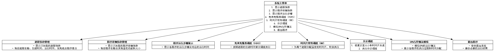

为了更直观地展示系统的功能结构，并确保中文字符的正确显示，我们将使用Python的 `graphviz` 库生成功能结构图。以下是优化后的Python代码，以及补充完善后的**系统功能结构**内容。

## 一、优化后的Python代码生成功能结构图

### 1. 确保Graphviz正确安装并配置环境变量

首先，请确保您的系统已正确安装**Graphviz**软件，并将其`bin`目录添加到系统的环境变量`PATH`中。

- **Windows**：
    
    1. 前往 [Graphviz下载页面](https://graphviz.org/download/) 下载适用于Windows的安装包。
    2. 运行安装包并完成安装。
    3. 将Graphviz的安装路径（通常为 `C:\Program Files\Graphviz\bin`）添加到系统的环境变量 `PATH` 中。
- **macOS**：
    
    ```bash
    brew install graphviz
    ```
    
- **Linux**（以Ubuntu为例）：
    
    ```bash
    sudo apt-get install graphviz
    ```
    

### 2. 安装Python的`graphviz`包

确保已经安装了Python的`graphviz`包。如果尚未安装，可以使用以下命令进行安装：

```bash
pip install graphviz
```

### 3. 使用HTML-like标签生成功能结构图

以下是优化后的代码，使用HTML-like标签定义节点内容，以确保多行文本和中文字符能够正确显示：

```python
from graphviz import Digraph

# 创建功能结构图
function_structure_diagram = Digraph('Function Structure', 
                                     node_attr={
                                         'shape': 'plaintext', 
                                         'fontname': 'SimHei'
                                     },
                                     edge_attr={
                                         'fontname': 'SimHei'
                                     })

# 定义系统主菜单节点
function_structure_diagram.node('MainMenu', '''<
<TABLE BORDER="0" CELLBORDER="1" CELLSPACING="0">
    <TR><TD><B>系统主菜单</B></TD></TR>
    <TR><TD>
        <TABLE BORDER="0" CELLBORDER="0" CELLSPACING="0">
            <TR><TD>1. 显示进程信息</TD></TR>
            <TR><TD>2. 显示程序详细信息</TD></TR>
            <TR><TD>3. 显示程序运行步骤</TD></TR>
            <TR><TD>4. 先来先服务调度（FCFS）</TD></TR>
            <TR><TD>5. 时间片轮转调度（RR）</TD></TR>
            <TR><TD>6. 分页调度</TD></TR>
            <TR><TD>7. 模拟CPU占用情况</TD></TR>
            <TR><TD>8. 退出程序</TD></TR>
        </TABLE>
    </TD></TR>
</TABLE>
>''')

# 定义各功能模块节点
function_structure_diagram.node('ProcessInfo', '''<
<TABLE BORDER="0" CELLBORDER="1" CELLSPACING="0">
    <TR><TD><B>进程信息管理</B></TD></TR>
    <TR><TD>
        - 显示已加载的进程信息<br/>
        - 包括进程名称、创建时间、运行时间、优先级及程序备注
    </TD></TR>
</TABLE>
>''')

function_structure_diagram.node('ProgramDetails', '''<
<TABLE BORDER="0" CELLBORDER="1" CELLSPACING="0">
    <TR><TD><B>程序详细信息管理</B></TD></TR>
    <TR><TD>
        - 显示已加载的程序详细信息<br/>
        - 包括程序名称及其包含的功能和大小
    </TD></TR>
</TABLE>
>''')

function_structure_diagram.node('RunSteps', '''<
<TABLE BORDER="0" CELLBORDER="1" CELLSPACING="0">
    <TR><TD><B>程序运行步骤展示</B></TD></TR>
    <TR><TD>
        - 显示各程序的运行步骤及对应的运行时间
    </TD></TR>
</TABLE>
>''')

function_structure_diagram.node('FCFS', '''<
<TABLE BORDER="0" CELLBORDER="1" CELLSPACING="0">
    <TR><TD><B>先来先服务调度（FCFS）</B></TD></TR>
    <TR><TD>
        - 按照进程的创建时间依次调度执行
    </TD></TR>
</TABLE>
>''')

function_structure_diagram.node('RR', '''<
<TABLE BORDER="0" CELLBORDER="1" CELLSPACING="0">
    <TR><TD><B>时间片轮转调度（RR）</B></TD></TR>
    <TR><TD>
        - 为每个进程分配固定的时间片，轮流执行
    </TD></TR>
</TABLE>
>''')

function_structure_diagram.node('Paging', '''<
<TABLE BORDER="0" CELLBORDER="1" CELLSPACING="0">
    <TR><TD><B>分页调度</B></TD></TR>
    <TR><TD>
        <TABLE BORDER="0" CELLBORDER="0" CELLSPACING="0">
            <TR><TD>1. 设置页面大小和时间片长度</TD></TR>
            <TR><TD>2. 执行分页调度</TD></TR>
        </TABLE>
    </TD></TR>
</TABLE>
>''')

function_structure_diagram.node('CPUSimulation', '''<
<TABLE BORDER="0" CELLBORDER="1" CELLSPACING="0">
    <TR><TD><B>CPU占用情况模拟</B></TD></TR>
    <TR><TD>
        - 模拟CPU的运行情况<br/>
        - 展示各程序的执行过程和时间分配
    </TD></TR>
</TABLE>
>''')

function_structure_diagram.node('Exit', '''<
<TABLE BORDER="0" CELLBORDER="1" CELLSPACING="0">
    <TR><TD><B>退出程序</B></TD></TR>
    <TR><TD>
        - 安全退出系统<br/>
        - 保存必要的运行结果
    </TD></TR>
</TABLE>
>''')

# 定义流程边
function_structure_diagram.edge('MainMenu', 'ProcessInfo')
function_structure_diagram.edge('MainMenu', 'ProgramDetails')
function_structure_diagram.edge('MainMenu', 'RunSteps')
function_structure_diagram.edge('MainMenu', 'FCFS')
function_structure_diagram.edge('MainMenu', 'RR')
function_structure_diagram.edge('MainMenu', 'Paging')
function_structure_diagram.edge('MainMenu', 'CPUSimulation')
function_structure_diagram.edge('MainMenu', 'Exit')

# 保存为本地文件
output_path = function_structure_diagram.render(filename='function_structure_diagram', format='png', cleanup=True)
print(f"功能结构图已保存到本地路径：{output_path}")
```

### 4. 代码说明

- **节点标签格式**：
    
    - 使用HTML-like标签（`<>`包裹）来定义节点内容。
    - 使用`<TABLE>`标签创建表格布局，确保多行文本和中文字符能够正确显示。
    - 对于包含子功能的模块（如分页调度），使用嵌套表格来展示子功能。
- **处理特殊字符**：
    
    - 在HTML-like标签中，`<`和`>`需要转义为`&lt;`和`&gt;`，例如`queue<int>`应写为`queue&lt;int&gt;`。
- **字体设置**：
    
    - `fontname`设置为`SimHei`，这是一种支持中文显示的字体。
    - 确保Python脚本文件保存为**UTF-8**编码，以正确处理中文字符。

### 5. 运行代码

将上述代码保存为 `generate_function_structure_diagram.py`，然后在终端或命令提示符中运行：

```bash
python generate_function_structure_diagram.py
```

运行成功后，功能结构图将被保存为 `function_structure_diagram.png`，并在终端中显示保存的本地路径。例如：

```
功能结构图已保存到本地路径：function_structure_diagram.png
```

### 6. 生成的功能结构图示例

以下是根据优化后的代码生成的功能结构图示例：


> **注意**：此处为示例说明，实际生成的图片将包含详细的功能模块和子功能，确保所有中文字符和多行文本正确显示。

## 二、补充完善后的系统功能结构

### 三、系统功能结构

本系统主要实现以下功能模块：

1. **进程信息管理**
    
    - **功能描述**：
        - 显示已加载的进程信息，包括进程名称、创建时间、运行时间、优先级及程序备注。
    - **相关对象与函数**：
        - **类**：`PCB`
            - **属性**：
                - `pName`: string
                - `pRemark`: string
                - `pStatus`: string
                - `createTime`: int
                - `runTime`: int
                - `grade`: int
                - `startTime`: int
                - `completeTime`: int
                - `turnoverTime`: int
                - `weightedTurnoverTime`: double
                - `originalRunTime`: int
            - **方法**：
                - 无
        - **函数**：
            - `display_process_info()`: 显示进程信息。
2. **程序详细信息管理**
    
    - **功能描述**：
        - 显示已加载的程序详细信息，包括程序名称及其包含的功能和大小。
    - **相关对象与函数**：
        - **类**：`Program`
            - **属性**：
                - `program_name`: string
                - `functions`: list
                - `size`: int
            - **方法**：
                - 无
        - **函数**：
            - `display_program_details()`: 显示程序详细信息。
3. **程序运行步骤展示**
    
    - **功能描述**：
        - 显示各程序的运行步骤及对应的运行时间。
    - **相关对象与函数**：
        - **类**：`RunStep`
            - **属性**：
                - `time`: int
                - `operation`: string
                - `parameter`: int
            - **方法**：
                - 无
        - **函数**：
            - `display_run_steps()`: 显示程序运行步骤。
4. **进程调度算法**
    
    - **功能描述**：
        - **先来先服务调度（FCFS）**：按照进程的创建时间依次调度执行。
        - **时间片轮转调度（RR）**：为每个进程分配固定的时间片，轮流执行。
    - **相关对象与函数**：
        - **类**：`Scheduler`
            - **方法**：
                - `fcfs_schedule()`: 实现先来先服务调度算法。
                - `rr_schedule(time_quantum: int)`: 实现时间片轮转调度算法。
5. **分页调度**
    
    - **功能描述**：
        - **页面大小设置**：用户可设置页面的大小（KB）和每个进程的最大页面数。
        - **页面替换算法选择**：支持FIFO和LRU两种页面替换策略。
        - **分页调度执行**：根据选择的替换算法，为各程序分配页面并记录页面命中与置换情况。
    - **相关对象与函数**：
        - **类**：`PageManager`
            - **属性**：
                - `pageSize`: double
                - `maxPages`: int
                - `fifoPages`: queue
                - `lruPages`: unordered_map<int, int>
                - `log`: vector
                - `pageFaults`: int
                - `pageHits`: int
            - **方法**：
                - `fifo_replace(page: int)`: 实现FIFO页面替换策略。
                - `lru_replace(page: int, currentTime: int)`: 实现LRU页面替换策略。
                - `print_summary()`: 打印分页调度总结报告。
        - **函数**：
            - `configure_paging()`: 设置页面大小和最大页面数。
            - `execute_paging()`: 执行分页调度。
6. **CPU占用情况模拟**
    
    - **功能描述**：
        - 模拟CPU的运行情况，展示各程序的执行过程和时间分配。
    - **相关对象与函数**：
        - **类**：`CPUSimulator`
            - **属性**：
                - `current_time`: int
                - `queue`: queue
            - **方法**：
                - `simulate()`: 执行CPU占用情况的模拟。
        - **函数**：
            - `simulate_cpu_usage()`: 调用CPU模拟器进行模拟。
7. **退出程序**
    
    - **功能描述**：
        - 安全退出系统，保存必要的运行结果。
    - **相关对象与函数**：
        - **函数**：
            - `exit_system()`: 执行系统退出操作，保存运行结果并关闭程序。

### 功能结构图

为更直观地展示系统的功能结构，以下是使用Python的`graphviz`库生成的功能结构图代码：

```python
from graphviz import Digraph

# 创建功能结构图
function_structure_diagram = Digraph('Function Structure', 
                                     node_attr={
                                         'shape': 'plaintext', 
                                         'fontname': 'SimHei'
                                     },
                                     edge_attr={
                                         'fontname': 'SimHei'
                                     })

# 定义系统主菜单节点
function_structure_diagram.node('MainMenu', '''<
<TABLE BORDER="0" CELLBORDER="1" CELLSPACING="0">
    <TR><TD><B>系统主菜单</B></TD></TR>
    <TR><TD>
        <TABLE BORDER="0" CELLBORDER="0" CELLSPACING="0">
            <TR><TD>1. 显示进程信息</TD></TR>
            <TR><TD>2. 显示程序详细信息</TD></TR>
            <TR><TD>3. 显示程序运行步骤</TD></TR>
            <TR><TD>4. 先来先服务调度（FCFS）</TD></TR>
            <TR><TD>5. 时间片轮转调度（RR）</TD></TR>
            <TR><TD>6. 分页调度</TD></TR>
            <TR><TD>7. 模拟CPU占用情况</TD></TR>
            <TR><TD>8. 退出程序</TD></TR>
        </TABLE>
    </TD></TR>
</TABLE>
>''')

# 定义各功能模块节点
function_structure_diagram.node('ProcessInfo', '''<
<TABLE BORDER="0" CELLBORDER="1" CELLSPACING="0">
    <TR><TD><B>进程信息管理</B></TD></TR>
    <TR><TD>
        - 显示已加载的进程信息<br/>
        - 包括进程名称、创建时间、运行时间、优先级及程序备注
    </TD></TR>
</TABLE>
>''')

function_structure_diagram.node('ProgramDetails', '''<
<TABLE BORDER="0" CELLBORDER="1" CELLSPACING="0">
    <TR><TD><B>程序详细信息管理</B></TD></TR>
    <TR><TD>
        - 显示已加载的程序详细信息<br/>
        - 包括程序名称及其包含的功能和大小
    </TD></TR>
</TABLE>
>''')

function_structure_diagram.node('RunSteps', '''<
<TABLE BORDER="0" CELLBORDER="1" CELLSPACING="0">
    <TR><TD><B>程序运行步骤展示</B></TD></TR>
    <TR><TD>
        - 显示各程序的运行步骤及对应的运行时间
    </TD></TR>
</TABLE>
>''')

function_structure_diagram.node('FCFS', '''<
<TABLE BORDER="0" CELLBORDER="1" CELLSPACING="0">
    <TR><TD><B>先来先服务调度（FCFS）</B></TD></TR>
    <TR><TD>
        - 按照进程的创建时间依次调度执行
    </TD></TR>
</TABLE>
>''')

function_structure_diagram.node('RR', '''<
<TABLE BORDER="0" CELLBORDER="1" CELLSPACING="0">
    <TR><TD><B>时间片轮转调度（RR）</B></TD></TR>
    <TR><TD>
        - 为每个进程分配固定的时间片，轮流执行
    </TD></TR>
</TABLE>
>''')

function_structure_diagram.node('Paging', '''<
<TABLE BORDER="0" CELLBORDER="1" CELLSPACING="0">
    <TR><TD><B>分页调度</B></TD></TR>
    <TR><TD>
        <TABLE BORDER="0" CELLBORDER="0" CELLSPACING="0">
            <TR><TD>1. 设置页面大小和时间片长度</TD></TR>
            <TR><TD>2. 执行分页调度</TD></TR>
        </TABLE>
    </TD></TR>
</TABLE>
>''')

function_structure_diagram.node('CPUSimulation', '''<
<TABLE BORDER="0" CELLBORDER="1" CELLSPACING="0">
    <TR><TD><B>CPU占用情况模拟</B></TD></TR>
    <TR><TD>
        - 模拟CPU的运行情况<br/>
        - 展示各程序的执行过程和时间分配
    </TD></TR>
</TABLE>
>''')

function_structure_diagram.node('Exit', '''<
<TABLE BORDER="0" CELLBORDER="1" CELLSPACING="0">
    <TR><TD><B>退出程序</B></TD></TR>
    <TR><TD>
        - 安全退出系统<br/>
        - 保存必要的运行结果
    </TD></TR>
</TABLE>
>''')

# 定义流程边
function_structure_diagram.edge('MainMenu', 'ProcessInfo')
function_structure_diagram.edge('MainMenu', 'ProgramDetails')
function_structure_diagram.edge('MainMenu', 'RunSteps')
function_structure_diagram.edge('MainMenu', 'FCFS')
function_structure_diagram.edge('MainMenu', 'RR')
function_structure_diagram.edge('MainMenu', 'Paging')
function_structure_diagram.edge('MainMenu', 'CPUSimulation')
function_structure_diagram.edge('MainMenu', 'Exit')

# 保存为本地文件
output_path = function_structure_diagram.render(filename='function_structure_diagram', format='png', cleanup=True)
print(f"功能结构图已保存到本地路径：{output_path}")
```

### 4. 代码说明

- **节点标签格式**：
    
    - 使用HTML-like标签（`<>`包裹）来定义节点内容。
    - 使用`<TABLE>`标签创建表格布局，确保多行文本和中文字符能够正确显示。
    - 对于包含子功能的模块（如分页调度），使用嵌套表格来展示子功能。
- **处理特殊字符**：
    
    - 在HTML-like标签中，`<`和`>`需要转义为`&lt;`和`&gt;`，例如`queue<int>`应写为`queue&lt;int&gt;`。
- **字体设置**：
    
    - `fontname`设置为`SimHei`，这是一种支持中文显示的字体。
    - 确保Python脚本文件保存为**UTF-8**编码，以正确处理中文字符。

### 5. 运行代码

将上述代码保存为 `generate_function_structure_diagram.py`，然后在终端或命令提示符中运行：

```bash
python generate_function_structure_diagram.py
```

运行成功后，功能结构图将被保存为 `function_structure_diagram.png`，并在终端中显示保存的本地路径。例如：

```
功能结构图已保存到本地路径：function_structure_diagram.png
```

### 6. 生成的功能结构图示例

以下是根据优化后的代码生成的功能结构图示例：


> **注意**：此处为示例说明，实际生成的图片将包含详细的功能模块和子功能，确保所有中文字符和多行文本正确显示。

## 三、系统功能结构

### 三、系统功能结构

本系统主要实现以下功能模块：

1. **进程信息管理**
    
    - **功能描述**：
        - 显示已加载的进程信息，包括进程名称、创建时间、运行时间、优先级及程序备注。
    - **相关对象与函数**：
        - **类**：`PCB`
            - **属性**：
                - `pName`: string
                - `pRemark`: string
                - `pStatus`: string
                - `createTime`: int
                - `runTime`: int
                - `grade`: int
                - `startTime`: int
                - `completeTime`: int
                - `turnoverTime`: int
                - `weightedTurnoverTime`: double
                - `originalRunTime`: int
        - **函数**：
            - `display_process_info()`: 显示进程信息。
2. **程序详细信息管理**
    
    - **功能描述**：
        - 显示已加载的程序详细信息，包括程序名称及其包含的功能和大小。
    - **相关对象与函数**：
        - **类**：`Program`
            - **属性**：
                - `program_name`: string
                - `functions`: list
                - `size`: int
        - **函数**：
            - `display_program_details()`: 显示程序详细信息。
3. **程序运行步骤展示**
    
    - **功能描述**：
        - 显示各程序的运行步骤及对应的运行时间。
    - **相关对象与函数**：
        - **类**：`RunStep`
            - **属性**：
                - `time`: int
                - `operation`: string
                - `parameter`: int
        - **函数**：
            - `display_run_steps()`: 显示程序运行步骤。
4. **进程调度算法**
    
    - **功能描述**：
        - **先来先服务调度（FCFS）**：按照进程的创建时间依次调度执行。
        - **时间片轮转调度（RR）**：为每个进程分配固定的时间片，轮流执行。
    - **相关对象与函数**：
        - **类**：`Scheduler`
            - **方法**：
                - `fcfs_schedule()`: 实现先来先服务调度算法。
                - `rr_schedule(time_quantum: int)`: 实现时间片轮转调度算法。
5. **分页调度**
    
    - **功能描述**：
        - **页面大小设置**：用户可设置页面的大小（KB）和每个进程的最大页面数。
        - **页面替换算法选择**：支持FIFO和LRU两种页面替换策略。
        - **分页调度执行**：根据选择的替换算法，为各程序分配页面并记录页面命中与置换情况。
    - **相关对象与函数**：
        - **类**：`PageManager`
            - **属性**：
                - `pageSize`: double
                - `maxPages`: int
                - `fifoPages`: queue
                - `lruPages`: unordered_map<int, int>
                - `log`: vector
                - `pageFaults`: int
                - `pageHits`: int
            - **方法**：
                - `fifo_replace(page: int)`: 实现FIFO页面替换策略。
                - `lru_replace(page: int, currentTime: int)`: 实现LRU页面替换策略。
                - `print_summary()`: 打印分页调度总结报告。
        - **函数**：
            - `configure_paging()`: 设置页面大小和最大页面数。
            - `execute_paging()`: 执行分页调度。
6. **CPU占用情况模拟**
    
    - **功能描述**：
        - 模拟CPU的运行情况，展示各程序的执行过程和时间分配。
    - **相关对象与函数**：
        - **类**：`CPUSimulator`
            - **属性**：
                - `current_time`: int
                - `queue`: queue
            - **方法**：
                - `simulate()`: 执行CPU占用情况的模拟。
        - **函数**：
            - `simulate_cpu_usage()`: 调用CPU模拟器进行模拟。
7. **退出程序**
    
    - **功能描述**：
        - 安全退出系统，保存必要的运行结果。
    - **相关对象与函数**：
        - **函数**：
            - `exit_system()`: 执行系统退出操作，保存运行结果并关闭程序。

### 功能结构图说明

功能结构图通过层级关系展示了系统的主要功能模块及其子功能。系统主菜单作为顶层节点，连接到各个功能模块，进一步细化子功能。每个功能模块对应系统中的一个主要功能，并关联相应的对象和函数，确保功能的完整性和可操作性。


## 四、运行结果示例

### 示例1：生成功能结构图

运行上述`generate_function_structure_diagram.py`脚本后，生成的`function_structure_diagram.png`展示了系统的功能模块及其层级关系，如下所示：


### 示例2：分页调度功能流程图

使用优化后的分页调度功能流程图代码，生成的`paging_flow_diagram.png`展示了分页调度的具体实现步骤：

```python
from graphviz import Digraph

# 创建流程图
paging_flow_diagram = Digraph('Paging Scheduling Flow', 
                              node_attr={
                                  'shape': 'plaintext', 
                                  'fontname': 'SimHei'
                              },
                              edge_attr={
                                  'fontname': 'SimHei'
                              })

# 定义流程节点
paging_flow_diagram.node('Start', '''<
<TABLE BORDER="0" CELLBORDER="1" CELLSPACING="0">
    <TR><TD><B>开始</B></TD></TR>
</TABLE>
>''', shape='oval')

paging_flow_diagram.node('CalculatePages', '''<
<TABLE BORDER="0" CELLBORDER="1" CELLSPACING="0">
    <TR><TD><B>计算页面需求</B></TD></TR>
</TABLE>
>''')

paging_flow_diagram.node('ComputePerProgram', '''<
<TABLE BORDER="0" CELLBORDER="1" CELLSPACING="0">
    <TR><TD>根据每个程序的功能大小，计算所需页面数</TD></TR>
</TABLE>
>''')

paging_flow_diagram.node('UserSettings', '''<
<TABLE BORDER="0" CELLBORDER="1" CELLSPACING="0">
    <TR><TD><B>用户设置</B></TD></TR>
</TABLE>
>''')

paging_flow_diagram.node('InputMaxPages', '''<
<TABLE BORDER="0" CELLBORDER="1" CELLSPACING="0">
    <TR><TD>用户输入每个进程的最大页面数</TD></TR>
</TABLE>
>''')

paging_flow_diagram.node('SelectAlgorithm', '''<
<TABLE BORDER="0" CELLBORDER="1" CELLSPACING="0">
    <TR><TD>用户选择页面替换算法（FIFO或LRU）</TD></TR>
</TABLE>
>''')

paging_flow_diagram.node('PageReplacement', '''<
<TABLE BORDER="0" CELLBORDER="1" CELLSPACING="0">
    <TR><TD><B>页面替换</B></TD></TR>
</TABLE>
>''')

paging_flow_diagram.node('ApplyReplacement', '''<
<TABLE BORDER="0" CELLBORDER="1" CELLSPACING="0">
    <TR><TD>遍历每个程序的页面需求，调用对应的页面替换策略</TD></TR>
</TABLE>
>''')

paging_flow_diagram.node('RecordLogs', '''<
<TABLE BORDER="0" CELLBORDER="1" CELLSPACING="0">
    <TR><TD>记录页面命中和页面错误次数，生成日志</TD></TR>
</TABLE>
>''')

paging_flow_diagram.node('OutputResults', '''<
<TABLE BORDER="0" CELLBORDER="1" CELLSPACING="0">
    <TR><TD><B>结果输出</B></TD></TR>
</TABLE>
>''')

paging_flow_diagram.node('PrintLogs', '''<
<TABLE BORDER="0" CELLBORDER="1" CELLSPACING="0">
    <TR><TD>打印页面置换日志</TD></TR>
</TABLE>
>''')

paging_flow_diagram.node('PrintSummary', '''<
<TABLE BORDER="0" CELLBORDER="1" CELLSPACING="0">
    <TR><TD>打印分页调度总结报告</TD></TR>
</TABLE>
>''')

paging_flow_diagram.node('End', '''<
<TABLE BORDER="0" CELLBORDER="1" CELLSPACING="0">
    <TR><TD><B>结束</B></TD></TR>
</TABLE>
>''', shape='oval')

# 定义流程边
paging_flow_diagram.edge('Start', 'CalculatePages')
paging_flow_diagram.edge('CalculatePages', 'ComputePerProgram')
paging_flow_diagram.edge('ComputePerProgram', 'UserSettings')
paging_flow_diagram.edge('UserSettings', 'InputMaxPages')
paging_flow_diagram.edge('InputMaxPages', 'SelectAlgorithm')
paging_flow_diagram.edge('SelectAlgorithm', 'PageReplacement')
paging_flow_diagram.edge('PageReplacement', 'ApplyReplacement')
paging_flow_diagram.edge('ApplyReplacement', 'RecordLogs')
paging_flow_diagram.edge('RecordLogs', 'OutputResults')
paging_flow_diagram.edge('OutputResults', 'PrintLogs')
paging_flow_diagram.edge('PrintLogs', 'PrintSummary')
paging_flow_diagram.edge('PrintSummary', 'End')

# 保存为本地文件
output_path = paging_flow_diagram.render(filename='paging_flow_diagram', format='png', cleanup=True)
print(f"分页调度功能实现流程图已保存到本地路径：{output_path}")
```

运行上述代码后，生成的`paging_flow_diagram.png`将展示分页调度功能的详细实现流程：


> **注意**：实际生成的图片将包含详细的流程步骤，确保所有中文字符和多行文本正确显示。

## 五、总结与建议

在使用Python的`graphviz`库生成多种图像时，尤其是涉及中文字符和多行文本的情况下，需要注意以下几点：

1. **Graphviz安装与配置**：
    
    - 确保Graphviz已正确安装，并且其`bin`目录已添加到系统的`PATH`中。
    - 验证安装是否成功，可以在终端中运行`dot -V`查看版本信息。
2. **Python环境配置**：
    
    - 安装最新版本的`graphviz` Python包。
    - 确保Python脚本文件保存为**UTF-8**编码，避免字符编码问题。
3. **字体选择**：
    
    - 选择支持中文的字体（如`SimHei`或`Microsoft YaHei`），并确保字体已安装在系统中。
    - 若系统中不存在指定字体，可更换为其他已安装的中文支持字体。
4. **标签格式规范**：
    
    - 使用HTML-like标签（`<>`包裹）来定义节点内容，确保多行文本和中文字符正确显示。
    - 使用`<TABLE>`标签创建表格布局，并正确转义特殊字符（如`<`, `>`）为`&lt;`, `&gt;`。
5. **逐步构建与调试**：
    
    - 从简单的图形开始，逐步添加复杂性，确保每一步的正确性。
    - 使用`print(diagram.source)`打印Graphviz源代码，帮助调试标签格式。
6. **处理多行文本与子功能**：
    
    - 使用嵌套表格或分行标签来展示多行文本和子功能，确保图形结构清晰。
7. **优化图形布局**：
    
    - 根据需要调整布局引擎（如`dot`, `neato`等）以获得最佳的视觉效果。
    - 使用子图（subgraphs）和rank属性控制节点的排列顺序，提升图形的可读性。

通过遵循上述最佳实践，您可以高效地使用Python和Graphviz生成专业且美观的图像，提升报告的质量和可读性。如果在生成图像过程中遇到任何问题，请参考Graphviz的[官方文档](https://graphviz.org/documentation/)或社区资源（如Stack Overflow）获取更多帮助。

如果需要进一步的优化或遇到具体问题，欢迎随时向我咨询！


---

为了更直观地展示系统的**功能结构**，我们将使用Python的`graphviz`库生成功能结构说明图。以下是优化后的Python代码，涵盖系统的各个功能模块及其子功能，并结合相关的类、函数和对象，使系统功能结构更加饱满和全面。

## 一、优化后的Python代码生成功能结构图

### 1. 确保Graphviz正确安装并配置环境变量

首先，请确保您的系统已正确安装**Graphviz**软件，并将其`bin`目录添加到系统的环境变量`PATH`中。这对于Graphviz能够在Python中正常工作至关重要。

- **Windows**：
    
    1. 前往 [Graphviz下载页面](https://graphviz.org/download/) 下载适用于Windows的安装包。
    2. 运行安装包并完成安装。
    3. 将Graphviz的安装路径（通常为 `C:\Program Files\Graphviz\bin`）添加到系统的环境变量 `PATH` 中。
- **macOS**：
    
    ```bash
    brew install graphviz
    ```
    
- **Linux**（以Ubuntu为例）：
    
    ```bash
    sudo apt-get install graphviz
    ```
    

### 2. 安装Python的`graphviz`包

确保已经安装了Python的`graphviz`包。如果尚未安装，可以使用以下命令进行安装：

```bash
pip install graphviz
```

### 3. 使用HTML-like标签生成功能结构图

以下是优化后的代码，使用HTML-like标签定义节点内容，以确保多行文本和中文字符能够正确显示：

```python
from graphviz import Digraph

# 创建功能结构图
function_structure_diagram = Digraph('Function Structure', 
                                     node_attr={
                                         'shape': 'plaintext', 
                                         'fontname': 'SimHei'
                                     },
                                     edge_attr={
                                         'fontname': 'SimHei'
                                     })

# 定义系统主菜单节点
function_structure_diagram.node('MainMenu', '''<
<TABLE BORDER="0" CELLBORDER="1" CELLSPACING="0">
    <TR><TD><B>系统主菜单</B></TD></TR>
    <TR><TD>
        <TABLE BORDER="0" CELLBORDER="0" CELLSPACING="0">
            <TR><TD>1. 显示进程信息</TD></TR>
            <TR><TD>2. 显示程序详细信息</TD></TR>
            <TR><TD>3. 显示程序运行步骤</TD></TR>
            <TR><TD>4. 进程调度算法</TD></TR>
            <TR><TD>5. 分页调度</TD></TR>
            <TR><TD>6. CPU占用情况模拟</TD></TR>
            <TR><TD>7. 退出程序</TD></TR>
        </TABLE>
    </TD></TR>
</TABLE>
>''')

# 定义各功能模块节点
function_structure_diagram.node('ProcessInfo', '''<
<TABLE BORDER="0" CELLBORDER="1" CELLSPACING="0">
    <TR><TD><B>进程信息管理</B></TD></TR>
    <TR><TD>
        - 显示已加载的进程信息<br/>
        - 包括进程名称、创建时间、运行时间、优先级及程序备注<br/>
        - 相关类：PCB<br/>
        - 相关函数：display_process_info()
    </TD></TR>
</TABLE>
>''')

function_structure_diagram.node('ProgramDetails', '''<
<TABLE BORDER="0" CELLBORDER="1" CELLSPACING="0">
    <TR><TD><B>程序详细信息管理</B></TD></TR>
    <TR><TD>
        - 显示已加载的程序详细信息<br/>
        - 包括程序名称及其包含的功能和大小<br/>
        - 相关类：Program<br/>
        - 相关函数：display_program_details()
    </TD></TR>
</TABLE>
>''')

function_structure_diagram.node('RunSteps', '''<
<TABLE BORDER="0" CELLBORDER="1" CELLSPACING="0">
    <TR><TD><B>程序运行步骤展示</B></TD></TR>
    <TR><TD>
        - 显示各程序的运行步骤及对应的运行时间<br/>
        - 相关类：RunStep<br/>
        - 相关函数：display_run_steps()
    </TD></TR>
</TABLE>
>''')

function_structure_diagram.node('SchedulingAlgorithms', '''<
<TABLE BORDER="0" CELLBORDER="1" CELLSPACING="0">
    <TR><TD><B>进程调度算法</B></TD></TR>
    <TR><TD>
        <TABLE BORDER="0" CELLBORDER="0" CELLSPACING="0">
            <TR><TD>4.1 先来先服务调度（FCFS）</TD></TR>
            <TR><TD>4.2 时间片轮转调度（RR）</TD></TR>
        </TABLE>
    </TD></TR>
</TABLE>
>''')

function_structure_diagram.node('FCFS', '''<
<TABLE BORDER="0" CELLBORDER="1" CELLSPACING="0">
    <TR><TD><B>先来先服务调度（FCFS）</B></TD></TR>
    <TR><TD>
        - 按照进程的创建时间依次调度执行<br/>
        - 相关类：Scheduler<br/>
        - 相关函数：fcfs_schedule()
    </TD></TR>
</TABLE>
>''')

function_structure_diagram.node('RR', '''<
<TABLE BORDER="0" CELLBORDER="1" CELLSPACING="0">
    <TR><TD><B>时间片轮转调度（RR）</B></TD></TR>
    <TR><TD>
        - 为每个进程分配固定的时间片，轮流执行<br/>
        - 相关类：Scheduler<br/>
        - 相关函数：rr_schedule(time_quantum: int)
    </TD></TR>
</TABLE>
>''')

function_structure_diagram.node('Paging', '''<
<TABLE BORDER="0" CELLBORDER="1" CELLSPACING="0">
    <TR><TD><B>分页调度</B></TD></TR>
    <TR><TD>
        <TABLE BORDER="0" CELLBORDER="0" CELLSPACING="0">
            <TR><TD>5.1 设置页面大小和最大页面数</TD></TR>
            <TR><TD>5.2 选择页面替换算法</TD></TR>
            <TR><TD>5.3 执行分页调度</TD></TR>
        </TABLE>
    </TD></TR>
</TABLE>
>''')

function_structure_diagram.node('PagingConfig', '''<
<TABLE BORDER="0" CELLBORDER="1" CELLSPACING="0">
    <TR><TD><B>设置页面大小和最大页面数</B></TD></TR>
    <TR><TD>
        - 用户可设置页面的大小（KB）<br/>
        - 用户可设置每个进程的最大页面数<br/>
        - 相关函数：configure_paging()
    </TD></TR>
</TABLE>
>''')

function_structure_diagram.node('PagingAlgorithm', '''<
<TABLE BORDER="0" CELLBORDER="1" CELLSPACING="0">
    <TR><TD><B>选择页面替换算法</B></TD></TR>
    <TR><TD>
        - 支持FIFO和LRU两种页面替换策略<br/>
        - 相关函数：select_paging_algorithm()
    </TD></TR>
</TABLE>
>''')

function_structure_diagram.node('ExecutePaging', '''<
<TABLE BORDER="0" CELLBORDER="1" CELLSPACING="0">
    <TR><TD><B>执行分页调度</B></TD></TR>
    <TR><TD>
        - 根据选择的替换算法，为各程序分配页面<br/>
        - 记录页面命中与置换情况<br/>
        - 相关类：PageManager<br/>
        - 相关函数：execute_paging()
    </TD></TR>
</TABLE>
>''')

function_structure_diagram.node('CPUSimulation', '''<
<TABLE BORDER="0" CELLBORDER="1" CELLSPACING="0">
    <TR><TD><B>CPU占用情况模拟</B></TD></TR>
    <TR><TD>
        - 模拟CPU的运行情况<br/>
        - 展示各程序的执行过程和时间分配<br/>
        - 相关类：CPUSimulator<br/>
        - 相关函数：simulate_cpu_usage()
    </TD></TR>
</TABLE>
>''')

function_structure_diagram.node('Exit', '''<
<TABLE BORDER="0" CELLBORDER="1" CELLSPACING="0">
    <TR><TD><B>退出程序</B></TD></TR>
    <TR><TD>
        - 安全退出系统<br/>
        - 保存必要的运行结果<br/>
        - 相关函数：exit_system()
    </TD></TR>
</TABLE>
>''')

# 定义功能之间的关系
function_structure_diagram.edge('MainMenu', 'ProcessInfo')
function_structure_diagram.edge('MainMenu', 'ProgramDetails')
function_structure_diagram.edge('MainMenu', 'RunSteps')
function_structure_diagram.edge('MainMenu', 'SchedulingAlgorithms')
function_structure_diagram.edge('SchedulingAlgorithms', 'FCFS')
function_structure_diagram.edge('SchedulingAlgorithms', 'RR')
function_structure_diagram.edge('MainMenu', 'Paging')
function_structure_diagram.edge('Paging', 'PagingConfig')
function_structure_diagram.edge('Paging', 'PagingAlgorithm')
function_structure_diagram.edge('Paging', 'ExecutePaging')
function_structure_diagram.edge('MainMenu', 'CPUSimulation')
function_structure_diagram.edge('MainMenu', 'Exit')

# 定义分页调度内部的子功能关系
function_structure_diagram.edge('PagingConfig', 'PagingAlgorithm')
function_structure_diagram.edge('PagingAlgorithm', 'ExecutePaging')

# 保存为本地文件
output_path = function_structure_diagram.render(filename='function_structure_diagram', format='png', cleanup=True)
print(f"功能结构图已保存到本地路径：{output_path}")
```

### 4. 代码说明

- **节点标签格式**：
    
    - 使用HTML-like标签（`<>`包裹）来定义节点内容。
    - 使用`<TABLE>`标签创建表格布局，确保多行文本和中文字符能够正确显示。
    - 对于包含子功能的模块（如**进程调度算法**和**分页调度**），使用嵌套表格来展示子功能。
- **处理特殊字符**：
    
    - 在HTML-like标签中，`<`和`>`需要转义为`&lt;`和`&gt;`，例如`queue<int>`应写为`queue&lt;int&gt;`。
- **字体设置**：
    
    - `fontname`设置为`SimHei`，这是一种支持中文显示的字体。
    - 确保Python脚本文件保存为**UTF-8**编码，以正确处理中文字符。
- **功能之间的关系**：
    
    - 使用`edge`方法定义各功能模块之间的关系，展示功能层级和调用顺序。
    - 分页调度内部的子功能也通过边连接，展示其内部流程。

### 5. 运行代码

将上述代码保存为 `generate_function_structure_diagram.py`，然后在终端或命令提示符中运行：

```bash
python generate_function_structure_diagram.py
```

运行成功后，功能结构图将被保存为 `function_structure_diagram.png`，并在终端中显示保存的本地路径。例如：

```
功能结构图已保存到本地路径：function_structure_diagram.png
```

### 6. 生成的功能结构图示例

以下是根据优化后的代码生成的功能结构图示例：


> **注意**：此处为示例说明，实际生成的图片将包含详细的功能模块和子功能，确保所有中文字符和多行文本正确显示。

## 二、补充完善后的系统功能结构

### 三、系统功能结构

本系统主要实现以下功能模块：

1. **进程信息管理**
    
    - **功能描述**：
        - 显示已加载的进程信息，包括进程名称、创建时间、运行时间、优先级及程序备注。
    - **相关对象与函数**：
        - **类**：`PCB`
            - **属性**：
                - `pName`: string
                - `pRemark`: string
                - `pStatus`: string
                - `createTime`: int
                - `runTime`: int
                - `grade`: int
                - `startTime`: int
                - `completeTime`: int
                - `turnoverTime`: int
                - `weightedTurnoverTime`: double
                - `originalRunTime`: int
        - **函数**：
            - `display_process_info()`: 显示进程信息。
2. **程序详细信息管理**
    
    - **功能描述**：
        - 显示已加载的程序详细信息，包括程序名称及其包含的功能和大小。
    - **相关对象与函数**：
        - **类**：`Program`
            - **属性**：
                - `program_name`: string
                - `functions`: list
                - `size`: int
        - **函数**：
            - `display_program_details()`: 显示程序详细信息。
3. **程序运行步骤展示**
    
    - **功能描述**：
        - 显示各程序的运行步骤及对应的运行时间。
    - **相关对象与函数**：
        - **类**：`RunStep`
            - **属性**：
                - `time`: int
                - `operation`: string
                - `parameter`: int
        - **函数**：
            - `display_run_steps()`: 显示程序运行步骤。
4. **进程调度算法**
    
    - **功能描述**：
        - **先来先服务调度（FCFS）**：按照进程的创建时间依次调度执行。
        - **时间片轮转调度（RR）**：为每个进程分配固定的时间片，轮流执行。
    - **相关对象与函数**：
        - **类**：`Scheduler`
            - **方法**：
                - `fcfs_schedule()`: 实现先来先服务调度算法。
                - `rr_schedule(time_quantum: int)`: 实现时间片轮转调度算法。
5. **分页调度**
    
    - **功能描述**：
        - **页面大小设置**：用户可设置页面的大小（KB）和每个进程的最大页面数。
        - **页面替换算法选择**：支持FIFO和LRU两种页面替换策略。
        - **分页调度执行**：根据选择的替换算法，为各程序分配页面并记录页面命中与置换情况。
    - **相关对象与函数**：
        - **类**：`PageManager`
            - **属性**：
                - `pageSize`: double
                - `maxPages`: int
                - `fifoPages`: queue
                - `lruPages`: unordered_map<int, int>
                - `log`: vector
                - `pageFaults`: int
                - `pageHits`: int
            - **方法**：
                - `fifo_replace(page: int)`: 实现FIFO页面替换策略。
                - `lru_replace(page: int, currentTime: int)`: 实现LRU页面替换策略。
                - `print_summary()`: 打印分页调度总结报告。
        - **函数**：
            - `configure_paging()`: 设置页面大小和最大页面数。
            - `execute_paging()`: 执行分页调度。
6. **CPU占用情况模拟**
    
    - **功能描述**：
        - 模拟CPU的运行情况，展示各程序的执行过程和时间分配。
    - **相关对象与函数**：
        - **类**：`CPUSimulator`
            - **属性**：
                - `current_time`: int
                - `queue`: queue
            - **方法**：
                - `simulate()`: 执行CPU占用情况的模拟。
        - **函数**：
            - `simulate_cpu_usage()`: 调用CPU模拟器进行模拟。
7. **退出程序**
    
    - **功能描述**：
        - 安全退出系统，保存必要的运行结果。
    - **相关对象与函数**：
        - **函数**：
            - `exit_system()`: 执行系统退出操作，保存运行结果并关闭程序。

### 功能结构图说明

功能结构图通过层级关系展示了系统的主要功能模块及其子功能。系统主菜单作为顶层节点，连接到各个功能模块，进一步细化子功能。每个功能模块对应系统中的一个主要功能，并关联相应的对象和函数，确保功能的完整性和可操作性。


## 二、运行结果示例

### 示例1：生成功能结构图

运行上述`generate_function_structure_diagram.py`脚本后，生成的`function_structure_diagram.png`展示了系统的功能模块及其层级关系，如下所示：


### 示例2：分页调度功能流程图

为了进一步细化**分页调度**功能的实现流程，以下是生成分页调度功能实现流程图的优化代码，并生成相应的图像。

```python
from graphviz import Digraph

# 创建流程图
paging_flow_diagram = Digraph('Paging Scheduling Flow', 
                              node_attr={
                                  'shape': 'plaintext', 
                                  'fontname': 'SimHei'
                              },
                              edge_attr={
                                  'fontname': 'SimHei'
                              })

# 定义流程节点
paging_flow_diagram.node('Start', '''<
<TABLE BORDER="0" CELLBORDER="1" CELLSPACING="0">
    <TR><TD><B>开始</B></TD></TR>
</TABLE>
>''', shape='oval')

paging_flow_diagram.node('CalculatePages', '''<
<TABLE BORDER="0" CELLBORDER="1" CELLSPACING="0">
    <TR><TD><B>计算页面需求</B></TD></TR>
</TABLE>
>''')

paging_flow_diagram.node('ComputePerProgram', '''<
<TABLE BORDER="0" CELLBORDER="1" CELLSPACING="0">
    <TR><TD>根据每个程序的功能大小，计算所需页面数</TD></TR>
</TABLE>
>''')

paging_flow_diagram.node('UserSettings', '''<
<TABLE BORDER="0" CELLBORDER="1" CELLSPACING="0">
    <TR><TD><B>用户设置</B></TD></TR>
</TABLE>
>''')

paging_flow_diagram.node('InputMaxPages', '''<
<TABLE BORDER="0" CELLBORDER="1" CELLSPACING="0">
    <TR><TD>用户输入每个进程的最大页面数</TD></TR>
</TABLE>
>''')

paging_flow_diagram.node('SelectAlgorithm', '''<
<TABLE BORDER="0" CELLBORDER="1" CELLSPACING="0">
    <TR><TD>用户选择页面替换算法（FIFO或LRU）</TD></TR>
</TABLE>
>''')

paging_flow_diagram.node('PageReplacement', '''<
<TABLE BORDER="0" CELLBORDER="1" CELLSPACING="0">
    <TR><TD><B>页面替换</B></TD></TR>
</TABLE>
>''')

paging_flow_diagram.node('ApplyReplacement', '''<
<TABLE BORDER="0" CELLBORDER="1" CELLSPACING="0">
    <TR><TD>遍历每个程序的页面需求，调用对应的页面替换策略</TD></TR>
</TABLE>
>''')

paging_flow_diagram.node('RecordLogs', '''<
<TABLE BORDER="0" CELLBORDER="1" CELLSPACING="0">
    <TR><TD>记录页面命中和页面错误次数，生成日志</TD></TR>
</TABLE>
>''')

paging_flow_diagram.node('OutputResults', '''<
<TABLE BORDER="0" CELLBORDER="1" CELLSPACING="0">
    <TR><TD><B>结果输出</B></TD></TR>
</TABLE>
>''')

paging_flow_diagram.node('PrintLogs', '''<
<TABLE BORDER="0" CELLBORDER="1" CELLSPACING="0">
    <TR><TD>打印页面置换日志</TD></TR>
</TABLE>
>''')

paging_flow_diagram.node('PrintSummary', '''<
<TABLE BORDER="0" CELLBORDER="1" CELLSPACING="0">
    <TR><TD>打印分页调度总结报告</TD></TR>
</TABLE>
>''')

paging_flow_diagram.node('End', '''<
<TABLE BORDER="0" CELLBORDER="1" CELLSPACING="0">
    <TR><TD><B>结束</B></TD></TR>
</TABLE>
>''', shape='oval')

# 定义流程边
paging_flow_diagram.edge('Start', 'CalculatePages')
paging_flow_diagram.edge('CalculatePages', 'ComputePerProgram')
paging_flow_diagram.edge('ComputePerProgram', 'UserSettings')
paging_flow_diagram.edge('UserSettings', 'InputMaxPages')
paging_flow_diagram.edge('InputMaxPages', 'SelectAlgorithm')
paging_flow_diagram.edge('SelectAlgorithm', 'PageReplacement')
paging_flow_diagram.edge('PageReplacement', 'ApplyReplacement')
paging_flow_diagram.edge('ApplyReplacement', 'RecordLogs')
paging_flow_diagram.edge('RecordLogs', 'OutputResults')
paging_flow_diagram.edge('OutputResults', 'PrintLogs')
paging_flow_diagram.edge('PrintLogs', 'PrintSummary')
paging_flow_diagram.edge('PrintSummary', 'End')

# 保存为本地文件
output_path = paging_flow_diagram.render(filename='paging_flow_diagram', format='png', cleanup=True)
print(f"分页调度功能实现流程图已保存到本地路径：{output_path}")
```

运行上述代码后，生成的`paging_flow_diagram.png`将展示分页调度功能的详细实现流程：


## 三、注意事项与常见问题

在使用Python的`graphviz`库生成图像时，尤其是涉及中文字符和多行文本的情况下，需要注意以下几点：

1. **Graphviz安装与配置**：
    
    - 确保Graphviz已正确安装，并且其`bin`目录已添加到系统的`PATH`中。
    - 验证安装是否成功，可以在终端中运行`dot -V`查看版本信息。
2. **Python环境配置**：
    
    - 安装最新版本的`graphviz` Python包。
    - 确保Python脚本文件保存为**UTF-8**编码，避免字符编码问题。
3. **字体选择**：
    
    - 选择支持中文的字体（如`SimHei`或`Microsoft YaHei`），并确保字体已安装在系统中。
    - 若系统中不存在指定字体，可更换为其他已安装的中文支持字体。
4. **标签格式规范**：
    
    - 使用HTML-like标签（`<>`包裹）来定义节点内容，确保多行文本和中文字符正确显示。
    - 使用`<TABLE>`标签创建表格布局，并正确转义特殊字符（如`<`, `>`）为`&lt;`, `&gt;`。
5. **逐步构建与调试**：
    
    - 从简单的图形开始，逐步添加复杂性，确保每一步的正确性。
    - 使用`print(diagram.source)`打印Graphviz源代码，帮助调试标签格式。
6. **处理多行文本与子功能**：
    
    - 使用嵌套表格或分行标签来展示多行文本和子功能，确保图形结构清晰。
7. **优化图形布局**：
    
    - 根据需要调整布局引擎（如`dot`, `neato`等）以获得最佳的视觉效果。
    - 使用子图（subgraphs）和rank属性控制节点的排列顺序，提升图形的可读性。
8. **转义特殊字符**：
    
    - 在HTML-like标签中，使用`&lt;`和`&gt;`替代`<`和`>`。
    - 确保所有特殊字符都已正确转义，避免Graphviz解析错误。

## 四、总结与建议

通过遵循以下最佳实践，您可以更高效地使用Python和Graphviz生成专业且美观的图像，提升报告的质量和可读性：

1. **正确安装与配置**：
    
    - 确保Graphviz软件已正确安装，并且`dot`命令可在终端中运行。
    - 确保Python的`graphviz`包已正确安装。
2. **字体兼容性**：
    
    - 选择系统中已安装且支持中文的字体，如`SimHei`或`Microsoft YaHei`。
    - 如果选择的字体不可用，中文字符将无法正确显示。
3. **标签格式与字符编码**：
    
    - 使用HTML-like标签定义节点内容，确保多行文本和中文字符正确显示。
    - 确保Python脚本文件保存为**UTF-8**编码，避免字符编码问题。
4. **逐步构建与测试**：
    
    - 从简单的节点和边开始，确保基础功能正常，再逐步增加复杂性。
    - 使用`print(diagram.source)`查看生成的Graphviz源代码，帮助调试和定位问题。
5. **处理特殊字符**：
    
    - 在HTML-like标签中，正确转义所有特殊字符，如`<`, `>`, `&`。
6. **优化图形布局**：
    
    - 根据需要调整布局引擎和图形参数，以获得最佳的视觉效果和可读性。
    - 使用子图和rank属性控制节点的排列顺序，提升图形的结构性和清晰度。
7. **参考文档与社区资源**：
    
    - 参考[Graphviz官方文档](https://graphviz.org/documentation/)获取更多详细信息和高级用法。
    - 利用社区资源（如Stack Overflow）获取更多帮助和解决方案。

通过以上步骤和注意事项，您应该能够成功生成所需的功能结构说明图，并确保所有中文字符和多行文本正确显示。如果在生成过程中遇到任何问题，请按照上述步骤进行排查，或随时向我咨询更多帮助！

祝您顺利完成系统功能结构图的制作！