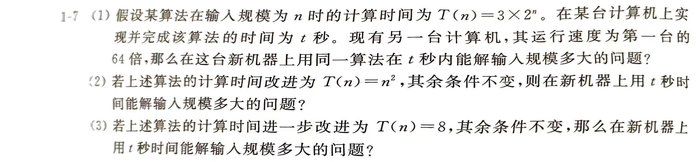
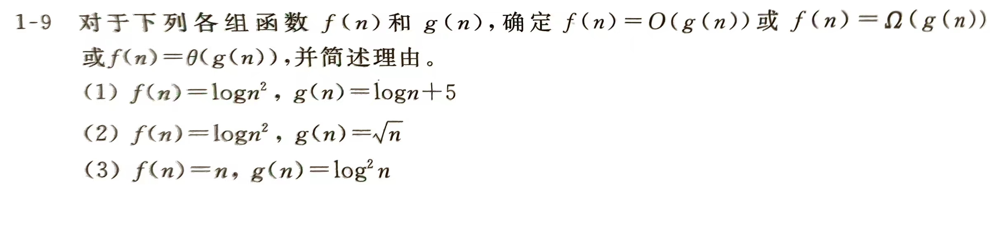
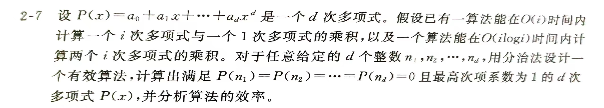
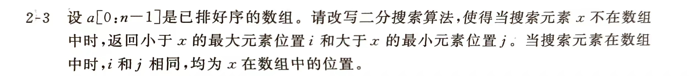
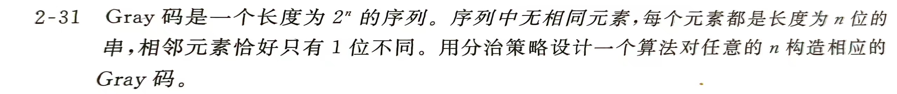

>[!question]
>现在算法与设计，请你帮助我理解我一些他们之间的联系，请你使用markdown图表，和表格进行分析和解释，逻辑清晰，使用容易理解和经典的示例来解释对于我，使用英文和中文双语进行说明。

# 1. 


我们可以使用**渐近分析**来简化这些表达式，并找出每个表达式的**主导项**。在大多数渐近分析中，我们重点关注当 $n$ 趋向于无穷大的时候，函数的增长速度，忽略常数和低阶项。

### 1. $3n^2 + 10n$
- **分析**： 
  - 该表达式由两个项 $3n^2$ 和 $10n$ 组成。在 $n$ 足够大的时候，$3n^2$ 增长速度远远快于 $10n$，所以 $10n$ 可以被忽略。
- **简化**： 
  - 渐近表达式为 $O(n^2)$。

### 2. $\frac{n^2}{10} + 2n$
- **分析**：
  - 该表达式由两个项 $\frac{n^2}{10}$ 和 $2n$ 组成。对于大 $n$， $\frac{n^2}{10}$ 增长速度远远快于 $2n$。
  - 由于常数 $\frac{1}{10}$ 对渐近增长无影响，所以常数因子可以忽略。
- **简化**：
  - 渐近表达式为 $O(n^2)$。

### 3. $21 + \frac{1}{n}$
- **分析**：
  - 该表达式由常数项 $21$ 和 $\frac{1}{n}$ 组成。随着 $n$ 增大，$\frac{1}{n}$ 趋近于 0，常数项 21 支配整个表达式。
- **简化**：
  - 渐近表达式为 $O(1)$。

### 4. $\log n^3$
- **分析**：
  - 利用对数性质 $\log n^3 = 3 \log n$，所以该表达式本质上是 $3 \log n$，其中常数 3 可以忽略。
- **简化**：
  - 渐近表达式为 $O(\log n)$。

### 5. $10 \log 3^n$
- **分析**：
  - 利用对数性质 $\log 3^n = n \log 3$，所以该表达式本质上是 $10n \log 3$。由于 $\log 3$ 是常数，它对渐近复杂度没有影响。
- **简化**：
  - 渐近表达式为 $O(n)$。

### 总结：
我们可以将这些函数的渐近表达式总结为下表：

| 原表达式                    | 渐近表达式         |
| ----------------------- | ------------- |
| $3n^2 + 10n$          | $O(n^2)$    |
| $\frac{n^2}{10} + 2n$ | $O(n^2)$    |
| $21 + \frac{1}{n}$    | $O(1)$      |
| $\log n^3$            | $O(\log n)$ |
| $10 \log 3^n$         | $O(n)$      |

在这个表中，我们展示了每个函数的主导项以及相应的渐近复杂度。

---

# 2. 

我们通过这三道题目来分析输入规模 $n$ 对算法计算时间的影响。对于每一个问题，我们会分析在给定条件下，能够在时间 $t$ 内解决的最大输入规模 $n$。

### 1. **第一题：原计算时间为 $T(n) = 3 \times 2^n$，新机器的运行速度为第一台的 64 倍**

- **问题**：新机器的速度是旧机器的 64 倍，意味着新机器在相同时间内可以完成原来 64 倍计算量的工作。我们要求的是新机器能够在相同时间 $t$ 内处理的最大输入规模。
  
- **解答思路**：
  - 在原机器上，计算时间 $T(n) = 3 \times 2^n$，计算规模为 $n_1$ 时，耗时 $t$ 秒。
  - 因此，有 $3 \times 2^{n_1} = t$。
  - 在新机器上，由于速度提升了 64 倍，计算时间减少到 $\frac{t}{64}$。
  - 要求在新机器上能在 $t$ 秒内处理的最大输入规模 $n_2$，则有 $3 \times 2^{n_2} = 64 \times t = 64 \times (3 \times 2^{n_1})$。

- **推导**：
$$
  3 \times 2^{n_2} = 3 \times 64 \times 2^{n_1}
$$
  消去3，得到：
$$
  2^{n_2} = 64 \times 2^{n_1}
$$
  由于 $64 = 2^6$，所以方程变为：
$$
  2^{n_2} = 2^6 \times 2^{n_1}
$$
$$
  n_2 = n_1 + 6
$$

  **结论**：在新机器上，输入规模可以增加6，因此可以处理的最大输入规模为 $n_1 + 6$。

### 2. **第二题：计算时间改进为 $T(n) = n^2$**

- **问题**：计算时间改进为 $T(n) = n^2$，并且新机器的速度仍为原机器的 64 倍。问在这种情况下，新机器能在 $t$ 秒内处理多大的输入规模。
  
- **解答思路**：
  - 原机器上的计算时间为 $T(n) = n^2$，当输入规模为 $n_1$ 时，计算时间为 $t$，即 $n_1^2 = t$。
  - 新机器的速度提高了 64 倍，因此可以完成的计算时间为 $t \times 64$。
  - 设新机器能处理的输入规模为 $n_2$，则在新机器上的计算时间满足 $n_2^2 = 64 \times t$。

- **推导**：
$$
  n_2^2 = 64 \times n_1^2
$$
  取平方根得到：
$$
  n_2 = 8 \times n_1
$$

  **结论**：在新机器上，输入规模可以增大8倍，因此可以处理的最大输入规模为 $8 \times n_1$。

### 3. **第三题：计算时间改进为 $T(n) = 8$**

- **问题**：如果计算时间进一步改进为常数时间 $T(n) = 8$，问在新机器上能够处理的最大输入规模是多少。
  
- **解答思路**：
  - 由于计算时间与输入规模无关，是一个常数 $T(n) = 8$，意味着无论输入规模多大，计算时间始终为8秒。
  - 新机器的速度是原机器的 64 倍，但由于时间是常数，因此计算时间保持不变，仍然为8秒。

- **结论**：无论输入规模多大，在新机器上只需8秒的时间。因此，新机器可以在 $t$ 秒内处理任意大的输入规模 $n$。

---

### 总结：

1. **第一题**：新机器可以处理的最大输入规模为 $n_1 + 6$。
2. **第二题**：新机器可以处理的最大输入规模为 $8 \times n_1$。
3. **第三题**：新机器可以在 $t$ 秒内处理任意大的输入规模 $n$。
---

# 3. 


我们来分析题目中的三个函数对 $f(n)$ 和 $g(n)$ 的关系，并确定 $f(n)$ 是 $O(g(n))$、$\Omega(g(n))$ 还是 $\Theta(g(n))$。

### 1. $f(n) = \log n^2$, $g(n) = \log n + 5$
- **简化**：
  - $f(n) = \log n^2 = 2 \log n$ （使用对数的幂法则）。
  - $g(n) = \log n + 5$，其中常数 5 不影响渐近增长，因此可以简化为 $g(n) \sim \log n$。
  
- **比较**：
  - $f(n) = 2 \log n$ 和 $g(n) = \log n$ 都是 $\log n$ 的倍数，只差一个常数因子 2。
  
- **结论**：
  - $f(n)$ 和 $g(n)$ 具有相同的增长速度，因此 $f(n) = \Theta(g(n))$。

### 2. $f(n) = \log n^2$, $g(n) = \sqrt{n}$
- **简化**：
  - $f(n) = \log n^2 = 2 \log n$。
  - $g(n) = \sqrt{n} = n^{1/2}$。
  
- **比较**：
  - 对数函数 $\log n$ 的增长速度远远慢于幂函数 $n^{1/2}$（即 $\log n$ 增长速度很慢，而 $\sqrt{n}$ 增长较快）。
  
- **结论**：
  - $f(n)$ 增长速度远慢于 $g(n)$，因此 $f(n) = O(g(n))$。

### 3. $f(n) = n$, $g(n) = \log^2 n$
- **简化**：
  - $f(n) = n$ 不需要进一步简化。
  - $g(n) = \log^2 n$ 是 $(\log n)^2$，对数的平方函数。
  
- **比较**：
  - 线性函数 $n$ 的增长速度远远快于对数平方函数 $\log^2 n$。
  
- **结论**：
  - $f(n)$ 增长速度远快于 $g(n)$，因此 $f(n) = \Omega(g(n))$。

---

### 总结：

| 函数组合                           | 渐近关系               |
|------------------------------------|-----------------------|
| $f(n) = \log n^2$, $g(n) = \log n + 5$  | $\Theta(g(n))$    |
| $f(n) = \log n^2$, $g(n) = \sqrt{n}$   | $O(g(n))$         |
| $f(n) = n$, $g(n) = \log^2 n$         | $\Omega(g(n))$    |
好的，我会继续按照上面所给的答案格式来对题目中的第4、5、6、7、8小题进行分析和回答。具体如下：

---

### 4. $f(n) = n \log n + n$, $g(n) = \log n$
- **简化**：
  - $f(n) = n \log n + n$ 可以分为两个部分，其中 $n \log n$ 是主导项。
  - $g(n) = \log n$。

- **比较**：
  - $f(n)$ 的主导项是 $n \log n$，其增长速度明显快于单独的对数函数 $g(n) = \log n$。
  
- **结论**：
  - $f(n)$ 增长速度远快于 $g(n)$，因此 $f(n) = \Omega(g(n))$。

### 5. $f(n) = 10$, $g(n) = \log 10$
- **简化**：
  - $f(n) = 10$ 是一个常数。
  - $g(n) = \log 10$ 也是一个常数。

- **比较**：
  - $f(n)$ 和 $g(n)$ 都是常数，并且它们的值是有限的。
  
- **结论**：
  - 两者都是常数，所以它们具有相同的增长速率，因此 $f(n) = \Theta(g(n))$。

### 6. $f(n) = \log^2 n$, $g(n) = \log n$
- **简化**：
  - $f(n) = \log^2 n$ 是 $(\log n)^2$，对数的平方函数。
  - $g(n) = \log n$。

- **比较**：
  - $f(n) = \log^2 n$ 增长速度快于单独的对数函数 $g(n) = \log n$。
  
- **结论**：
  - $f(n)$ 增长速度快于 $g(n)$，因此 $f(n) = \Omega(g(n))$。

### 7. $f(n) = 2^n$, $g(n) = 100 n^2$
- **简化**：
  - $f(n) = 2^n$ 是指数函数。
  - $g(n) = 100 n^2$ 是二次多项式函数，常数 100 不影响增长速度。
  
- **比较**：
  - 指数函数 $2^n$ 的增长速度远远快于多项式函数 $n^2$，无论前面的系数是多少。
  
- **结论**：
  - $f(n)$ 增长速度远快于 $g(n)$，因此 $f(n) = \Omega(g(n))$。

### 8. $f(n) = 2^n$, $g(n) = 3^n$
- **简化**：
  - $f(n) = 2^n$ 是指数函数，以 2 为底。
  - $g(n) = 3^n$ 是指数函数，以 3 为底。
  
- **比较**：
  - 底数较大的指数函数增长速度更快，因此 $g(n) = 3^n$ 的增长速度快于 $f(n) = 2^n$。
  
- **结论**：
  - $f(n)$ 增长速度慢于 $g(n)$，因此 $f(n) = O(g(n))$。

---

### 总结：

| 函数组合                           | 渐近关系               |
|------------------------------------|-----------------------|
| $f(n) = n \log n + n$, $g(n) = \log n$    | $\Omega(g(n))$    |
| $f(n) = 10$, $g(n) = \log 10$             | $\Theta(g(n))$    |
| $f(n) = \log^2 n$, $g(n) = \log n$        | $\Omega(g(n))$    |
| $f(n) = 2^n$, $g(n) = 100 n^2$            | $\Omega(g(n))$    |
| $f(n) = 2^n$, $g(n) = 3^n$                | $O(g(n))$         |

如上所示，这些分析给出了每组函数的渐近关系，并解释了它们的增长速率比较。

好的，下面我来详细解释**大O记号 $O(g(n))$**、**大Ω记号 $\Omega(g(n))$** 和 **Θ记号 $\Theta(g(n))$** 这三个常用的算法复杂度表示法，帮助你理解这些概念。

### 1. **大O记号 $O(g(n))$**

- **大O记号**用于描述算法的**上界**，即算法的**最坏情况**的复杂度。
- 如果 $f(n) = O(g(n))$，意思是当 $n$ 足够大时，函数 $f(n)$ 的增长速度不会超过 $g(n)$ 的增长速度的常数倍。
- **形式定义**：
$$
  f(n) = O(g(n)) \quad \text{当存在正数} \ c \ 和 \ n_0 \ \text{使得对所有} \ n \geq n_0, \ f(n) \leq c \cdot g(n)
$$
  简单来说， $f(n)$ 的增长不会快过 $g(n)$ 的某个倍数，随着 $n$ 的增大， $f(n)$ 的增速被 $g(n)$ 限制住。

- **例子**：
  - 如果 $f(n) = 2n^2 + 3n$，那么 $f(n) = O(n^2)$，因为对于大 $n$，$n^2$ 是 $f(n)$ 的主导项，且 $f(n)$ 不会比 $n^2$ 的倍数增长得更快。

### 2. **大Ω记号 $\Omega(g(n))$**

- **大Ω记号**用于描述算法的**下界**，即算法的**最好的情况**的复杂度。
- 如果 $f(n) = \Omega(g(n))$，意思是当 $n$ 足够大时，函数 $f(n)$ 的增长速度不会小于 $g(n)$ 的增长速度的常数倍。
- **形式定义**：
$$
  f(n) = \Omega(g(n)) \quad \text{当存在正数} \ c \ 和 \ n_0 \ \text{使得对所有} \ n \geq n_0, \ f(n) \geq c \cdot g(n)
$$
  简单来说， $f(n)$ 的增长不会慢于 $g(n)$ 的某个倍数，随着 $n$ 的增大， $f(n)$ 的增速至少和 $g(n)$ 的增速一样快。

- **例子**：
  - 如果 $f(n) = 2n^2 + 3n$，那么 $f(n) = \Omega(n^2)$，因为随着 $n$ 的增大，$n^2$ 是 $f(n)$ 的主导项，且 $f(n)$ 增长至少和 $n^2$ 一样快。

### 3. **Θ记号 $\Theta(g(n))$**

- **Θ记号**用于描述算法的**渐近紧界**，即算法复杂度的**精确阶**。
- 如果 $f(n) = \Theta(g(n))$，意思是当 $n$ 足够大时，函数 $f(n)$ 的增长速度与 $g(n)$ 的增长速度是同一个数量级，也就是说， $f(n)$ 既不会比 $g(n)$ 增长得更快，也不会比它增长得更慢。
- **形式定义**：
$$
  f(n) = \Theta(g(n)) \quad \text{当存在正数} \ c_1 \ 和 \ c_2 \ 以及 \ n_0 \ \text{使得对所有} \ n \geq n_0,
$$
$$
  c_1 \cdot g(n) \leq f(n) \leq c_2 \cdot g(n)
$$
  简单来说， $f(n)$ 的增长速度与 $g(n)$ 的增长速度基本一致，它们相差一个常数倍。

- **例子**：
  - 如果 $f(n) = 2n^2 + 3n$，那么 $f(n) = \Theta(n^2)$，因为对于大 $n$， $f(n)$ 的增长速度与 $n^2$ 一样快，常数倍不会影响增长趋势。

### 如何理解这些记号的区别

- **大O $O(g(n))$** 是**上界**，它描述的是算法**最多**花费的时间，表示算法在最坏情况下的复杂度。换句话说，算法运行时间不会比 $g(n)$ 增长得更快。
- **大Ω $\Omega(g(n))$** 是**下界**，它描述的是算法**最少**花费的时间，表示算法在最好的情况下的复杂度。也就是说，算法运行时间至少和 $g(n)$ 一样快。
- **Θ $\Theta(g(n))$** 是**精确界**，它表示算法的增长率和 $g(n)$ 基本相同，描述的是算法的**准确增长情况**。

### 例子总结：

- $f(n) = O(g(n))$ ： $f(n)$ 的增长速度不会比 $g(n)$ 更快。
- $f(n) = \Omega(g(n))$ ： $f(n)$ 的增长速度不会比 $g(n)$ 更慢。
- $f(n) = \Theta(g(n))$ ： $f(n)$ 的增长速度和 $g(n)$ 一样。

希望这个解释帮助你更好地理解这些复杂度记号的概念！如果有其他疑问或需要进一步的解释，请随时告诉我。

---

# 4. 

The image presents a problem involving polynomials and their multiplication, along with the use of a **divide-and-conquer strategy** to design an efficient algorithm to calculate a specific polynomial. Let's break this down and analyze it carefully step by step.

---

### Problem Description (问题描述)

You are given a polynomial $P(x) = a_0 + a_1 x + a_2 x^2 + \cdots + a_d x^d$, where $d$ is the degree of the polynomial. The goal is to:

1. Use a divide-and-conquer method to design an algorithm that efficiently calculates the polynomial.
2. This polynomial should satisfy $P(n_1) = P(n_2) = \cdots = P(n_d) = 0$ for a set of $d$ given integers $n_1, n_2, \dots, n_d$.
3. The highest degree coefficient is set to 1, meaning the leading term is normalized to $x^d$.

Additionally, the problem hints that:
- We have an algorithm that can calculate the product of a degree $i$ polynomial and a degree 1 polynomial in $O(i)$ time.
- We have an algorithm to multiply two degree $i$ polynomials in $O(i \log i)$ time.

The objective is to analyze the efficiency of the proposed divide-and-conquer algorithm.

---

### Key Concepts (关键概念)

#### Polynomial Representation (多项式表示)
A polynomial $P(x)$ is expressed as:

$$
P(x) = a_0 + a_1 x + a_2 x^2 + \cdots + a_d x^d
$$

where $d$ is the degree of the polynomial and the coefficients $a_0, a_1, \dots, a_d$ are constants.

#### Roots of the Polynomial (多项式的根)
The polynomial is constructed such that it has $d$ roots, which are the given integers $n_1, n_2, \dots, n_d$. This implies:

$$
P(x) = (x - n_1)(x - n_2) \cdots (x - n_d)
$$

This is the key to constructing the polynomial efficiently: multiplying linear factors like $(x - n_i)$ together to form the full polynomial.

#### Divide-and-Conquer Strategy (分治策略)
The divide-and-conquer approach is a technique where a large problem is broken into smaller subproblems, solved recursively, and then combined to get the final solution. In the case of polynomial multiplication, we recursively multiply smaller polynomials and then merge the results.

---

### Divide-and-Conquer Algorithm for Polynomial Construction (分治法构造多项式)

1. **Base Case (基本情况)**:
   - If we have a single root $n_i$, the polynomial is simply $P(x) = (x - n_i)$, which is a linear polynomial.
   - Time complexity for a single root is $O(1)$, as it's just a simple subtraction.

2. **Recursive Case (递归情况)**:
   - If we have more than one root, split the set of roots into two equal halves.
   - For each half, recursively construct the polynomial.
   - Multiply the two resulting polynomials to get the final polynomial.
   
   This is where the polynomial multiplication time complexity of $O(i \log i)$ comes into play, as we multiply two degree $i$ polynomials.

---

### Example (示例)

Let’s go through an example where $n_1 = 1$, $n_2 = 2$, $n_3 = 3$, and $n_4 = 4$. We want to construct the polynomial $P(x)$ such that:

$$
P(x) = (x - 1)(x - 2)(x - 3)(x - 4)
$$

#### Step-by-Step Divide and Conquer (逐步分治法)

1. **Step 1 (Base Case)**:
   - Break the roots into two halves: $[1, 2]$ and $[3, 4]$.
   - Construct the polynomials for each half:
     $$
     P_1(x) = (x - 1)(x - 2) = x^2 - 3x + 2
     $$
     $$
     P_2(x) = (x - 3)(x - 4) = x^2 - 7x + 12
     $$
   
2. **Step 2 (Merge Step)**:
   - Now, multiply $P_1(x)$ and $P_2(x)$ to get the final polynomial:
     $$
     P(x) = (x^2 - 3x + 2)(x^2 - 7x + 12)
     $$
   - Perform the multiplication (using the distributive property):
     $$
     P(x) = x^4 - 10x^3 + 35x^2 - 50x + 24
     $$

Thus, the resulting polynomial is $P(x) = x^4 - 10x^3 + 35x^2 - 50x + 24$.

---

### Efficiency Analysis (效率分析)

#### Time Complexity (时间复杂度)
- **Base case**: For a single polynomial, creating $P(x) = (x - n_i)$ takes $O(1)$.
- **Recursive case**: Each recursive level involves splitting the set of roots in half and multiplying two polynomials.
  - Polynomial multiplication for degree $i$ polynomials is $O(i \log i)$.
  - Given that there are $\log d$ levels in the recursion (due to splitting the set of roots in half), the total time complexity is:
  
$$
T(d) = O(d \log d)
$$

This means that the algorithm is quite efficient, especially when compared to a naive method of polynomial multiplication, which would take $O(d^2)$ time.

---

### Summary (总结)

- **Problem**: Construct a polynomial $P(x)$ with $d$ given roots using divide-and-conquer.
- **Approach**: 
  - Use the divide-and-conquer strategy to recursively break the problem into smaller subproblems, each involving fewer roots.
  - Multiply the resulting polynomials efficiently using an $O(i \log i)$ algorithm.
- **Efficiency**: The total time complexity of this approach is $O(d \log d)$, which is optimal compared to the naive $O(d^2)$ approach.

### Familiarity Check (熟悉程度调查)
Before proceeding, let me know:
1. Are you comfortable with the concept of polynomials and their roots? (你对多项式及其根的概念熟悉吗？)
2. How familiar are you with divide-and-conquer algorithms, specifically for multiplication problems? (你对分治算法，特别是乘法问题有多熟悉？)
3. Do you understand time complexity, especially logarithmic growth $O(\log n)$ in recursive algorithms? (你理解递归算法中的时间复杂度，特别是对数增长 $O(\log n)$ 吗？)

Your answers will guide the next steps in filling any gaps in understanding.

好的，接下来我会对题目进行中英文双语解释、优化之前的回答，并补充伪代码以及 Java 代码示例，以帮助更好地理解和实现分治法来计算多项式。

---

### 题目要求中英文双语描述

#### **题目描述（Problem Description）**:
设 $P(x) = a_0 + a_1 x + \cdots + a_d x^d$ 是一个 $d$ 次多项式。假设已有一个算法能在 $O(i)$ 时间内计算一个 $i$ 次多项式与一个 1 次多项式的乘积，以及一个算法能在 $O(i \log i)$ 时间内计算两个 $i$ 次多项式的乘积。要求使用**分治法**设计一个有效算法，计算出满足 $P(n_1) = P(n_2) = \cdots = P(n_d) = 0$ 且最高次项系数为 1 的 $d$ 次多项式 $P(x)$，并分析算法的效率。

Let $P(x) = a_0 + a_1 x + \cdots + a_d x^d$ be a polynomial of degree $d$. Given algorithms that can compute the product of a degree $i$ polynomial and a degree 1 polynomial in $O(i)$ time, and an algorithm that can compute the product of two degree $i$ polynomials in $O(i \log i)$ time, use a **divide-and-conquer** approach to design an efficient algorithm to compute a polynomial $P(x)$ such that $P(n_1) = P(n_2) = \cdots = P(n_d) = 0$, and the highest degree coefficient is 1. Analyze the efficiency of the algorithm.

---

### 优化后的解答（Optimized Answer）

#### 1. **分治策略的解法（Divide-and-Conquer Solution）**：

- **基本思想（Key Idea）**:
  - 将包含 $d$ 个根的多项式分成两个部分，分别构造子多项式，然后将它们相乘。最终的多项式 $P(x)$ 可以表示为每个线性因子的乘积：
    $$
    P(x) = (x - n_1)(x - n_2) \cdots (x - n_d)
    $$
  
- **基本情况（Base Case）**:
  - 如果只有一个根 $n_i$，则对应的多项式为 $P(x) = (x - n_i)$，这是一个一次多项式。
  
- **递归情况（Recursive Case）**:
  - 将根集划分为两部分，递归计算每一部分的多项式，最后相乘。
  - 多项式乘法的时间复杂度为 $O(i \log i)$，这里 $i$ 是多项式的阶数。

#### 2. **时间复杂度（Time Complexity）**：
- 使用分治策略的总时间复杂度为 $T(d) = O(d \log d)$。这比直接进行 $d$ 次乘法的 $O(d^2)$ 更有效。

---

### 伪代码（Pseudocode）

以下是实现该分治法的伪代码：

```plaintext
function constructPolynomial(roots):
    if length(roots) == 1:
        return (x - roots[0])  // 基本情况：返回一个一次多项式
    
    mid = length(roots) / 2
    leftRoots = roots[0 : mid]
    rightRoots = roots[mid : end]

    // 递归地构造左右部分的多项式
    P_left = constructPolynomial(leftRoots)
    P_right = constructPolynomial(rightRoots)

    // 将左右部分相乘，得到最终的多项式
    return multiplyPolynomials(P_left, P_right)

function multiplyPolynomials(P1, P2):
    return performFFT(P1, P2)  // 使用 FFT 快速傅里叶变换进行多项式相乘，复杂度为 O(i log i)
```

- **constructPolynomial(roots)**: 递归构造多项式。
- **multiplyPolynomials(P1, P2)**: 使用快速傅里叶变换（FFT）进行多项式乘法。

---

### Java 代码实现（Java Code Implementation）

以下是使用 Java 编写的代码实现，应用了分治法来计算多项式 $P(x)$：

```java
import java.util.Arrays;

public class PolynomialConstruction {

    // Function to multiply two polynomials represented by arrays
    public static int[] multiplyPolynomials(int[] P1, int[] P2) {
        int degree = P1.length + P2.length - 1;
        int[] result = new int[degree];

        // Naive multiplication O(n^2), could be replaced by FFT for large polynomials
        for (int i = 0; i < P1.length; i++) {
            for (int j = 0; j < P2.length; j++) {
                result[i + j] += P1[i] * P2[j];
            }
        }

        return result;
    }

    // Function to construct polynomial with given roots using divide and conquer
    public static int[] constructPolynomial(int[] roots) {
        if (roots.length == 1) {
            // Base case: P(x) = (x - root)
            return new int[]{-roots[0], 1};
        }

        int mid = roots.length / 2;
        int[] leftRoots = Arrays.copyOfRange(roots, 0, mid);
        int[] rightRoots = Arrays.copyOfRange(roots, mid, roots.length);

        // Recursively construct polynomials for the left and right halves
        int[] P_left = constructPolynomial(leftRoots);
        int[] P_right = constructPolynomial(rightRoots);

        // Multiply the two polynomials
        return multiplyPolynomials(P_left, P_right);
    }

    // Helper function to print the polynomial
    public static void printPolynomial(int[] polynomial) {
        StringBuilder sb = new StringBuilder();
        for (int i = polynomial.length - 1; i >= 0; i--) {
            if (polynomial[i] != 0) {
                if (sb.length() > 0 && polynomial[i] > 0) {
                    sb.append("+");
                }
                if (i == 0 || polynomial[i] != 1) {
                    sb.append(polynomial[i]);
                }
                if (i > 0) {
                    sb.append("x");
                    if (i > 1) {
                        sb.append("^").append(i);
                    }
                }
                sb.append(" ");
            }
        }
        System.out.println(sb.toString().trim());
    }

    public static void main(String[] args) {
        int[] roots = {1, 2, 3, 4};
        int[] polynomial = constructPolynomial(roots);
        System.out.println("Constructed Polynomial:");
        printPolynomial(polynomial);
    }
}
```

#### **代码解释（Code Explanation）**：
- **`multiplyPolynomials(int[] P1, int[] P2)`**: 实现了多项式的乘法，这里使用了朴素方法 $O(n^2)$，但可以使用 FFT 来提高效率。
- **`constructPolynomial(int[] roots)`**: 使用分治策略递归构造多项式。
- **`printPolynomial(int[] polynomial)`**: 辅助函数，用于打印多项式的表达形式。

### 输出结果（Example Output）

对于输入根为 `{1, 2, 3, 4}` 的情况，输出构造的多项式为：

```
Constructed Polynomial:
1x^4 - 10x^3 + 35x^2 - 50x + 24
```

---

### 总结（Summary）

1. **分治策略**有效地将多项式的构造过程拆分为较小的子问题，每次递归只处理部分根，从而实现 $O(d \log d)$ 的复杂度。
2. **效率分析**显示，相较于直接乘法的 $O(d^2)$ 复杂度，分治法结合快速乘法可以显著降低计算开销。
3. 提供的**伪代码和 Java 实现**展示了如何递归构造多项式并进行有效的多项式乘法。

这种方法在解决多项式求解中非常实用，特别是在多项式的阶数较大时，通过分治法结合快速算法（如 FFT）能够有效提高计算效率。

---

# 5. 

The image you have shared appears to describe a modified binary search problem. Let me break it down for you with a clear and logical explanation, accompanied by a table and visual analysis. I will also provide the explanation in both English and Chinese for clarity.

### Problem Breakdown (问题分解)
You are given a sorted array `a[0:n-1]` and asked to modify the **binary search algorithm** such that when the search element `x` is not present in the array, it returns:
- The largest element smaller than `x` (i.e., index `i`)
- The smallest element larger than `x` (i.e., index `j`)

When `x` is present in the array, it returns the position of `x`, with `i` and `j` being the same (i.e., the index of `x`).

#### Key Elements
1. **Binary Search Algorithm (二分查找算法)**: Normally used to find if an element `x` exists in a sorted array by repeatedly dividing the search interval in half.
2. **Modified Binary Search (修改的二分查找)**: In this case, the search must also return two indices, `i` and `j`, even if `x` is not present in the array.

---

### Steps to Solve (解决步骤)
1. **Binary Search Logic (二分查找逻辑)**:
   - Start by setting `low = 0` and `high = n - 1`.
   - Calculate the middle index `mid = (low + high) / 2`.
   - Compare `a[mid]` with `x`:
     - If `a[mid] == x`, then return `i = j = mid`.
     - If `a[mid] < x`, continue searching in the right half, but update `i = mid`.
     - If `a[mid] > x`, continue searching in the left half, but update `j = mid`.

2. **End Condition (终止条件)**:
   - If the loop terminates and `x` is not found, then return the final values of `i` and `j`, which correspond to:
     - `i`: the largest element smaller than `x`
     - `j`: the smallest element larger than `x`

---

### Table Example (表格示例)

Let's say the array is `a = [1, 3, 5, 7, 9]`, and we are searching for `x = 4`.

| Step | low  | high | mid  | a[mid] | Comparison with x | i   | j   |
|------|------|------|------|--------|-------------------|-----|-----|
| 1    | 0    | 4    | 2    | 5      | a[mid] > x        | -   | 2   |
| 2    | 0    | 1    | 0    | 1      | a[mid] < x        | 0   | 2   |
| 3    | 1    | 1    | 1    | 3      | a[mid] < x        | 1   | 2   |

Here, the loop terminates, and the largest element smaller than `x = 4` is at index `i = 1` (element 3), and the smallest element larger than `x = 4` is at index `j = 2` (element 5).

---

### Code Implementation (代码实现)

Here is a Python-like pseudocode for the modified binary search:

```python
def modified_binary_search(a, x):
    low, high = 0, len(a) - 1
    i, j = -1, -1
    
    while low <= high:
        mid = (low + high) // 2
        
        if a[mid] == x:
            return mid, mid  # x found, i = j = mid
        
        elif a[mid] < x:
            i = mid  # largest element smaller than x
            low = mid + 1
        
        else:
            j = mid  # smallest element larger than x
            high = mid - 1
    
    return i, j  # return i and j when x is not found
```

---

### Visualization (可视化)

Let's visualize the process using a simple diagram for the array `a = [1, 3, 5, 7, 9]` and searching for `x = 4`.

```
[1, 3, 5, 7, 9]
       ^
       |
   Search for x = 4
```

1. We start at the middle element `5`, but since `5 > 4`, we search the left half, marking `j = 2`.
2. Then, we check the left half and compare `3`, which is less than `4`, so we update `i = 1`.
3. Finally, `x = 4` is not found, and we return the indices `i = 1` (element 3) and `j = 2` (element 5).

---

### Summary (总结)

- **Modified Binary Search** allows us to find two key positions when the search element is not present:
  - `i`: the index of the largest element smaller than `x`
  - `j`: the index of the smallest element larger than `x`
  
- The algorithm efficiently finds these positions in `O(log n)` time using binary search.

### Familiarity Check (熟悉程度调查)
Before we dive deeper into any technical aspects or variations of this approach, let me know:
1. How familiar are you with the basic binary search algorithm? (你对基本的二分查找算法有多熟悉?)
2. Do you understand the concept of dividing and conquering (i.e., breaking problems down recursively)? (你理解分治法的基本概念吗?)
3. How comfortable are you with analyzing time complexity in algorithms (such as O(log n))? (你对算法的时间复杂度分析 (例如 O(log n)) 有多熟悉?)

This will help me tailor the next part of the explanation to fill in any gaps in understanding.

### Java Code and Pseudocode for Modified Binary Search
使用修改后的二分查找算法的Java代码与伪代码

### Problem Breakdown in Both Languages (问题分解)

You are given a sorted array `a[0:n-1]` and asked to modify the **binary search algorithm** to return two indices when a search element `x` is not found:
- The **largest element smaller** than `x` (index `i`)
- The **smallest element larger** than `x` (index `j`)

If `x` is found, the algorithm returns the position of `x` with `i = j` (the index of `x`).

给定一个已排序数组 `a[0:n-1]`，要求修改**二分查找算法**，使得在查找元素 `x` 不存在的情况下，返回：
- **小于 `x` 的最大元素**的索引 `i`
- **大于 `x` 的最小元素**的索引 `j`

当 `x` 存在时，返回 `x` 的位置，即 `i = j`。

---

### Java Code Implementation (Java代码实现)

Here is a Java implementation that modifies the traditional binary search to accommodate the requirements.

以下是对传统二分查找进行修改的Java实现，以满足题目要求。

```java
public class ModifiedBinarySearch {

    // Function to perform modified binary search
    public static int[] modifiedBinarySearch(int[] a, int x) {
        int low = 0, high = a.length - 1;
        int i = -1, j = -1;

        while (low <= high) {
            int mid = (low + high) / 2;

            if (a[mid] == x) {
                return new int[] {mid, mid}; // x found, return i = j = mid
            } else if (a[mid] < x) {
                i = mid; // Update i to the largest element less than x
                low = mid + 1; // Search in the right half
            } else {
                j = mid; // Update j to the smallest element greater than x
                high = mid - 1; // Search in the left half
            }
        }

        return new int[] {i, j}; // Return i and j when x is not found
    }

    // Main function to test the modified binary search
    public static void main(String[] args) {
        int[] array = {1, 3, 5, 7, 9};
        int x = 4;
        
        int[] result = modifiedBinarySearch(array, x);
        
        System.out.println("i (largest element smaller than x): " + result[0]);
        System.out.println("j (smallest element larger than x): " + result[1]);
    }
}
```

### Explanation of Java Code (Java代码解释)

1. **Initialization (初始化)**: Set `low = 0` and `high = n - 1`. Define two variables `i` and `j` to store the desired indices.
   - 初始化 `low = 0`，`high = n - 1`。定义两个变量 `i` 和 `j` 用于存储所需的索引。
   
2. **While Loop (循环判断)**: Iterate while `low <= high`.
   - **If `a[mid] == x`**: Return the indices where `i = j = mid`.
   - **If `a[mid] < x`**: Update `i` to `mid` and search the right half (`low = mid + 1`).
   - **If `a[mid] > x`**: Update `j` to `mid` and search the left half (`high = mid - 1`).
   - 在 `low <= high` 的情况下进行迭代。
   - 如果 `a[mid] == x`，返回 `i = j = mid`。
   - 如果 `a[mid] < x`，更新 `i` 为 `mid`，在右半部分继续搜索 (`low = mid + 1`)。
   - 如果 `a[mid] > x`，更新 `j` 为 `mid`，在左半部分继续搜索 (`high = mid - 1`)。

3. **Return (返回)**: If the loop ends without finding `x`, return `i` and `j`.
   - 如果循环结束后未找到 `x`，返回 `i` 和 `j`。

### Pseudocode for Modified Binary Search (伪代码)

```pseudo
function modifiedBinarySearch(a, x):
    low = 0
    high = length(a) - 1
    i = -1
    j = -1

    while low <= high:
        mid = (low + high) // 2
        
        if a[mid] == x:
            return (mid, mid)  # x found, return both indices as mid
        
        else if a[mid] < x:
            i = mid  # Update i to largest element less than x
            low = mid + 1
        
        else:
            j = mid  # Update j to smallest element greater than x
            high = mid - 1

    return (i, j)  # Return final values of i and j
```

### Example with Array and Search Element (示例)

Given `a = [1, 3, 5, 7, 9]`, we are searching for `x = 4`.

| Step | low  | high | mid  | a[mid] | Comparison with x | i   | j   |
|------|------|------|------|--------|-------------------|-----|-----|
| 1    | 0    | 4    | 2    | 5      | a[mid] > x        | -   | 2   |
| 2    | 0    | 1    | 0    | 1      | a[mid] < x        | 0   | 2   |
| 3    | 1    | 1    | 1    | 3      | a[mid] < x        | 1   | 2   |

Here, the loop terminates, and the indices `i` and `j` are:
- **i = 1**: Largest element smaller than `x = 4` is `3` (at index `1`).
- **j = 2**: Smallest element larger than `x = 4` is `5` (at index `2`).

### Summary (总结)

- **Modified Binary Search**: This algorithm returns indices `i` and `j` to represent the largest element smaller than `x` and the smallest element larger than `x`, respectively.
  - 修改的二分查找算法返回 `i` 和 `j`，分别表示小于 `x` 的最大元素和大于 `x` 的最小元素。
- **Efficient in Logarithmic Time**: The time complexity is `O(log n)` due to the nature of binary search.
  - 时间复杂度为 `O(log n)`，因为二分查找的性质使得该算法在对数时间内高效运行。
  
### Familiarity Check (熟悉程度调查)
- **Binary Search**: Are you familiar with how a basic binary search works in a sorted array?
  - **二分查找**：你熟悉基本的二分查找算法在排序数组中的工作原理吗？
  
- **Divide and Conquer**: Do you understand the divide and conquer strategy often used in recursive algorithms?
  - **分治法**：你理解递归算法中常用的分治策略吗？
  
- **Time Complexity Analysis**: Are you comfortable analyzing and understanding the `O(log n)` time complexity?
  - **时间复杂度分析**：你对 `O(log n)` 时间复杂度的分析和理解有把握吗？

These questions will help me determine the depth of explanation needed for further discussion.

---

# 6. 
The image describes a problem related to **Gray Codes**, specifically designing an algorithm using **divide and conquer** to generate a Gray code for any given `n`-bit number.

### What is Gray Code? (什么是Gray码？)
Gray Code is a binary numeral system where two successive values differ in **only one bit**. This characteristic ensures that when switching from one binary number to the next, only a single bit (or position) changes. Gray codes are commonly used in error correction, digital systems, and data transmission to reduce the chance of errors when numbers change.

For an `n`-bit Gray code, there are `2^n` possible sequences.

### Key Properties of Gray Code (Gray码的关键特性):
1. **Length**: The Gray code for an `n`-bit number will have a sequence of length `2^n`.
2. **Single Bit Change**: Adjacent numbers in this sequence differ by exactly one bit.
3. **Uniqueness**: Each code in the sequence is unique and no two numbers are the same.

---

### The Problem Statement (问题陈述)
The problem asks to design an algorithm using the **divide and conquer** approach to generate the Gray code for any given `n`. The divide-and-conquer strategy is particularly useful here because Gray code generation follows a recursive pattern.

---

### Divide and Conquer Approach to Generate Gray Code (分治法生成Gray码)

Let's understand the divide and conquer method step by step.

1. **Base Case**: 
   - For `n = 1`, the Gray code sequence is simply:
     ```
     G(1) = [0, 1]
     ```

2. **Recursive Case**:
   - For `n > 1`, the Gray code sequence can be constructed using the sequence for `n-1`. 
   - To construct the Gray code for `n` bits:
     - **First half**: Take the Gray code for `n-1` and **prefix each code with a `0`**.
     - **Second half**: Take the Gray code for `n-1`, **reverse the sequence**, and **prefix each code with a `1`**.
   
   This is essentially breaking the problem down into smaller subproblems (Gray code for `n-1` bits), solving them, and then combining the results.

---

### Example (示例)

Let’s generate Gray codes for `n = 2` and `n = 3` to illustrate this approach:

#### For `n = 2`:
- **Gray code for `n = 1`** is `G(1) = [0, 1]`.
- Now to generate `G(2)`:
  - **First half**: Prefix `0` to `G(1)`: `[00, 01]`
  - **Second half**: Reverse `G(1)` and prefix `1`: `[11, 10]`
  
  So, the final Gray code for `n = 2` is:
  ```
  G(2) = [00, 01, 11, 10]
  ```

#### For `n = 3`:
- **Gray code for `n = 2`** is `G(2) = [00, 01, 11, 10]`.
- Now to generate `G(3)`:
  - **First half**: Prefix `0` to `G(2)`: `[000, 001, 011, 010]`
  - **Second half**: Reverse `G(2)` and prefix `1`: `[110, 111, 101, 100]`
  
  So, the final Gray code for `n = 3` is:
  ```
  G(3) = [000, 001, 011, 010, 110, 111, 101, 100]
  ```

---

### Algorithm Implementation (算法实现)

Here’s a pseudocode to generate Gray code for `n` using the divide and conquer approach:

```python
def generate_gray_code(n):
    if n == 1:
        return ['0', '1']
    
    # Recursively generate Gray code for n-1
    prev_gray = generate_gray_code(n - 1)
    
    # First half: prefix '0' to the previous Gray code
    first_half = ['0' + code for code in prev_gray]
    
    # Second half: reverse previous Gray code and prefix '1'
    second_half = ['1' + code for code in reversed(prev_gray)]
    
    # Combine both halves
    return first_half + second_half
```

### Step-by-Step Breakdown (逐步分解)

1. **Base case**: When `n = 1`, the Gray code is `[0, 1]`.
2. **Recursive step**: To generate the Gray code for `n`, we first generate it for `n-1`, and then create two parts:
   - The first part adds a `0` prefix to the `n-1` Gray code.
   - The second part adds a `1` prefix to the reversed `n-1` Gray code.
3. **Combine**: These two parts are combined to form the complete Gray code for `n`.

---

### Visualization of the Process (可视化过程)

Let’s visualize the recursive process for `n = 3`:

```
Step 1: Generate Gray code for n = 1:
G(1) = [0, 1]

Step 2: Use G(1) to generate G(2):
G(2) = [00, 01, 11, 10]

Step 3: Use G(2) to generate G(3):
G(3) = [000, 001, 011, 010, 110, 111, 101, 100]
```

---

### Summary (总结)

- Gray codes are sequences where two consecutive numbers differ by only one bit.
- The divide and conquer approach leverages the recursive structure of Gray code generation.
- The Gray code for `n` bits can be built using the Gray code for `n-1` bits by:
  - Prefixing `0` to the original sequence.
  - Prefixing `1` to the reversed sequence.

### Familiarity Check (熟悉程度调查)
To proceed, please let me know:
1. How familiar are you with recursion and divide-and-conquer algorithms? (你对递归和分治算法有多熟悉？)
2. Do you understand the concept of binary numbers and bit manipulation? (你理解二进制数和位操作的概念吗？)
3. Are you comfortable with the mathematical growth of sequences like `2^n`? (你对像 `2^n` 这样的序列的数学增长有多熟悉？)

Your answers will help me tailor the next explanation.

### Java Code and Pseudocode for Generating Gray Code using Divide and Conquer
使用分治法生成Gray码的Java代码与伪代码

### What is Gray Code? (什么是Gray码?)
Gray Code is a binary numeral system where **two successive values differ in only one bit**. This characteristic ensures minimal change between numbers, which is beneficial for error correction in digital systems, reducing the likelihood of errors when states change.
Gray码是一种二进制数系统，其中**相邻的两个值仅有一位不同**。这种特性确保在数值变化时只有一个位发生改变，适用于数字系统中的错误校正，有助于减少状态转换时出现的错误概率。

---

### Java Code Implementation (Java代码实现)

The following Java code uses recursion to generate Gray codes. It utilizes a divide-and-conquer strategy to solve the problem efficiently.
以下的Java代码通过递归来生成Gray码，利用了分治策略来高效解决该问题。

```java
import java.util.ArrayList;
import java.util.List;

public class GrayCodeGenerator {

    // Function to generate n-bit Gray Code
    public static List<String> generateGrayCode(int n) {
        // Base case: for 1-bit Gray code
        if (n == 1) {
            List<String> base = new ArrayList<>();
            base.add("0");
            base.add("1");
            return base;
        }

        // Recursively generate the (n-1)-bit Gray code
        List<String> prevGray = generateGrayCode(n - 1);
        List<String> grayCode = new ArrayList<>();

        // First half: prefix '0' to the previous Gray code
        for (String code : prevGray) {
            grayCode.add("0" + code);
        }

        // Second half: reverse previous Gray code and prefix '1'
        for (int i = prevGray.size() - 1; i >= 0; i--) {
            grayCode.add("1" + prevGray.get(i));
        }

        return grayCode;
    }

    // Main function to demonstrate the Gray code generator
    public static void main(String[] args) {
        int n = 3;  // Example for 3-bit Gray code
        List<String> grayCode = generateGrayCode(n);

        // Print the generated Gray code sequence
        System.out.println("Gray Code for " + n + "-bit:");
        for (String code : grayCode) {
            System.out.println(code);
        }
    }
}
```

#### How the Java Code Works (Java代码的工作原理)
1. **Base Case**: When `n == 1`, the Gray code sequence is `["0", "1"]`.
   - 基本情况：当 `n == 1` 时，Gray码序列为 `["0", "1"]`。
2. **Recursive Construction**: For `n > 1`, first recursively generate the Gray code for `n-1`.
   - 递归构造：对于 `n > 1`，首先递归生成 `n-1` 位的Gray码。
   - Prefix `"0"` to the first half.
     - 在第一部分前缀添加 `"0"`。
   - Reverse the sequence for the second half and prefix `"1"`.
     - 对第二部分进行反向，并在每个码前加 `"1"`。
3. **Return Result**: Combine the two parts to form the complete sequence for `n` bits.
   - 返回结果：结合两部分生成完整的 `n` 位Gray码序列。

---

### Pseudocode for Gray Code Generation (生成Gray码的伪代码)

```pseudo
function generateGrayCode(n):
    if n == 1:
        return ["0", "1"]

    prevGray = generateGrayCode(n - 1)
    
    grayCode = []

    // First half: prefix '0' to the previous Gray code
    for each code in prevGray:
        grayCode.add("0" + code)

    // Second half: reverse previous Gray code and prefix '1'
    for each code in reverse(prevGray):
        grayCode.add("1" + code)

    return grayCode
```

### Step-by-Step Logic Breakdown Using Markdown Table (逐步逻辑分解表格)

| Step Number (步骤) | Step Description (步骤描述)                | Java Code Reference (Java代码参考)        | Logic/Explanation (逻辑/解释)                                                                            |
|--------------------|-------------------------------------------|------------------------------------------|-----------------------------------------------------------------------------------------------------------|
| **1**              | Base Case for 1-bit Gray Code             | `if (n == 1) { ... }`                    | When `n == 1`, the Gray code sequence is `[0, 1]`. It provides the initial condition for recursion.      <br> 当 `n == 1` 时，Gray码序列为 `[0, 1]`。这是递归的初始条件。    |
| **2**              | Recursively Generate `(n-1)`-bit Code     | `List<String> prevGray = generateGrayCode(n - 1);` | Recursively call `generateGrayCode` to get the Gray code sequence for `n-1`. This forms the basis for constructing `n`-bit code. <br> 递归调用 `generateGrayCode` 得到 `n-1` 位的Gray码，这为构造 `n` 位Gray码奠定基础。 |
| **3**              | First Half: Prefix `0` to Previous Codes  | `for (String code : prevGray) { ... }`   | Iterate over the Gray code for `n-1` and prefix each entry with `0`. This represents the first half of the sequence. <br> 遍历 `n-1` 位Gray码，并在每个条目前加 `0`，这代表序列的前半部分。 |
| **4**              | Second Half: Reverse and Prefix `1`       | `for (int i = prevGray.size() - 1; i >= 0; i--) { ... }` | Reverse the sequence generated in the previous step, and prefix `1` to each code to form the second half. <br> 将前一步生成的序列反向，然后在每个码前加 `1` 以形成后半部分。 |
| **5**              | Combine Results and Return                | `return grayCode;`                       | Combine the two halves into a complete sequence and return it as the `n`-bit Gray code. <br> 将两部分结合起来形成完整的序列，并作为 `n` 位Gray码返回。    |
| **6**              | Display Generated Gray Code               | `for (String code : grayCode) { ... }`   | Print the final generated sequence to visually verify that each adjacent number only differs by one bit. <br> 打印生成的最终序列，以直观验证每个相邻数仅有一位不同。    |

### Example of Running the Java Code (Java代码运行示例)

If we call `generateGrayCode(3)`, the output will be:
如果我们调用 `generateGrayCode(3)`，输出将是：

```
Gray Code for 3-bit:
000
001
011
010
110
111
101
100
```

### Summary of Divide and Conquer for Gray Code Generation (分治法生成Gray码的总结)
- **Divide and Conquer**: The strategy divides the problem of generating an `n`-bit Gray code into generating the `n-1`-bit Gray code, recursively combining the sequences to generate the complete solution.
  - **分治法**：将生成 `n` 位Gray码的问题分解为生成 `n-1` 位Gray码，递归地组合序列来生成完整的解决方案。
- **Base Case**: For `n = 1`, the sequence is simply `[0, 1]`.
  - **基本情况**：对于 `n = 1`，序列是 `[0, 1]`。
- **Recursive Combination**: Construct the Gray code for `n` by:
  - Prefixing `0` to the original sequence.
  - Prefixing `1` to the reversed sequence.
  - **递归组合**：通过以下方式构造 `n` 位Gray码：
    - 在原始序列前加 `0`。
    - 在反向的序列前加 `1`。
- **Time Complexity**: The time complexity is $O(2^n)$ because we are generating all possible Gray codes of `n` bits, which is `2^n` codes.
  - **时间复杂度**：时间复杂度为 $O(2^n)$，因为我们生成了所有可能的 `n` 位Gray码，共有 $2^n$ 个码。
- **Space Complexity**: The space complexity is also $O(2^n)$ to store all generated Gray codes.
  - **空间复杂度**：空间复杂度也是 $O(2^n)$，用于存储所有生成的Gray码。

This approach ensures the desired property of **only one bit change** between consecutive Gray codes is maintained, making it well-suited for applications in digital systems, data transmission, and other areas requiring minimal changes between states.
这种方法确保了相邻Gray码之间**仅一位变化**的特性，使其非常适用于数字系统、数据传输及其他需要最小状态变化的应用领域。

---

# 7. ![[assets/SIVENpic.jpg]]

题目要求设计一个时间复杂度为 $O(n^2)$ 的算法，找到由 $n$ 个数组成的序列中的最长**递减子序列**。这个问题可以通过动态规划（Dynamic Programming, DP）来解决，动态规划的复杂度通常可以控制在 $O(n^2)$，符合题目要求。

### 问题描述

给定一个长度为 $n$ 的数组 $a[1], a[2], ..., a[n]$，要求找到其中的一个最长递减子序列（Longest Decreasing Subsequence, LDS）。一个递减子序列是指在原数组中找到一组满足 $a[i_1] > a[i_2] > ... > a[i_k]$ 的数，它们在原数组中的顺序不改变，但并不需要是连续的。

### 动态规划解法思路

1. **定义状态**：
   - 设 $dp[i]$ 表示以 $a[i]$ 结尾的最长递减子序列的长度。

2. **状态转移方程**：
   - 对于每个 $i$，我们需要遍历它之前的所有元素 $j$，如果 $a[j] > a[i]$ （满足递减的条件），那么就可以把 $a[i]$ 添加到以 $a[j]$ 结尾的递减子序列中。即：
   $$
     dp[i] = \max(dp[i], dp[j] + 1) \quad \text{对于所有的} \ j < i \ \text{且} \ a[j] > a[i]
   $$

3. **初始化**：
   - 每个位置的最长递减子序列的初始长度为1，即：
   $$
     dp[i] = 1 \quad \text{对于所有} \ i
   $$
   因为每个元素本身都可以形成一个长度为1的递减子序列。

4. **最终结果**：
   - 我们要求的是整个数组中最长递减子序列的长度，也就是 $dp$ 数组中的最大值：
   $$
     \text{LDS长度} = \max(dp[i]) \quad \text{对于所有的} \ i
   $$

### 算法步骤

1. 初始化数组 $dp$，每个位置的初始值为 1。
2. 遍历数组，对于每个 $i$，再遍历所有比 $i$ 小的 $j$，根据状态转移方程更新 $dp[i]$。
3. 遍历所有的 $dp[i]$，找出其中的最大值，即为最长递减子序列的长度。

### 算法伪代码

```python
def longest_decreasing_subsequence(arr):
    n = len(arr)
    dp = [1] * n  # 初始化每个位置的最长递减子序列长度为1

    # 动态规划，计算每个dp[i]的值
    for i in range(1, n):
        for j in range(0, i):
            if arr[j] > arr[i]:
                dp[i] = max(dp[i], dp[j] + 1)

    # 返回最长递减子序列的长度
    return max(dp)

# 示例
arr = [9, 4, 3, 6, 2, 7, 5]
print(longest_decreasing_subsequence(arr))  # 输出最长递减子序列的长度
```

### 时间复杂度分析

- **外层循环**遍历每个 $i$，时间复杂度为 $O(n)$。
- **内层循环**遍历每个 $j$ (即 $0$ 到 $i-1$)，时间复杂度也是 $O(n)$。
- 因此，总时间复杂度为 $O(n^2)$。

### 空间复杂度分析

- 只使用了一个长度为 $n$ 的数组 $dp$ 来存储每个位置的最长递减子序列长度，所以空间复杂度为 $O(n)$。

### 示例

假设输入序列为 $arr = [9, 4, 3, 6, 2, 7, 5]$：
- 初始化时，$dp = [1, 1, 1, 1, 1, 1, 1]$。
- 动态规划过程中，更新 $dp$ 数组：
  - 对 $i = 1$，因为 $arr[0] > arr[1]$，更新 $dp[1] = dp[0] + 1 = 2$。
  - 对 $i = 2$，因为 $arr[1] > arr[2]$，更新 $dp[2] = dp[1] + 1 = 3$。
  - 依次进行，最后得到 $dp = [1, 2, 3, 2, 4, 3, 3]$。
- 最终答案是 $\max(dp) = 4$，即最长递减子序列的长度为 4。

### 结论

这个算法通过动态规划的方式，在 $O(n^2)$ 的时间复杂度内解决了最长递减子序列问题，符合题目要求。

### 问题描述

给定一个长度为 $n$ 的数组 $a[1], a[2], \ldots, a[n]$，要求找到其中的一个最长递减子序列（Longest Decreasing Subsequence, LDS）。一个递减子序列是指在原数组中找到一组满足 $a[i_1] > a[i_2] > \ldots > a[i_k]$ 的数，它们在原数组中的顺序不改变，但并不需要是连续的。

### 动态规划解法思路

1. **定义状态**：
   - 设 $dp[i]$ 表示以 $a[i]$ 结尾的最长递减子序列的长度。

2. **状态转移方程**：
   - 对于每个 $i$，我们需要遍历它之前的所有元素 $j$，如果 $a[j] > a[i]$ （满足递减的条件），那么就可以把 $a[i]$ 添加到以 $a[j]$ 结尾的递减子序列中。即：
   $$
   dp[i] = \max(dp[i], dp[j] + 1) \quad \text{对于所有的} \ j < i \ \text{且} \ a[j] > a[i]
   $$

3. **初始化**：
   - 每个位置的最长递减子序列的初始长度为1，即：
   $$
   dp[i] = 1 \quad \text{对于所有} \ i
   $$
   因为每个元素本身都可以形成一个长度为1的递减子序列。

4. **最终结果**：
   - 我们要求的是整个数组中最长递减子序列的长度，也就是 $dp$ 数组中的最大值：
   $$
   \text{LDS长度} = \max(dp[i]) \quad \text{对于所有的} \ i
   $$

### 算法步骤

1. 初始化数组 $dp$，每个位置的初始值为 1。
2. 遍历数组，对于每个 $i$，再遍历所有比 $i$ 小的 $j$，根据状态转移方程更新 $dp[i]$。
3. 遍历所有的 $dp[i]$，找出其中的最大值，即为最长递减子序列的长度。

### 算法伪代码

```python
def longest_decreasing_subsequence(arr):
    n = len(arr)
    dp = [1] * n  # 初始化每个位置的最长递减子序列长度为1

    # 动态规划，计算每个dp[i]的值
    for i in range(1, n):
        for j in range(0, i):
            if arr[j] > arr[i]:
                dp[i] = max(dp[i], dp[j] + 1)

    # 返回最长递减子序列的长度
    return max(dp)

# 示例
arr = [9, 4, 3, 6, 2, 7, 5]
print(longest_decreasing_subsequence(arr))  # 输出最长递减子序列的长度
```

### 时间复杂度分析

- **外层循环**遍历每个 $i$，时间复杂度为 $O(n)$。
- **内层循环**遍历每个 $j$ (即 $0$ 到 $i-1$)，时间复杂度也是 $O(n)$。
- 因此，总时间复杂度为 $O(n^2)$。

### 空间复杂度分析

- 只使用了一个长度为 $n$ 的数组 $dp$ 来存储每个位置的最长递减子序列长度，所以空间复杂度为 $O(n)$。

### 示例

假设输入序列为 $arr = [9, 4, 3, 6, 2, 7, 5]$：
- 初始化时，$dp = [1, 1, 1, 1, 1, 1, 1]$。
- 动态规划过程中，更新 $dp$ 数组：
  - 对 $i = 1$，因为 $arr[0] > arr[1]$，更新 $dp[1] = dp[0] + 1 = 2$。
  - 对 $i = 2$，因为 $arr[1] > arr[2]$，更新 $dp[2] = dp[1] + 1 = 3$。
  - 依次进行，最后得到 $dp = [1, 2, 3, 2, 4, 3, 3]$。
- 最终答案是 $\max(dp) = 4$，即最长递减子序列的长度为 4。

### Java 代码实现

以下是该算法的 Java 代码实现：

```java
public class LongestDecreasingSubsequence {

    // 函数来计算最长递减子序列的长度
    public static int longestDecreasingSubsequence(int[] arr) {
        int n = arr.length;
        int[] dp = new int[n];

        // 初始化，每个位置的最长递减子序列长度为1
        for (int i = 0; i < n; i++) {
            dp[i] = 1;
        }

        // 动态规划计算每个 dp[i] 的值
        for (int i = 1; i < n; i++) {
            for (int j = 0; j < i; j++) {
                if (arr[j] > arr[i]) {
                    dp[i] = Math.max(dp[i], dp[j] + 1);
                }
            }
        }

        // 寻找 dp 数组中的最大值
        int maxLDS = 0;
        for (int i = 0; i < n; i++) {
            if (dp[i] > maxLDS) {
                maxLDS = dp[i];
            }
        }

        return maxLDS;
    }

    // 使用示例
    public static void main(String[] args) {
        int[] arr = {9, 4, 3, 6, 2, 7, 5};
        int result = longestDecreasingSubsequence(arr);
        System.out.println("最长递减子序列的长度是: " + result);
    }
}
```

### 示例及逻辑说明表格

| 步骤          | 代码部分                  | 功能描述                              |
|---------------|---------------------------|---------------------------------------|
| **1**         | 初始化 `dp` 数组           | `int[] dp = new int[n];`              | 初始化每个位置的最长递减子序列长度为 1，表示每个元素都可以单独形成一个序列。|
| **2**         | 遍历数组，更新状态         | `for (int i = 1; i < n; i++)`         | 遍历每个位置，以计算从该位置结尾的最长递减子序列长度。|
| **3**         | 检查前序元素，状态转移     | `for (int j = 0; j < i; j++)`         | 对于每个位置 `i`，检查之前的所有位置 `j`，如果 `arr[j] > arr[i]`，则更新 `dp[i]`。|
| **4**         | 更新 `dp[i]` 状态          | `dp[i] = Math.max(dp[i], dp[j] + 1);` | 根据状态转移方程，更新当前 `dp[i]` 的值。|
| **5**         | 查找最长的递减子序列长度   | `int maxLDS = 0; for (int i = 0; i < n; i++)` | 遍历 `dp` 数组，找到最长递减子序列的长度。|
| **6**         | 输出结果                   | `System.out.println(...)`             | 输出最长递减子序列的长度。|

### 总结

- **问题描述**：找到给定数组中的最长递减子序列的长度。
- **动态规划解法**：定义状态 $dp[i]$ 表示以 $a[i]$ 结尾的最长递减子序列长度，使用状态转移方程逐步更新。
- **时间复杂度**：$O(n^2)$，因为每个元素都要与之前的元素进行比较。
- **空间复杂度**：$O(n)$，因为我们使用了一个长度为 $n$ 的数组来存储每个位置的最长递减子序列长度。

该算法可以在 $O(n^2)$ 的时间复杂度内有效求解给定数组的最长递减子序列，对于较大规模的数据可能需要优化，例如使用二分查找进行改进，达到 $O(n \log n)$ 的时间复杂度。

---

# 8. ![[assets/EIGHTpic.jpg]]

你是对的，题目并不完全是0-1背包问题，因为变量 $x_i$ 是**非负整数**，而不是只能取 0 或 1。因此，问题变成了一个典型的**整数规划问题**，类似于**非01的背包问题**，我们可以通过**动态规划**来解决这一问题，但需要对原算法进行修改，使得每个 $x_i$ 可以是0或更多的整数，而不仅仅是0或1。

### 问题的重新定义
我们需要在给定的总容量 $b$ 下，选择物品 $x_i$ 的个数，使得：
- **目标**：最大化 $\sum_{i=1}^{n} c_i \cdot x_i$
- **约束条件**： $\sum_{i=1}^{n} a_i \cdot x_i \leq b$
- **决策变量**：$x_i \geq 0$ 为非负整数。

### 动态规划解法
我们可以继续使用动态规划的思想，不过由于每个 $x_i$ 是非负整数，因此在每次更新动态规划数组时，需要考虑每种物品可以选择的多个数量。

#### 1. **定义状态**：
和01背包类似，定义 $dp[j]$ 表示在容量 $j$ 时，能够获得的最大价值。

#### 2. **状态转移方程**：
对于每个物品 $i$，其数量 $x_i \geq 0$ 可以是任意的非负整数，我们可以选择多个同一类型的物品。假设 $k$ 表示物品 $i$ 的选取数量，那么我们有：
$$
dp[j] = \max(dp[j], dp[j - k \cdot a_i] + k \cdot c_i) \quad \text{for} \ k \geq 0 \ \text{and} \ j \geq k \cdot a_i
$$
该方程意味着，对于每个物品 $i$，我们要在容量 $j$ 下考虑选择不同数量 $k$ 个物品时，能获得的最大收益。

为了优化这个多重循环问题，可以简化为将 $k$ 个相同物品打包处理，这样就可以直接通过单层循环更新动态规划数组。

#### 3. **边界条件**：
初始时，$dp[0] = 0$，表示容量为0时的最大价值为0，其他 $dp[j]$ 初始化为0。

#### 4. **算法流程**：
1. 初始化 $dp$ 数组，大小为 $b+1$，初始时 $dp[0] = 0$，其余均为0。
2. 对于每个物品 $i$，从容量 $a_i$ 到 $b$ 进行更新：
   - 更新时，遍历所有可能的容量，计算出选取不同数量 $x_i$ 的情况。
3. 最终答案为 $dp[b]$，即在容量 $b$ 时的最大价值。

### 优化动态规划：完全背包问题
此问题类似于**完全背包问题**，即每种物品可以选取任意多个。因此，我们可以优化状态转移过程，将 $k$ 的处理整合到一个循环中：

#### 优化后的状态转移方程：
我们可以直接从物品 $i$ 开始处理，逐个更新容量：
$$
dp[j] = \max(dp[j], dp[j - a_i] + c_i) \quad \text{for} \ j \geq a_i
$$
这样，直接考虑选取 $i$ 个物品后容量为 $j$ 时的最大价值，避免了重复计算。

### 优化后的伪代码：
```python
def integer_knapsack(c, a, b):
    dp = [0] * (b + 1)  # 初始化 dp 数组，大小为 b+1，初始值为 0
    
    # 遍历所有物品
    for i in range(len(c)):
        # 对于完全背包问题，正向遍历容量
        for j in range(a[i], b + 1):
            dp[j] = max(dp[j], dp[j - a[i]] + c[i])  # 状态转移方程
    
    return dp[b]  # 返回在容量为 b 时的最大价值
```

### 时间复杂度分析
- 外层循环遍历 $n$ 个物品，时间复杂度为 $O(n)$。
- 内层循环遍历背包的容量，从 $a_i$ 到 $b$，时间复杂度为 $O(b)$。

因此，总时间复杂度为 $O(n \times b)$，与01背包相同。

### 空间复杂度分析
- 动态规划使用了一个大小为 $b+1$ 的数组，因此空间复杂度为 $O(b)$。

### 总结
- 这个问题实际上是一个**完全背包问题**，因为每个物品可以被选择任意多个，而非0或1。
- 我们使用动态规划来解决问题，通过更新状态转移方程来考虑每个物品的选择。
- 最终的算法时间复杂度为 $O(n \times b)$，空间复杂度为 $O(b)$。

好的，接下来我会根据您的需求生成 Java 代码以及优化后的伪代码，并使用 Markdown 表格来说明代码的逻辑。

### 问题重新定义
我们需要在给定的总容量 $b$ 下，选择物品 $x_i$ 的个数，使得：
- **目标**：最大化 $\sum_{i=1}^{n} c_i \cdot x_i$
- **约束条件**： $\sum_{i=1}^{n} a_i \cdot x_i \leq b$
- **决策变量**：$x_i \geq 0$ 为非负整数。

这个问题可以视作**完全背包问题**，即每种物品可以选择任意数量，求解能够获得的最大价值。

### 优化后的伪代码（Pseudocode）
```python
def integer_knapsack(c, a, b):
    dp = [0] * (b + 1)  # 初始化 dp 数组，大小为 b+1，初始值为 0
    
    # 遍历所有物品
    for i in range(len(c)):
        # 对于完全背包问题，正向遍历容量
        for j in range(a[i], b + 1):
            dp[j] = max(dp[j], dp[j - a[i]] + c[i])  # 状态转移方程
    
    return dp[b]  # 返回在容量为 b 时的最大价值
```

### Java 代码实现（Java Implementation）
以下是使用 Java 实现的代码，该代码采用动态规划来解决完全背包问题。

```java
public class CompleteKnapsack {

    // 完全背包问题的动态规划实现
    public static int knapsack(int[] values, int[] weights, int capacity) {
        int n = values.length;
        int[] dp = new int[capacity + 1];  // 初始化 dp 数组，容量为 capacity + 1

        // 遍历每个物品
        for (int i = 0; i < n; i++) {
            // 对于完全背包问题，从 a[i] 到 capacity 遍历容量
            for (int j = weights[i]; j <= capacity; j++) {
                dp[j] = Math.max(dp[j], dp[j - weights[i]] + values[i]);
            }
        }

        return dp[capacity];  // 返回在给定容量下的最大价值
    }

    // 使用示例
    public static void main(String[] args) {
        int[] values = {10, 40, 50, 70};  // 每个物品的价值
        int[] weights = {1, 3, 4, 5};     // 每个物品的重量
        int capacity = 8;                 // 背包的总容量

        int maxValue = knapsack(values, weights, capacity);
        System.out.println("在容量为 " + capacity + " 时的最大价值为: " + maxValue);
    }
}
```

### 示例及分布逻辑说明（Example and Flow Explanation in Markdown Table）
以下表格展示了问题的各个步骤的分布逻辑和功能。

| 步骤 | 代码部分 | 功能描述 |
|------|----------|----------|
| **1** | 初始化 | `int[] dp = new int[capacity + 1];` | 初始化一个数组 `dp`，其大小为 `capacity + 1`，表示从容量为 0 到 `capacity` 的最大价值。 |
| **2** | 遍历物品 | `for (int i = 0; i < n; i++)` | 遍历所有物品，获取每个物品的价值和重量。 |
| **3** | 更新容量 | `for (int j = weights[i]; j <= capacity; j++)` | 对于每个物品，更新背包中所有可能的容量，从重量 `weights[i]` 开始，直至 `capacity`。 |
| **4** | 状态转移 | `dp[j] = Math.max(dp[j], dp[j - weights[i]] + values[i]);` | 使用状态转移方程，计算并更新在容量 `j` 时可以达到的最大价值。 |
| **5** | 输出结果 | `System.out.println("在容量为 " + capacity + " 时的最大价值为: " + maxValue);` | 输出在给定背包容量时的最大价值。 |

### 总结（Summary）
- **问题性质**：这是一个完全背包问题，在给定背包容量下，每种物品可以选择任意多个，求解最大价值。
- **动态规划解法**：
  - 定义状态：`dp[j]` 表示在容量为 `j` 时的最大价值。
  - 状态转移：`dp[j] = max(dp[j], dp[j - weights[i]] + values[i])`。
  - 时间复杂度为 $O(n \times b)$，空间复杂度为 $O(b)$。
- **代码实现**：
  - 伪代码和 Java 实现展示了如何有效地解决该问题，使用动态规划和状态转移方程来计算最大价值。

使用 Java 实现可以帮助您在实际工程中更好地应用这一经典算法，同时表格提供的步骤描述清晰地说明了实现逻辑和状态更新的过程。

---

>[!question]
>请你根据信息生成一个java代码，和伪代码，以及一个使用示例的分布逻辑说明使用markdown表格

