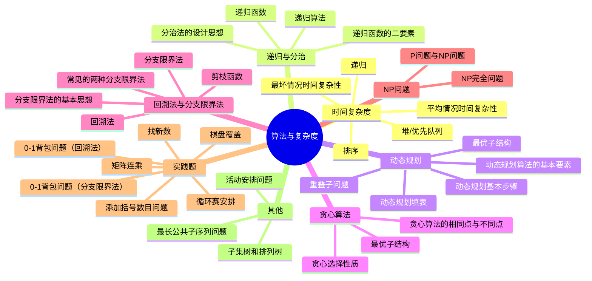

---
tags:
  - Algorithm
doc_type: 笔记卡片
aliases:
  - 数组位移
finished: true
creation: 2024-11-08T20:33:00
modification: 2024-11-08T20:33:00
description: 基本思想
review-frequency: normal
---
---

- [x] 1. 01 背包问题 ✅ 2024-11-24
- [x] 2. 各算法的基本思想，求解问题的步骤。
- [ ] 3. 渐进阶的排序
- [ ] 4. 毕波那契
- [ ] 5. 流水作业调度
- [ ] 6. 矩阵连乘
- [ ] 7. 装载问题
- [ ] 8. 贪心算法的证明
- [ ] 9. O 的性质

---
## 思维导图

## 问题分析与记忆方法

## 一、问答题

### 详细：第一部分

#### 1. **什么是最坏情况时间复杂性？什么是平均情况时间复杂性？**

- **问题分析**：最坏情况和平均情况时间复杂性描述了算法在不同情况下的运行时间。简单来说：
  - **最坏情况时间复杂性**：算法在最不利情况下所需的最大运行时间。它衡量的是算法在面对最复杂、最耗时的输入时的表现，确保算法的效率在最差情况下也有保证。
  - **平均情况时间复杂性**：算法在随机输入下的期望运行时间，假设所有可能的输入出现的概率相等。

- **理解与记忆**：
  - 最坏情况可以类比于考试中遇到的最难的题目，这时我们可能需要花费最多的时间来解答，这是“最坏情况”的时间消耗。
  - 平均情况类似于日常练习中遇到的各种题目。若我们每天做很多题，某天的平均时间就能代表我们在“平均情况”下的表现。

- **关键点总结**：
  - **最坏情况**：关注在所有可能输入中耗时最长的情况。
  - **平均情况**：计算在所有输入出现概率相等的前提下的平均耗时。

#### 2. **什么是递归算法？什么是递归函数？**

- **问题分析**：递归是一种在定义中包含自身的过程。递归算法是指一个算法通过调用自身来解决问题，递归函数是一个通过调用自身来实现递归的函数。

- **理解与记忆**：
  - 递归就像俄罗斯套娃，一层又一层，每层套娃都是一个更小的版本。递归的过程就是在分解问题，每次处理一个更小的同类问题。
  
- **递归算法和递归函数的区别**：
  - **递归算法**：一种通过调用自身来解决问题的算法，可以直接或间接调用自己。
  - **递归函数**：一个调用自身的函数，通过重复调用来实现递归。

#### 3. **递归函数的二要素是什么？**

- **问题分析**：递归函数有两个关键组成部分：
  - **基准情况**（边界条件）：确保递归能在某一条件下停止，否则递归将无限循环。
  - **递归步**（递归方程）：解决一个比当前问题稍小的子问题，将问题逐步缩小。

- **理解与记忆**：
  - 边界条件是递归的终点，相当于当我们把俄罗斯套娃拆到最小的那个娃时停止。
  - 递归步是我们不断缩小的问题规模，每次只处理比当前情况稍小的情况，直到触及边界条件。

- **关键点总结**：
  - **边界条件**：停止递归的条件，防止无限递归。
  - **递归方程**：通过递归调用逐步解决更小的子问题。

#### 4. **分治法的设计思想是什么？**

- **问题分析**：分治法是一种将复杂问题分解成小问题并递归解决的策略。通常分为三步：
  - **分解**：将大问题分成多个相同类型的小问题。
  - **解决**：递归解决每个子问题。
  - **合并**：将所有子问题的解合并成原问题的解。

- **理解与记忆**：
  - 分治法可以类比为切披萨。披萨很大，我们将其分成几块，每块都较小更容易吃。解决每块后再组合，便解决了整个披萨。
  
- **关键点总结**：
  - 分治法的核心是“分而治之”：将复杂问题分解为更小的子问题，然后递归解决，最后组合结果。

#### 5. **什么叫问题的最优子结构性质？**

- **问题分析**：最优子结构意味着一个问题的最优解是通过子问题的最优解组合得到的。这个性质是动态规划和贪心算法的核心特性。

- **理解与记忆**：
  - 最优子结构类似于建房子，每一层或每一个模块都必须是最优才能保证整个房子的质量最佳。整体最优依赖于各个局部最优。
  
- **关键点总结**：
  - **最优子结构**：一个问题的最优解可以分解为多个子问题的最优解组合，这一性质常见于动态规划和贪心算法。

---

### 详细：第二部分

#### 6．动态规划基本步骤是什么？

- **问题分析**：掌握动态规划解决问题的流程。
- **知识点拓展**：
  - **记忆化搜索**：递归与动态规划的结合。
- **理解与记忆**：
  - **四步法**：分解、定义最优值、计算最优值、自底向上构建解。
- **关键点**：
  1. 分解问题。
  2. 递归定义最优值。
  3. 自底向上计算。
  4. 构造最优解。

#### 7．动态规划算法的基本要素是什么？举例说明一些可以用动态规划算法解决的问题。

- **问题分析**：识别动态规划的核心属性及应用场景。
- **知识点拓展**：
  - **记忆化**与**表格填充**。
- **理解与记忆**：
  - 动态规划如搭积木，利用已完成的小块构建大块。
- **关键点**：
  - **最优子结构**。
  - **重叠子问题**。
- **示例问题**：
  - 矩阵连乘
  - 最长公共子序列（LCS）
  - 0-1背包问题

#### 8．说明分治法与动态规划法的相同点和不同之处？

- **问题分析**：比较分治法与动态规划法的异同。
- **知识点拓展**：
  - **Memoization**：动态规划的记忆化技术。
- **理解与记忆**：
  - 分治是切披萨，动态规划是记住每一块的味道，避免重复切割。
- **关键点**：
  - **相同点**：都将问题分解为更小的子问题。
  - **不同点**：动态规划处理有重叠的子问题，分治处理独立的子问题。

#### 9．贪心算法的两个重要要素是什么？举例说明一些可以用贪心算法解决的问题。

- **问题分析**：理解贪心算法的核心属性及应用场景。
- **知识点拓展**：
  - **局部最优**与**全局最优**的关系。
- **理解与记忆**：
  - 贪心算法如贪吃的小鸟，每次选择眼前最美的种子。
- **关键点**：
  1. **贪心选择性质**。
  2. **最优子结构性质**。
- **示例问题**：
  - 活动安排问题
  - 最优装载问题
  - 单源最短路径问题（如Dijkstra算法）

#### 10．什么叫贪心选择性质？

- **问题分析**：深入理解贪心选择的机制。
- **知识点拓展**：
  - **无后效性**：选择当前最优不影响未来选择。
- **理解与记忆**：
  - 每次选择眼前最好的，不考虑未来。
- **关键点**：
  - 整体最优解可通过一系列局部最优选择得到。

#### 11．贪心算法与动态规划算法的相同点和不同之处？

- **问题分析**：比较贪心算法与动态规划的异同。
- **知识点拓展**：
  - **适用场景**：何时选择贪心，何时选择动态规划。
- **理解与记忆**：
  - 贪心如短跑，动态规划如长跑。
- **关键点**：
  - **相同点**：都具有最优子结构，解决最优化问题。
  - **不同点**：
    - 贪心具有贪心选择性质，依赖局部最优。
    - 动态规划具有重叠子问题性质，需保存中间结果。

---

### 详细：第三部分

#### 12. **背包问题与0－1背包问题有何区别？**

- **问题分析**：背包问题和0-1背包问题的主要区别在于物品的选择方式：
  - **0-1背包问题**：每个物品只能选择“拿”或“不拿”，不能拆分。每个物品的选择是二元的（0或1）。
  - **背包问题**（如分数背包）：允许物品部分选择，即可以拿走物品的一部分，以便更有效地利用背包空间。

- **知识点拓展**：
  - **完全背包问题**：一种扩展的背包问题，每种物品可以选择多次而不限次数。

- **理解与记忆**：
  - 可以将0-1背包类比为一次旅行中选衣服的决策：你只能决定要不要带每件衣服，不允许撕下一半。而分数背包更像是带零食上路，可以根据需要选择食物的部分重量。

#### 13. **回溯法与分支限界法之间的相同点是什么？不同之处在哪些方面？**

- **问题分析**：回溯法与分支限界法都用于解决组合优化问题，具有一些相似的结构，但在解法和策略上有显著不同。
  - **相同点**：两者都构造出解空间树，并在该树上进行搜索，以寻找最优解。
  - **不同点**：
    - **回溯法**：采用深度优先搜索策略，逐步探查各分支并在不满足条件时返回（称为“回溯”），以避免不必要的计算。
    - **分支限界法**：采用广度优先搜索或优先级策略，选择最有潜力的分支继续探索，并用剪枝技术去除无潜力的分支。

- **知识点拓展**：
  - **剪枝策略**：回溯法和分支限界法都可以通过剪枝优化搜索效率，但在分支限界法中，更依赖优先级和限界函数来判断哪些分支更有潜力。

- **理解与记忆**：
  - 回溯法如深潜，需要对每条路径进行探索，发现行不通的路便折返；而分支限界法像广域搜索，优先寻找看起来更有潜力的路径。

#### 14. **分支限界法基本思想是什么？**

- **问题分析**：分支限界法的核心思想是通过在解空间树上构建和剪枝以找到最优解。在构建的同时，优先扩展有潜力的节点，避免无效的计算。
  - **基本步骤**：
    - 使用广度优先策略，或基于节点的优先级（如最小代价）来扩展分支。
    - 在每个节点上构建所有子节点并判断它们的潜力，剪去无法产生更优解的分支。

- **知识点拓展**：
  - **优先队列**：分支限界法通常用优先队列来记录当前最有潜力的节点，帮助算法更快地找到最优解。

- **理解与记忆**：
  - 分支限界法类似图书馆管理员按优先级整理书籍，管理员首先处理最相关的书，避免去查找那些明显不符合需求的书籍。

#### 15. **常用的剪枝函数有哪两类？**

- **问题分析**：剪枝函数帮助算法提高效率，避免不必要的计算。通常有两类剪枝函数：
  1. **约束函数剪枝**：基于约束条件，在解空间树上去掉不符合条件的节点。
  2. **限界函数剪枝**：通过估计函数来剪去那些没有潜力达到更优解的分支。

- **知识点拓展**：
  - **剪枝的重要性**：剪枝可以显著减少搜索空间，提高解题速度，尤其在大规模问题中效果尤为明显。

- **理解与记忆**：
  - 约束函数类似于门卫，直接拒绝不符合条件的路径；限界函数则像投资顾问，会根据潜力预测是否值得继续探索该路径。

#### 16. **约束函数的功能是什么？**

- **问题分析**：约束函数是一种基于条件的剪枝方式，它确保解空间树上仅保留满足条件的分支，排除不符合约束的路径。
  - **功能**：用于判断哪些节点不满足问题的约束条件，减少不必要的探索。
  
- **知识点拓展**：
  - **约束满足问题（CSP）**：约束函数常用于约束满足问题中，在CSP中，通过限制来寻找满足所有条件的解。

- **理解与记忆**：
  - 约束函数可以类比为“门卫”，它会在入口筛查哪些路径符合条件，只允许合格的路径进入探索，从而节省了算法的运行时间和资源。

---

### 详细：第四部分

#### 17. **限界函数的功能是什么？**

- **问题分析**：限界函数用于判断某条路径是否有潜力成为最优解，如果该路径的最优潜力低于当前解，就可以舍弃这条路径，以提高效率。
  - **核心作用**：通过设定“边界”或“界限”，在解空间树中剪去那些虽可行但无法达到最优解的子树，从而避免无效的探索。

- **知识点拓展**：
  - **估价函数**：限界函数通常基于估价函数来评估节点潜力，确保仅有潜力达到最优解的分支被进一步探索。

- **理解与记忆**：
  - 限界函数就像一个路障，阻挡那些在理论上已经不可能达到最优解的路径，确保计算资源仅用于有可能找到最优解的路径。

#### 18. **常见的两种分支限界法是什么？**

- **问题分析**：分支限界法有两种主要实现方式，即“队列式”和“优先队列式”。这两种方式使用不同的队列管理策略来控制节点的选择顺序。
  1. **队列式 (FIFO)**：采用先进先出原则，类似排队买票，先来的节点先被处理。
  2. **优先队列式**：根据节点的优先级来选择扩展的节点，优先处理有更大潜力的节点。优先队列式的策略类似急诊室先处理重症患者，确保更有希望的分支优先扩展。

- **知识点拓展**：
  - **优先级队列实现**：优先队列通常基于节点的潜力值（如最低代价或最大收益）来管理节点的顺序。

- **理解与记忆**：
  - 队列式可以类比为“先来先服务”的排队模式，而优先队列式更像一个“急诊优先”的队列，总是优先处理最有希望的节点。

#### 19. **什么是P问题和NP问题？**

- **问题分析**：P和NP问题属于计算复杂性理论的基础概念，用来分类问题的解决难度。
  - **P问题**：指存在可以在多项式时间内解决的问题，常见的例子是排序或基本数学计算。
  - **NP问题**：指那些解答可以在多项式时间内验证的问题，即给出答案后能快速验证其正确性，典型问题包括图的着色问题等。

- **知识点拓展**：
  - **NP-完全问题**：这是NP问题中的一个子集，具有更复杂的性质。
  - **NP-难问题**：比NP问题更难解决，但不一定在NP类中。

- **理解与记忆**：
  - P问题可以想象为“容易解决的问题”，如小学数学题。NP问题更像是谜题，答案能快速验证，但得出答案可能非常困难。

#### 20. **回溯法中剪枝函数有哪几类？各有何用途？**

- **问题分析**：在回溯法中，剪枝函数用于减少搜索空间，主要分为两类：
  1. **约束函数**：判断当前节点是否符合约束条件，若不满足则剪去相关子树。
  2. **限界函数**：用于估计当前节点是否可能达到最优解，若无法达到，则舍弃该分支。

- **知识点拓展**：
  - **启发式剪枝**：利用问题特性或启发式方法对剪枝策略进行优化。

- **理解与记忆**：
  - 约束函数如同筛子，直接筛去不符合条件的解；限界函数则像一台天平，用来评估当前解是否有潜力达到最优解。

#### 21. **什么是NP完全问题？**

- **问题分析**：NP完全问题是复杂性理论中的一个重要类别，它定义了“难以解决但易于验证”的问题，并具有如下性质：
  1. 它属于NP问题。
  2. 任意其他NP问题都可以通过多项式时间归约到该问题上。

- **知识点拓展**：
  - **Cook-Levin定理**：第一个证明NP完全性的定理，指出“布尔可满足性问题”是NP完全的，为NP完全性理论奠定了基础。
  - **归约**：将一个复杂问题转换为另一问题，从而证明其复杂性。

- **理解与记忆**：
  - NP完全问题如同极难的谜题，可以轻松验证答案的对错，但解答非常耗时。若能找到一种快速解决某个NP完全问题的办法，那么所有NP问题都能在多项式时间内解决。

#### 22. **子集树和排列树**

- **问题分析**：子集树和排列树都是解空间树的类型，广泛用于组合优化问题。
  - **子集树**：用于组合问题，列出所有可能的子集。
  - **排列树**：用于排列问题，列出所有可能的排列顺序。

- **知识点拓展**：
  - **状态空间树**：解空间树的一种表示形式，显示所有可能解的结构。

- **理解与记忆**：
  - 子集树如同列出所有物品的组合，如不同衣服的搭配。排列树则像尝试不同的出行路线组合，确保遍历所有可能的顺序。

---

## 二、时间复杂度计算

#### 1. 动态规划、贪心

- **分析**：关注算法的最内层循环次数。
- **公式**：通常表示为算法的时间复杂度上界。
- **记忆方法**：识别嵌套循环或递归调用的层数。

#### 2. 排序

- **分析**：常见排序算法的时间复杂度。
- **公式**：
  $$ T(n) = O(n \log n) $$
- **记忆方法**：记住快速排序、归并排序的平均时间复杂度均为$O(n \log n)$。

#### 3. 堆/优先队列

- **分析**：堆操作的时间复杂度。
- **公式**：
  $$ T(n) = O(\log n) $$
- **记忆方法**：堆是一种完全二叉树，每次操作最多需要调整树的高度。

#### 4. 回溯法、分支限界法解背包问题

- **分析**：这些方法在最坏情况下的时间复杂度。
- **公式**：
  $$ T(n) = O(n \cdot 2^n) $$
- **记忆方法**：背包问题属于NP问题，解空间指数级增长。

#### 5. 递归

- **分析**：递归算法的时间复杂度。
- **公式**：
  $$ 
  T(n) = n^{\log_m k} + \sum_{j=0}^{\log_m n - 1} k^j f\left(\frac{n}{m^j}\right) 
  $$
  （主定理）
  
  **典型情况**：
  $$
  T(k) = m \cdot T(k-1) + O(1) 
  $$
  $$
  T(k) = O(m^k)
  $$
- **记忆方法**：掌握递归关系的求解方法，如主定理、递归树法等。

## 三、证明

#### 活动安排问题

- **问题分析**：证明贪心算法在活动安排问题中的正确性。
- **知识点拓展**：
  - **反证法**：通过假设相反情况来证明结论。
  - **数学归纳法**：用于逐步验证命题。
- **理解与记忆**：
  - 选择最早结束的活动，确保剩余时间最大化。
- **关键点**：
  - 通过比较不同活动的结束时间，证明贪心选择的最优性。

#### 最长公共子序列问题

- **问题分析**：证明LCS问题具有最优子结构性质。
- **知识点拓展**：
  - **动态规划的应用**：构建DP表格求解LCS。
- **理解与记忆**：
  - 将问题分解为前缀子问题，逐步构建解。
- **关键点**：
  - 通过递归定义和反证法证明最优子结构。

## 四、动态规划填表

#### 最长公共子序列

- **更新顺序**：从左至右、从上往下更新。
- **记忆方法**：按行或按列填表，确保依赖的子问题已解决。

#### 0-1背包

- **更新顺序**：从左至右、从下往上更新。
- **变量**：
  - $w$：重量/体积
  - $v$：价值
- **记忆方法**：逆序遍历重量，确保每个物品只选一次。
- **注意**：
  - 不要使用不正确的DP公式，遵循正确的状态转移。

#### 矩阵连乘

- **方法**：
  - 使用$p_{0..n}$存放矩阵$A_{1..n}$的维数。
  - $A_i$的维数为$p_{i-1} \times p_i$。
- **记忆方法**：理解矩阵链的分割点，优化乘法顺序。

## 五、实践题

1. **棋盘覆盖**  
  [ 算法设计与分析/数据结构与算法实验1：棋盘覆盖问题](https://blog.csdn.net/qq_46640863/article/details/122589701?spm=1001.2014.3001.5501)

2. **循环赛安排**  
   [算法设计与分析/数据结构与算法实验2：循环赛安排问题](https://blog.csdn.net/qq_46640863/article/details/122594455?spm=1001.2014.3001.5501)

3. **矩阵连乘**  
   [算法设计与分析/数据结构与算法实验3：矩阵连乘问题](https://blog.csdn.net/qq_46640863/article/details/122595245?spm=1001.2014.3001.5501)

4. **添加括号数目问题**  
   [算法设计与分析/数据结构与算法实验4：添加括号数目问题](https://blog.csdn.net/qq_46640863/article/details/122619976?spm=1001.2014.3001.5501)

5. **找新数**  
   [算法设计与分析/数据结构与算法实验5：找新数最小的删除方案](https://blog.csdn.net/qq_46640863/article/details/122647365?spm=1001.2014.3001.5501)

6. **0-1背包问题（回溯法）**  
   [算法设计与分析/数据结构与算法实验6：0-1背包问题（回溯法）](https://blog.csdn.net/qq_46640863/article/details/122655826?spm=1001.2014.3001.5501)

7. **0-1背包问题（分支限界法）**  
   [算法设计与分析/数据结构与算法实验7：0-1背包问题（分支限界法）](https://blog.csdn.net/qq_46640863/article/details/122661284?spm=1001.2014.3001.5501)

- **理解与记忆**：
  - **实践题**：通过动手实验，加深对算法的理解。
  - **分类记忆**：将实践题按照算法类型分类，便于联想。

## 总结与记忆技巧

1. **分类记忆**：将问题按算法类型（递归、动态规划、贪心等）分类，形成知识树。
2. **联想记忆**：通过类比日常生活中的事物，帮助记忆抽象概念。
3. **思维导图**：利用思维导图可视化知识点，理解它们之间的关系。
4. **反复练习**：通过实践题和习题加深记忆，理解应用场景。
5. **递归理解**：将递归看作是问题的缩小版本，逐步理解其本质。

## 进一步的知识点拓展

- **复杂性理论**：
  - **NP-完全性**：理解问题的难度及其在计算机科学中的重要性。
  - **多项式时间归约**：如何将一个问题转化为另一个问题。

- **高级算法设计**：
  - **启发式算法**：在无法找到精确解时，寻找近似解。
  - **随机化算法**：利用随机性提高算法效率或简化设计。

- **数据结构**：
  - **树和图**：理解解空间树的构建与遍历。
  - **堆和优先队列**：深入了解堆的实现及其应用。

通过系统地分析和理解这些问题，并结合有效的记忆方法，可以更好地掌握算法与复杂度的核心概念，为考试和实际应用打下坚实的基础。
