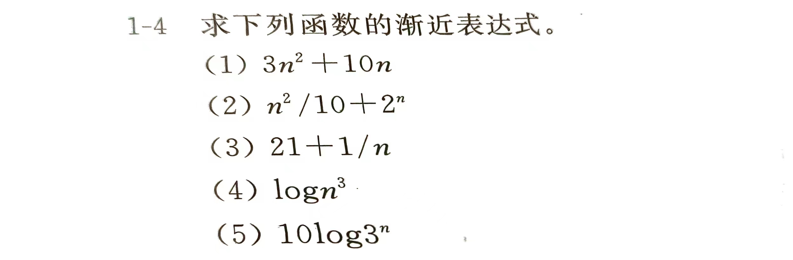

# ONE. 

我们可以使用**渐近分析**来简化这些表达式，并找出每个表达式的**主导项**。在大多数渐近分析中，我们重点关注当 $n$ 趋向于无穷大的时候，函数的增长速度，忽略常数和低阶项。

### 1. $3n^2 + 10n$
- **分析**： 
  - 该表达式由两个项 $3n^2$ 和 $10n$ 组成。在 $n$ 足够大的时候，$3n^2$ 增长速度远远快于 $10n$，所以 $10n$ 可以被忽略。
- **简化**： 
  - 渐近表达式为 $O(n^2)$。

### 2. $\frac{n^2}{10} + 2n$
- **分析**：
  - 该表达式由两个项 $\frac{n^2}{10}$ 和 $2n$ 组成。对于大 $n$， $\frac{n^2}{10}$ 增长速度远远快于 $2n$。
  - 由于常数 $\frac{1}{10}$ 对渐近增长无影响，所以常数因子可以忽略。
- **简化**：
  - 渐近表达式为 $O(n^2)$。

### 3. $21 + \frac{1}{n}$
- **分析**：
  - 该表达式由常数项 $21$ 和 $\frac{1}{n}$ 组成。随着 $n$ 增大，$\frac{1}{n}$ 趋近于 0，常数项 21 支配整个表达式。
- **简化**：
  - 渐近表达式为 $O(1)$。

### 4. $\log n^3$
- **分析**：
  - 利用对数性质 $\log n^3 = 3 \log n$，所以该表达式本质上是 $3 \log n$，其中常数 3 可以忽略。
- **简化**：
  - 渐近表达式为 $O(\log n)$。

### 5. $10 \log 3^n$
- **分析**：
  - 利用对数性质 $\log 3^n = n \log 3$，所以该表达式本质上是 $10n \log 3$。由于 $\log 3$ 是常数，它对渐近复杂度没有影响。
- **简化**：
  - 渐近表达式为 $O(n)$。

### 总结：
我们可以将这些函数的渐近表达式总结为下表：

| 原表达式                    | 渐近表达式         |
| ----------------------- | ------------- |
| $3n^2 + 10n$          | $O(n^2)$    |
| $\frac{n^2}{10} + 2n$ | $O(n^2)$    |
| $21 + \frac{1}{n}$    | $O(1)$      |
| $\log n^3$            | $O(\log n)$ |
| $10 \log 3^n$         | $O(n)$      |

---
# THREE. 

1-9 对下列各组函数 $f (n)$ 和 $g (n)$，确定 $f (n) = O (g (n))$ 或 $f (n) = \Omega (g (n))$ 或$f (n) =  \Theta(g(n))$并简述理由。

(1) $f (n) = \log n^2$，$g (n) = \log n + 5$  
(2) $f (n) = \log n^2$，$g (n) = \sqrt{n}$  
(3) $f (n) = n$，$g (n) = \log^2 n$  
(4) $f (n) = n \log n + n$，$g (n) = \log n$  
(5) $f (n) = 10$，$g (n) = \log 10$  
(6) $f (n) = \log^2 n$，$g (n) = \log n$  
(7) $f (n) = 2^n$，$g (n) = 100 n^2$  
(8) $f (n) = 2^n$，$g (n) = 3^n$

我们来分析题目中的三个函数对 $f(n)$ 和 $g(n)$ 的关系，并确定 $f(n)$ 是 $O(g(n))$、$\Omega(g(n))$ 还是 $\Theta(g(n))$。

### 1. $f(n) = \log n^2$, $g(n) = \log n + 5$
- **简化**：
  - $f(n) = \log n^2 = 2 \log n$ （使用对数的幂法则）。
  - $g(n) = \log n + 5$，其中常数 5 不影响渐近增长，因此可以简化为 $g(n) \sim \log n$。
  
- **比较**：
  - $f(n) = 2 \log n$ 和 $g(n) = \log n$ 都是 $\log n$ 的倍数，只差一个常数因子 2。
  
- **结论**：
  - $f(n)$ 和 $g(n)$ 具有相同的增长速度，因此 $f(n) = \Theta(g(n))$。

### 2. $f(n) = \log n^2$, $g(n) = \sqrt{n}$
- **简化**：
  - $f(n) = \log n^2 = 2 \log n$。
  - $g(n) = \sqrt{n} = n^{1/2}$。
  
- **比较**：
  - 对数函数 $\log n$ 的增长速度远远慢于幂函数 $n^{1/2}$（即 $\log n$ 增长速度很慢，而 $\sqrt{n}$ 增长较快）。
  
- **结论**：
  - $f(n)$ 增长速度远慢于 $g(n)$，因此 $f(n) = O(g(n))$。

### 3. $f(n) = n$, $g(n) = \log^2 n$
- **简化**：
  - $f(n) = n$ 不需要进一步简化。
  - $g(n) = \log^2 n$ 是 $(\log n)^2$，对数的平方函数。
  
- **比较**：
  - 线性函数 $n$ 的增长速度远远快于对数平方函数 $\log^2 n$。
  
- **结论**：
  - $f(n)$ 增长速度远快于 $g(n)$，因此 $f(n) = \Omega(g(n))$。

### 4. $f(n) = n \log n + n$, $g(n) = \log n$
- **简化**：
  - $f(n) = n \log n + n$ 可以分为两个部分，其中 $n \log n$ 是主导项。
  - $g(n) = \log n$。

- **比较**：
  - $f(n)$ 的主导项是 $n \log n$，其增长速度明显快于单独的对数函数 $g(n) = \log n$。
  
- **结论**：
  - $f(n)$ 增长速度远快于 $g(n)$，因此 $f(n) = \Omega(g(n))$。

### 5. $f(n) = 10$, $g(n) = \log 10$
- **简化**：
  - $f(n) = 10$ 是一个常数。
  - $g(n) = \log 10$ 也是一个常数。

- **比较**：
  - $f(n)$ 和 $g(n)$ 都是常数，并且它们的值是有限的。
  
- **结论**：
  - 两者都是常数，所以它们具有相同的增长速率，因此 $f(n) = \Theta(g(n))$。

### 6. $f(n) = \log^2 n$, $g(n) = \log n$
- **简化**：
  - $f(n) = \log^2 n$ 是 $(\log n)^2$，对数的平方函数。
  - $g(n) = \log n$。

- **比较**：
  - $f(n) = \log^2 n$ 增长速度快于单独的对数函数 $g(n) = \log n$。
  
- **结论**：
  - $f(n)$ 增长速度快于 $g(n)$，因此 $f(n) = \Omega(g(n))$。

### 7. $f(n) = 2^n$, $g(n) = 100 n^2$
- **简化**：
  - $f(n) = 2^n$ 是指数函数。
  - $g(n) = 100 n^2$ 是二次多项式函数，常数 100 不影响增长速度。
  
- **比较**：
  - 指数函数 $2^n$ 的增长速度远远快于多项式函数 $n^2$，无论前面的系数是多少。
  
- **结论**：
  - $f(n)$ 增长速度远快于 $g(n)$，因此 $f(n) = \Omega(g(n))$。

### 8. $f(n) = 2^n$, $g(n) = 3^n$
- **简化**：
  - $f(n) = 2^n$ 是指数函数，以 2 为底。
  - $g(n) = 3^n$ 是指数函数，以 3 为底。
  
- **比较**：
  - 底数较大的指数函数增长速度更快，因此 $g(n) = 3^n$ 的增长速度快于 $f(n) = 2^n$。
  
- **结论**：
  - $f(n)$ 增长速度慢于 $g(n)$，因此 $f(n) = O(g(n))$。

---

### 总结：
| 函数组合                                   | 渐近关系           |
| -------------------------------------- | -------------- |
| $f(n) = \log n^2$, $g(n) = \log n + 5$ | $\Theta(g(n))$ |
| $f(n) = \log n^2$, $g(n) = \sqrt{n}$   | $O(g(n))$      |
| $f(n) = n$, $g(n) = \log^2 n$          | $\Omega(g(n))$ |
| $f(n) = n \log n + n$, $g(n) = \log n$ | $\Omega(g(n))$ |
| $f(n) = 10$, $g(n) = \log 10$          | $\Theta(g(n))$ |
| $f(n) = \log^2 n$, $g(n) = \log n$     | $\Omega(g(n))$ |
| $f(n) = 2^n$, $g(n) = 100 n^2$         | $\Omega(g(n))$ |
| $f(n) = 2^n$, $g(n) = 3^n$             | $O(g(n))$      |

---

