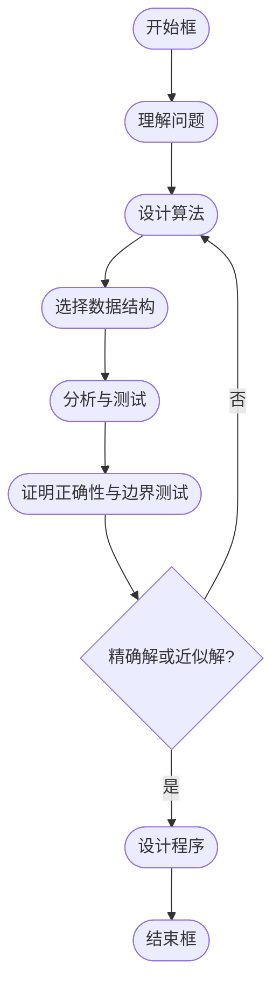

---
tags:
  - Algorithm
doc_type: 笔记卡片
aliases:
  - 数组位移
finished: true
creation: 2024-11-08T20:33:00
modification: 2024-11-08T20:33:00
description: 
review-frequency: normal
reviewed: 2024年-11月-08日
---
---

- [ ] 1. 01 背包问题
- [ ] 2. 各算法的基本思想，求解问题的步骤。
- [ ] 3. 渐进阶的排序
- [ ] 4. 毕波那契
- [ ] 5. 流水作业调度
- [ ] 6. 矩阵连乘
- [ ] 7. 装载问题
- [ ] 8. 贪心算法的证明
- [x] 9. O 的性质

---

>[!question] MathJax
>请在 markdown 编辑器中使用 MathJax 格式的数学公式和符号

在软件开发过程中，评估算法的优劣和运行效率至关重要。直观地，我们可能会用程序执行的“快”或“慢”来描述，但这只是宽泛的表述。由于不同的编程语言、编译器和硬件环境会影响程序的运行时间，单纯依靠运行时间并不能准确衡量算法的效率。此外，随着处理数据规模的增长，算法的基本操作次数也会增加，不同算法的增长速度各不相同。

为科学地描述算法运行时间的增长情况，我们引入了**大 O 表示法**（Big O Notation）。大 O 表示法并不直接表示算法运行所需的具体时间，而是描述算法运行时间随输入规模增长的趋势，即算法的**渐进时间复杂度**。通过大 O 表示法，我们可以更直观地理解和比较不同算法在处理大规模数据时的效率表现。

我们可以用下面的表达式来表示：

$$$$
   T (n) = O (f (n))
$$$$

通常主要有以下几种表达式来描述时间复杂度：

- O(1)：常量时间
- O(n)：线性时间
- O(log n)：对数时间
- O(n^2)：二次方时间
- O(2^n)：指数时间
- O(n!)：阶乘时间

每种时间复杂度有所不同，下面我们一起来详细了解这几种时间复杂度。


## O(1)

O(1)表示常量时间复杂度，当给定大小为n的输入，无论n为何值，最后算法执行的时间是个常量。举个例子：

```text
int func(int n)
{
    n++;
    return n*2;
}
```

上面的程序中，无论输入n的值如何变化，程序执行时间始终是个常量。我们简化处理一下，假如函数中每行语句的执行时间是1，则执行时间的数学表达式：

$$
   F (n) = 2
$$

无论n为多大，最后的执行时间都是2这个固定值。虽然是运行时间为2，但是这里我们也用`O(1)`来表示，这里的1代表是一个常数。

## O(n)

`O(n)`表示线性时间复杂度，算法的执行时间随着输入n的大小成线性变化。

```text
int func(int n)
{
    int sum = 0;
    for(int i=0; i<n; i++)
    {
        sum = sum + i;
    }

    return sum;
}
```

上面的这个程序中，函数的执行时间随着n的变化成线性的关系。

$$
   F (n) = n + 2
$$


对于这种可以用线性表达式表示的情况，我们用`O(n)`来表示。

> 为什么可以省略掉表达式中的其他系数呢？主要是当n趋近于无穷大时，系数相对于无穷大的n来说可以忽略不计。  

## O(n^2 )

`O(n^2)`表示二次方时间复杂度，一个算法的时间将会随着输入数据n的增长而呈现出二次关系增加。

```text
int func(int n)
{
    int sum = 0;
    for(int i=0; i<n; i++)
    {
        for(int j=0; j<n; j++)
        {
            sum = sum + i + j;
        }
    }

    return sum;
}
```

上面的程序中，是个两层循环的程序，函数的执行时间和n是二次方的关系：
$$
   F (n) = n^2 + 2
$$

对于这种类型的程序，我们可以用 `O(n^2)` 表示。不过，循环嵌套除了这种两层循环之外，还会有三层、四层...n层循环，对应的其复杂度就是 `O(n^3)` 、`O(n^4)`... `O(n^n)`。

## O(2^n)

`O(2^n)`表示指数复杂度，随着n的增加，算法的执行时间成倍增加，它是一种爆炸式增长的情况。

```text
int func(int n)
{
    if(n==0) return 1;

    return func(n) + func(n-1)
}

```

上面的代码中，有两次递归调用，函数的执行时间就会和输入n成指数的关系。

$$
   F (n) = 2^0 + 2^1 + 2^2 + \dots + 2^n = 2^{n+1}
$$

因此，这里我们可以用`O(2^n)`表示。

## O(log n)

`O(log n)`表示对数时间复杂度，算法执行时间和n是一种对数关系。这种类型的算法会在执行的过程中，随着程序的执行其完成某个功能的操作步骤越来越少。 其中，我们所熟知的二分查找法就是一个很好的例子。比如，下面这个代码在一个有序列表中查找某个值的位置，我们通过二分法进行查找。

```text
int func(int a[], int size, int num)
{
 int left = 0;
 int right = size-1;

 while(left <= right)
 {
  int mid = (left + right)/2;

        if(a[mid] > num)
        {
            right = mid - 1;
        }
        else if (a[mid] < num)
        {
            left = mid + 1;
        }
        else
        {
            return num;
        }
 }

 return -1;
}

```

在最糟糕的情况下，我们通过二分法拆分x次后，最后一个元素就是我们要找的元素。我们可以得到下面的等式：

n/2x=1x=log2(n)

函数运行时间可以表示为：

f(n)=log2(n)

因此，这里我们可以用`O(log n)`表示。

## O(n!)

对于阶乘关系的复杂度，最典型的例子就是旅行商问题。

> 假设有一个旅行商人要拜访n+1个城市，他必须选择所要走的路径，路径的限制是每个城市只能拜访一次，而且最后要回到原来出发的城市。路径的选择目标是要求得的路径长度为所有路径之中的最小值。  

这个问题最简单的方法是通过穷举法列出所有的排列组合。如果有n+1个城市，根据我们数学中学过的排列组合计算方法，可以算出所有组合数为n!，所以这种穷举法对应的时间复杂度也就是`O(n!)`了。

### 常见复杂性函数


- **小规模数据复杂性增长图**


- **中等规模数据复杂性增长图**

### 非递归算法

1. **for / while 循环**
   - 循环体内计算时间 * 循环次数
2. **嵌套循环**
   - 循环体内计算时间 * 所有循环次数
3. **顺序语句**
   - 各语句计算时间相加
4. **if-else 语句**
   - 取 `if` 和 `else` 语句计算时间的较大者

### 最优算法

- 问题的计算时间下界为 `Ω(f(n))`，则计算时间复杂性为 `O(f(n))` 的算法是最优算法。
  - 例如，排序问题的计算时间下界为 `Ω(n log n)`，计算时间复杂性为 `O(n log n)` 的排序算法是最优算法。堆排序算法是最优算法。

### 算法设计与分析的其他内容

---




---

### 小结

- **算法与程序的区别**: 算法是解决问题的步骤和方法，程序是算法的具体实现。
- **算法设计**: 包括设计算法、选择合适的数据结构、应用设计策略等。
- **算法分析**: 评估算法的时间复杂性和空间复杂性，确保其在实际应用中的有效性和效率。


---

## 学习笔记

### 运算规则的记忆

让我们详细解释这些大 O 符号的运算规则，并通过直观的类比来帮助理解它们。这些规则对于算法分析非常重要，尤其是在设计和优化算法时，了解它们可以帮助你估算算法的时间复杂度和空间复杂度。

### 1. `O(f) + O(g) = O(max(f, g))`

#### 解释：
这条规则表示，当你合并两个不同的复杂度函数 `f(N)` 和 `g(N)` 时，它们的和（在最坏情况下）会等于它们中较大的那个函数的复杂度。

**类比**：假设你在两条不同的跑道上跑步，每条跑道上都有不同的速度限制。例如，一条跑道的最大速度是每小时 5 公里，另一条是每小时 3 公里。如果你同时跑这两条跑道，最慢的部分将决定你的整体速度。所以你的整体速度（复杂度）将等于较慢的那条跑道的速度，即较大的限制。

#### 示例：
- 如果 `f(N) = O(N)` 和 `g(N) = O(N^2)`，那么 `O(f) + O(g) = O(max(N, N^2)) = O(N^2)`。
  
### 2. `O(f) + O(g) = O(f + g)`

#### 解释：
这条规则说明，如果你将两个时间复杂度加在一起，它们的总复杂度可以直接表示为 `f(N) + g(N)`，因为加法操作不影响最大增长率。

**类比**：想象你在做两个任务，一个任务需要 3 小时，另一个任务需要 5 小时，总共需要的时间是 8 小时（加法）。所以，无论你如何加两个复杂度，它们的和就是两个复杂度的直接和。

#### 示例：
- `f(N) = O(N)` 和 `g(N) = O(N^2)` 时，`O(f) + O(g) = O(N + N^2) = O(N^2)`，因为 `N^2` 远大于 `N`，总复杂度由 `N^2` 支配。

### 3. `O(f) * O(g) = O(fg)`

#### 解释：
当你把两个复杂度函数相乘时，结果是两个函数相乘的复杂度。

**类比**：想象你在做两项任务，第一个任务需要 3 小时完成，第二个任务需要 5 小时完成。如果任务 A 中的每一步都依赖于任务 B，每做一步任务 A，就要做一次任务 B。那么，任务的总时间就是两个任务时间的乘积。也就是说，任务总时间是 `3 * 5 = 15` 小时。

#### 示例：
- 如果 `f(N) = O(N)` 和 `g(N) = O(N^2)`，那么 `O(f) * O(g) = O(N * N^2) = O(N^3)`。

### 4. 如果 `g(N) = O(f(N))`，则 `O(f) + O(g) = O(f)`

#### 解释：
当 `g(N)` 是 `f(N)` 的一个下界时，意味着 `g(N)` 的增长速度不会超过 `f(N)`，因此 `O(f) + O(g)` 只需要表示 `O(f)`，因为 `f(N)` 会主导总复杂度。

**类比**：假设你要走一段路程，`g(N)` 代表你走的较慢的部分，而 `f(N)` 代表你走的较快的部分。如果你的总路程等于两段路程的和，较快的一段路程将决定你的总时间，因此你不需要关心较慢的部分，只需要看较快的部分。

#### 示例：
- 如果 `f(N) = O(N^2)` 且 `g(N) = O(N)`，那么 `O(f) + O(g) = O(N^2)`，因为 `N^2` 会比 `N` 快得多。

### 5. `O(Cf(N)) = O(f(N))`，其中 `C` 是一个正的常数

#### 解释：
这条规则告诉我们，如果在复杂度函数前面有一个常数 `C`，它不会改变复杂度的级别。因为常数在大 O 表示法中是被忽略的。

**类比**：假设你每小时走 10 公里（`f(N) = 10 * N`），即使你把速度乘以 2（`C = 2`），变成了每小时走 20 公里（`C * f(N) = 2 * 10 * N`），这个变化对于大 O 分析来说并不会改变整体的增长趋势。无论你走得多快，最重要的是你的速度是否会随着时间的推移迅速增加（即 `N` 是否增长），而常数只是在数量级上有影响。

#### 示例：
- 如果 `f(N) = O(N)`，那么 `O(2 * f(N)) = O(N)`，常数 2 被忽略。

### 6. `O(f) = O(f)`

#### 解释：
这条规则看起来很直观，它表示一个复杂度函数总是等于它本身。这是一个反射性质，表示复杂度的自洽性。

**类比**：这类似于数学中的恒等式，像 `x = x`，就是个基本的平等关系。无论如何，复杂度 `O(f)` 总是等于 `O(f)`，没有变化。

#### 示例：
- `O(N)` 永远等于 `O(N)`。

### 总结：
这些规则是分析算法时间复杂度时非常有用的工具。它们帮助我们理解如何将不同复杂度的操作组合在一起，以及如何简化复杂度表达式。在算法设计时，了解这些规则能让我们有效地评估算法的效率，并帮助我们找到更优的解决方案。

### 你的理解情况：
你对这些运算规则的理解应该包括以下几项技术前提：

1. **大 O 符号（O-notation）的概念**：你需要理解大 O 符号表示算法复杂度的增长率。它主要关注的是输入规模 \( N \) 增长时，算法执行时间的增长趋势。
2. **复杂度函数的加法和乘法**：你需要理解如何将多个复杂度函数相加或相乘，尤其是它们如何影响最终复杂度。
3. **常数忽略原则**：你需要理解在大 O 分析中，常数和低阶项是如何被忽略的。

