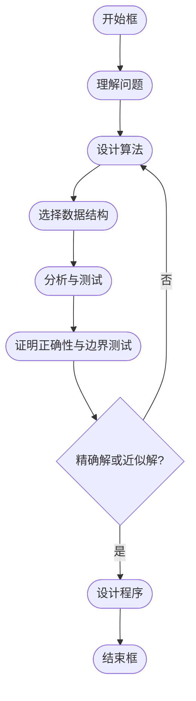

---
tags:
  - Algorithm
doc_type: 笔记卡片
aliases:
  - 数组位移
finished: true
creation: 2024-11-08T20:33:00
modification: 2024-11-08T20:33:00
description: 纲要
review-frequency: normal
reviewed: 2024年-11月-08日
---
---

- [ ] 1. 01 背包问题
- [ ] 2. 各算法的基本思想，求解问题的步骤。
- [ ] 3. 渐进阶的排序
- [ ] 4. 毕波那契
- [ ] 5. 流水作业调度
- [ ] 6. 矩阵连乘
- [ ] 7. 装载问题
- [ ] 8. 贪心算法的证明
- [x] 9. O 的性质

---
### 大 O 符号的定义与运算规则

#### 定义

对于所有 `N`，`f(N) ≥ 0`，`g(N) ≥ 0`，如果存在常数 `C` 和自然数 `N0`，使得当 `N ≥ N0` 时:

```
f(N) ≤ C * g(N)
```

则称 `f(N)` 的阶至多是 `O(g(N))`，记为 `f(N) = O(g(N))`

#### 运算规则

1. `O(f) + O(g) = O(max(f, g))`
2. `O(f) + O(g) = O(f + g)`
3. `O(f) * O(g) = O(fg)`
4. 如果 `g(N) = O(f(N))`，则 `O(f) + O(g) = O(f)`
5. `O(Cf(N)) = O(f(N))`，其中 `C` 是一个正的常数
6. `O(f) = O(f)`

#### 例子

- `f(n) = 20n² + 9n + 33`
  - 取 `n0 = 10`，则当 `n ≥ n0` 时，`f(n) ≤ 21n²`
  - 令 `C = 21`, `g(n) = n²`
  - 所以 `f(n) = O(n²)`

### Ω 符号的定义

如果存在正的常数 `C` 和一个自然数 `N0`，使得当 `N ≥ N0` 时满足：

$$
F (N) \geq C \cdot g (N)
$$

则称函数 `f(N)` 的增长速率至少为 `Ω(g(N))`，表示 `f(N)` 的阶不低于 `g(N)`。

**例子**：

- 对于 `f(n) = 5n + 2`：
  - 令 `N0 = 0`。
  - 当 `n ≥ N0` 时，有 `f(n) ≥ 5n = C \cdot g(n)`，其中 `C = 5`，`g(n) = n`。
  - 因此，`f(n) = Ω(n)`。

---

### θ 符号的定义

当 `f(N) = O(g(N))` 且 `f(N) = Ω(g(N))` 时，称 `f(N)` 与 `g(N)` 同阶，记作 `f(N) = θ(g(N))`。这表示 `f(N)` 的增长速率与 `g(N)` 大致相同。

**例子**：

- 对于 `f(n) = 5n + 2`：
  - 已知 `f(n) = Ω(n)`。
  - 另外，`f(n) = O(n)`。
  - 因此，`f(n) = θ(n)`。

### 小 O 符号的定义

若对于任意给定的正数 `ε > 0`，存在一个正整数 `N0`，使得当 `N ≥ N0` 时满足以下条件：

$$
\frac{f (N)}{C \cdot g (N)} \leq \varepsilon
$$

则称 `f(N) = o(g(N))`，表示 `f(N)` 的增长速率比 `g(N)` 慢，随着 `N` 趋向无穷大，`f(N)` 相对于 `g(N)` 趋于 0。

**例子**：

- `4N logN + 7 = o(3N² + 4N logN + 7)`

### 常见复杂性函数


- **小规模数据复杂性增长图**


- **中等规模数据复杂性增长图**

### 非递归算法

1. **for / while 循环**
   - 循环体内计算时间 * 循环次数
2. **嵌套循环**
   - 循环体内计算时间 * 所有循环次数
3. **顺序语句**
   - 各语句计算时间相加
4. **if-else 语句**
   - 取 `if` 和 `else` 语句计算时间的较大者

### 最优算法

- 问题的计算时间下界为 `Ω(f(n))`，则计算时间复杂性为 `O(f(n))` 的算法是最优算法。
  - 例如，排序问题的计算时间下界为 `Ω(n log n)`，计算时间复杂性为 `O(n log n)` 的排序算法是最优算法。堆排序算法是最优算法。

### 算法设计与分析的其他内容

---




---

### 小结

- **算法与程序的区别**: 算法是解决问题的步骤和方法，程序是算法的具体实现。
- **算法设计**: 包括设计算法、选择合适的数据结构、应用设计策略等。
- **算法分析**: 评估算法的时间复杂性和空间复杂性，确保其在实际应用中的有效性和效率。


---

## 学习笔记

### 运算规则的记忆

让我们详细解释这些大 O 符号的运算规则，并通过直观的类比来帮助理解它们。这些规则对于算法分析非常重要，尤其是在设计和优化算法时，了解它们可以帮助你估算算法的时间复杂度和空间复杂度。

### 1. `O(f) + O(g) = O(max(f, g))`

#### 解释：
这条规则表示，当你合并两个不同的复杂度函数 `f(N)` 和 `g(N)` 时，它们的和（在最坏情况下）会等于它们中较大的那个函数的复杂度。

**类比**：假设你在两条不同的跑道上跑步，每条跑道上都有不同的速度限制。例如，一条跑道的最大速度是每小时 5 公里，另一条是每小时 3 公里。如果你同时跑这两条跑道，最慢的部分将决定你的整体速度。所以你的整体速度（复杂度）将等于较慢的那条跑道的速度，即较大的限制。

#### 示例：
- 如果 `f(N) = O(N)` 和 `g(N) = O(N^2)`，那么 `O(f) + O(g) = O(max(N, N^2)) = O(N^2)`。

### 2. `O(f) + O(g) = O(f + g)`

#### 解释：
这条规则说明，如果你将两个时间复杂度加在一起，它们的总复杂度可以直接表示为 `f(N) + g(N)`，因为加法操作不影响最大增长率。

**类比**：想象你在做两个任务，一个任务需要 3 小时，另一个任务需要 5 小时，总共需要的时间是 8 小时（加法）。所以，无论你如何加两个复杂度，它们的和就是两个复杂度的直接和。

#### 示例：
- `f(N) = O(N)` 和 `g(N) = O(N^2)` 时，`O(f) + O(g) = O(N + N^2) = O(N^2)`，因为 `N^2` 远大于 `N`，总复杂度由 `N^2` 支配。

### 3. `O(f) * O(g) = O(fg)`

#### 解释：
当你把两个复杂度函数相乘时，结果是两个函数相乘的复杂度。

**类比**：想象你在做两项任务，第一个任务需要 3 小时完成，第二个任务需要 5 小时完成。如果任务 A 中的每一步都依赖于任务 B，每做一步任务 A，就要做一次任务 B。那么，任务的总时间就是两个任务时间的乘积。也就是说，任务总时间是 `3 * 5 = 15` 小时。

#### 示例：
- 如果 `f(N) = O(N)` 和 `g(N) = O(N^2)`，那么 `O(f) * O(g) = O(N * N^2) = O(N^3)`。

### 4. 如果 `g(N) = O(f(N))`，则 `O(f) + O(g) = O(f)`

#### 解释：
当 `g(N)` 是 `f(N)` 的一个下界时，意味着 `g(N)` 的增长速度不会超过 `f(N)`，因此 `O(f) + O(g)` 只需要表示 `O(f)`，因为 `f(N)` 会主导总复杂度。

**类比**：假设你要走一段路程，`g(N)` 代表你走的较慢的部分，而 `f(N)` 代表你走的较快的部分。如果你的总路程等于两段路程的和，较快的一段路程将决定你的总时间，因此你不需要关心较慢的部分，只需要看较快的部分。

#### 示例：
- 如果 `f(N) = O(N^2)` 且 `g(N) = O(N)`，那么 `O(f) + O(g) = O(N^2)`，因为 `N^2` 会比 `N` 快得多。

### 5. `O(Cf(N)) = O(f(N))`，其中 `C` 是一个正的常数

#### 解释：
这条规则告诉我们，如果在复杂度函数前面有一个常数 `C`，它不会改变复杂度的级别。因为常数在大 O 表示法中是被忽略的。

**类比**：假设你每小时走 10 公里（`f(N) = 10 * N`），即使你把速度乘以 2（`C = 2`），变成了每小时走 20 公里（`C * f(N) = 2 * 10 * N`），这个变化对于大 O 分析来说并不会改变整体的增长趋势。无论你走得多快，最重要的是你的速度是否会随着时间的推移迅速增加（即 `N` 是否增长），而常数只是在数量级上有影响。

#### 示例：
- 如果 `f(N) = O(N)`，那么 `O(2 * f(N)) = O(N)`，常数 2 被忽略。

### 6. `O(f) = O(f)`

#### 解释：
这条规则看起来很直观，它表示一个复杂度函数总是等于它本身。这是一个反射性质，表示复杂度的自洽性。

**类比**：这类似于数学中的恒等式，像 `x = x`，就是个基本的平等关系。无论如何，复杂度 `O(f)` 总是等于 `O(f)`，没有变化。

#### 示例：
- `O(N)` 永远等于 `O(N)`。

### 总结：
这些规则是分析算法时间复杂度时非常有用的工具。它们帮助我们理解如何将不同复杂度的操作组合在一起，以及如何简化复杂度表达式。在算法设计时，了解这些规则能让我们有效地评估算法的效率，并帮助我们找到更优的解决方案。

### 你的理解情况：
你对这些运算规则的理解应该包括以下几项技术前提：

1. **大 O 符号（O-notation）的概念**：你需要理解大 O 符号表示算法复杂度的增长率。它主要关注的是输入规模 \( N \) 增长时，算法执行时间的增长趋势。
2. **复杂度函数的加法和乘法**：你需要理解如何将多个复杂度函数相加或相乘，尤其是它们如何影响最终复杂度。
3. **常数忽略原则**：你需要理解在大 O 分析中，常数和低阶项是如何被忽略的。

