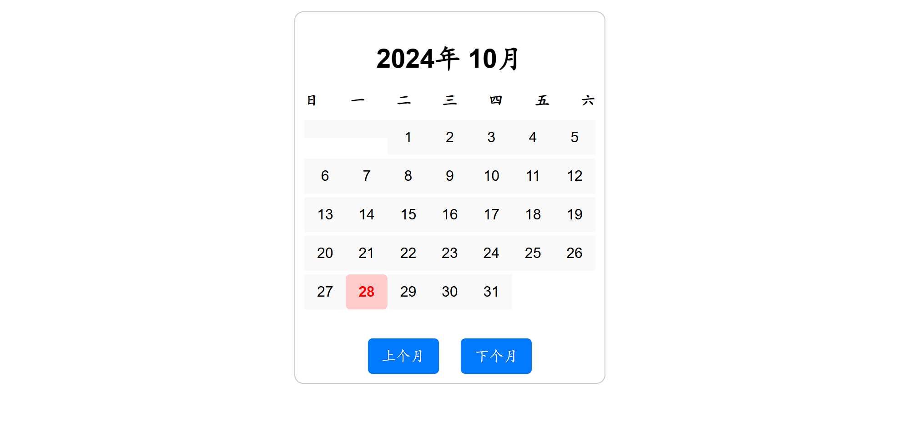
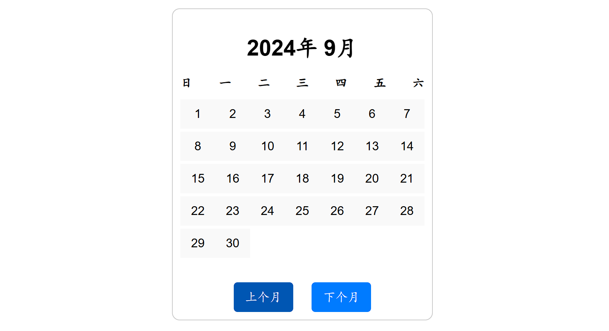
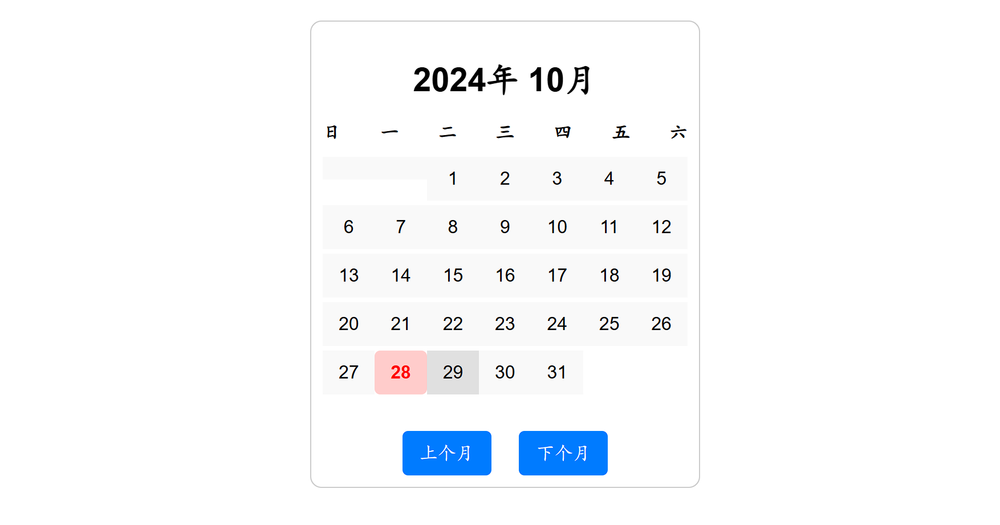

```latex
\chapter{实验结果}

经过以上步骤，最终实现了一个完整的电子日历，具备以下功能：

\begin{enumerate}
    \item 当前日期高亮显示：通过JavaScript动态计算并高亮当前日期。见图\ref{fig:current-date}.
    \item 月份切换功能：用户可以通过点击“上个月”或“下个月”按钮，轻松地查看其他月份的日历。见图\ref{fig:month-switch}.
    \item 界面美观，响应迅速：通过合理的CSS样式和优化的JavaScript逻辑，日历具有较好的用户体验。见图\ref{fig:responsive-design}.
\end{enumerate}

\section{当前日期高亮显示}

实现当前日期的高亮显示功能，使用户能够一目了然地识别当天。通过JavaScript获取系统当前日期，并在渲染日历时，比较每个日期与当前日期是否匹配。如果匹配，则为该日期元素添加特定的CSS类\texttt{today}，从而应用高亮样式。

```



```latex

\begin{figure}[htbp]
    \centering
    \includegraphics[width=0.6\textwidth]{assets/current_date_placeholder.png}
    \caption{当前日期高亮显示示意图}
    \label{fig:current-date}
\end{figure}

\textbf{分析与说明：}

高亮显示当前日期不仅提升了日历的实用性，还增强了用户的交互体验。用户无需额外查找即可快速定位当天，提升了日历的友好性和易用性。通过动态添加CSS类，实现了视觉上的区分，使得当前日期在整体布局中更加突出。

\section{月份切换功能}

提供“上个月”和“下个月”按钮，允许用户方便地浏览不同月份的日历。通过监听按钮的点击事件，调整当前日期的月份属性，并重新渲染日历内容。

```



```latex

\begin{figure}[htbp]
    \centering
    \includegraphics[width=0.6\textwidth]{assets/month_switch_placeholder.png}
    \caption{月份切换功能示意图}
    \label{fig:month-switch}
\end{figure}

\textbf{分析与说明：}

月份切换功能是电子日历的核心交互之一。用户通过简单的按钮操作，即可浏览任意月份，极大地提升了日历的灵活性和实用性。JavaScript中的日期对象方法\texttt{setMonth}和\texttt{getMonth}被巧妙应用，确保了月份的正确切换，即使跨年份切换也能正常工作。此外，重新渲染日历内容的机制保证了每次切换后的日历显示准确无误。

\section{界面美观，响应迅速}

通过精心设计的CSS样式，使电子日历具有简洁、美观的界面。同时，利用Flex布局和媒体查询，实现了响应式设计，确保日历在不同设备和屏幕尺寸下均能良好显示。

```



```latex

\begin{figure}[htbp]
    \centering
    \includegraphics[width=0.6\textwidth]{assets/responsive_design_placeholder.png}
    \caption{响应式设计示意图}
    \label{fig:responsive-design}
\end{figure}

\textbf{分析与说明：}

界面的美观性直接影响用户的使用体验。通过合理运用CSS的布局模型和样式属性，日历界面不仅美观大方，还具备良好的可读性。响应式设计的实现，使得日历能够适应不同设备的屏幕尺寸，无论是在桌面端还是移动端，用户都能获得一致且优质的使用体验。优化的JavaScript逻辑确保了日历的加载和切换过程流畅无卡顿，进一步提升了整体用户体验。

```

# 关键词

电子日历；DOM操作；事件处理；响应式设计；前端开发；用户体验

# Keywords

Electronic Calendar; DOM Manipulation; Event Handling; Responsive Design; Front-End Development; User Experience
```