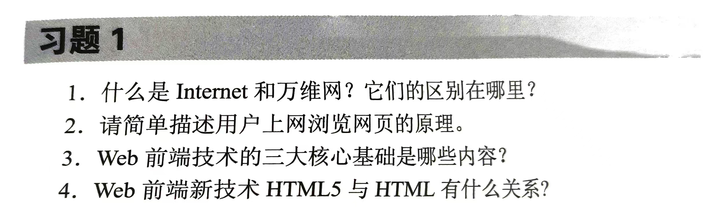
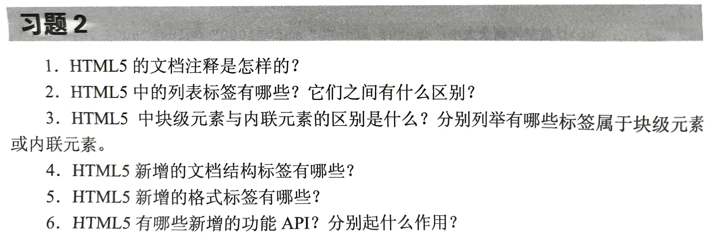
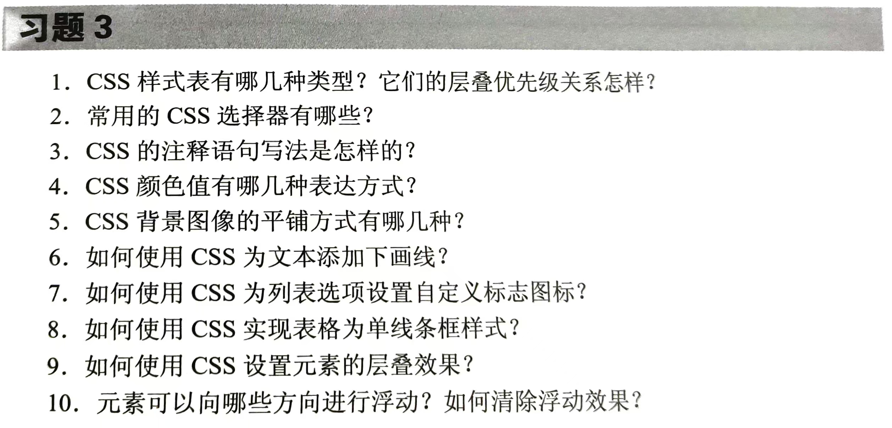
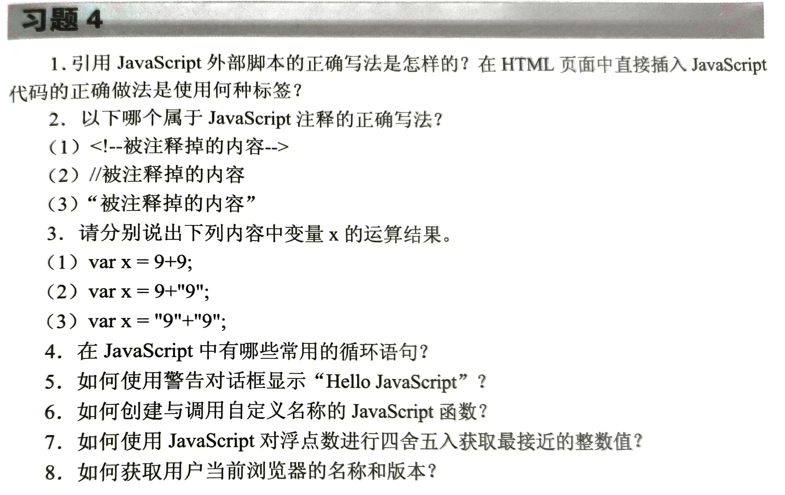
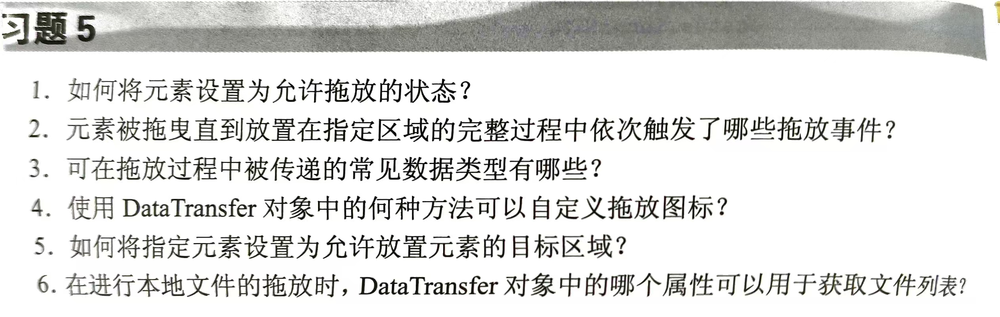
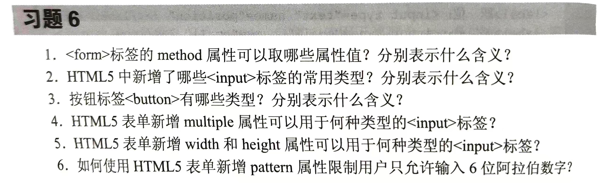
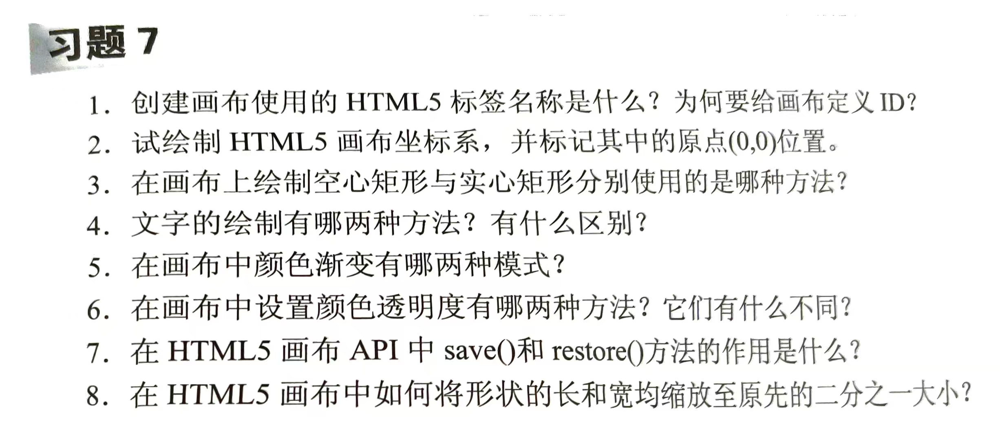
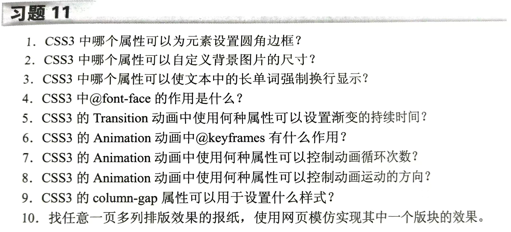

---
Tags:
  - HTML
Dlink:
  - "[[../---资料库导览---]]"
---

### 习题1

```plaintext
1. 什么是 Internet 和万维网？它们的区别在哪里？
2. 请简单描述用户上网浏览网页的原理。
3. Web 前端技术的三大核心基础是哪些内容？
4. Web 前端新技术 HTML5 与 HTML 有什么关系？
```

### 习题2

```plaintext
1. HTML5 的文档注释是怎样的？
2. HTML5 中的列表标签有哪些？它们之间有什么区别？
3. HTML5 中块级元素与内联元素的区别是什么？分别列举哪些标签属于块级元素或内联元素。
4. HTML5 新增的文档结构标签有哪些？
5. HTML5 新增的格式标签有哪些？
6. HTML5 有哪些新增的功能 API？分别起什么作用？
```

### 习题3

```plaintext
1. CSS 样式表有哪几种类型？它们的层叠优先级关系怎样？
2. 常用的 CSS 选择器有哪些？
3. CSS 的注释语句写法是怎样的？
4. CSS 颜色值有哪几种表达方式？
5. CSS 背景图像的平铺方式有哪几种？
6. 如何使用 CSS 为文本添加下划线？
7. 如何使用 CSS 为列表选项设置自定义标志图标？
8. 如何使用 CSS 实现表格为单线条框样式？
9. 如何使用 CSS 设置元素的层叠效果？
10. 元素可以向哪些方向进行浮动？如何清除浮动效果？
```

### 习题4

```plaintext
1. 引用 JavaScript 外部脚本的正确写法是怎样的？在 HTML 页面中直接插入 JavaScript 代码的正确做法是使用何种标签？
2. 以下哪个属于 JavaScript 注释的正确写法？
   (1) <!--被注释掉的内容-->
   (2) //被注释掉的内容
   (3) “被注释掉的内容”
3. 请分别说出下列内容中变量 x 的运算结果。
   (1) var x = 9+9;
   (2) var x = 9+"9";
   (3) var x = "9"+"9";
4. 在 JavaScript 中有哪些常用的循环语句？
5. 如何使用警告对话框显示 “Hello JavaScript”？
6. 如何创建与调用自定义名称的 JavaScript 函数？
7. 如何使用 JavaScript 对浮点数进行四舍五入获取最近的整数值？
8. 如何获取用户当前浏览器的名称和版本？
```

### 习题 5

```plaintext
1. 如何将元素设置为允许拖放的状态？

2. 元素被拖曳直到放置在指定区域的完整过程中依次触发了哪些拖放事件？

3. 可在拖放过程中被传递的常见数据类型有哪些？

4. 使用 DataTransfer 对象中的何种方法可以自定义拖放图标？

5. 如何将指定元素设置为允许放置元素的目标区域？

6. 在进行本地文件的拖放时，DataTransfer 对象中的哪个属性可以用于获取文件列表？
```


### 习题6

```plaintext
1. `<form>`标签的 method 属性可以取哪些属性值？分别表示什么含义？
2. HTML5 中新增了哪些 `<input>` 标签的常用类型？分别表示什么含义？
3. 按钮标签 `<button>` 有哪些类型？分别表示什么含义？
4. HTML5 表单新增 multiple 属性可以用于何种类型的 `<input>` 标签？
5. HTML5 表单新增 width 和 height 属性可以用于何种类型的 `<input>` 标签？
6. 如何使用 HTML5 表单新增 pattern 属性限制用户只允许输入 6 位阿拉伯数字？
```

### 习题7

```plaintext
1. 创建画布使用的 HTML5 标签名称是什么？为何要给画布定义 ID？
2. 试绘制 HTML5 画布坐标系，并标记其中的原点 (0,0) 位置。
3. 在画布上绘制空心矩形与实心矩形分别使用的是什么方法？
4. 文字的绘制有哪两种方法？有什么区别？
5. 在画布中颜色渐变有哪两种模式？
6. 在画布中设置颜色透明度有哪两种方法？它们有什么不同？
7. 在 HTML5 画布 API 中 save() 和 restore() 方法的作用是什么？
8. 在 HTML5 画布中如何将形状的长和宽均缩放至原先的二分之一大小？
```

### 习题11

```plaintext
1. CSS3 中哪个属性可以为元素设置圆角边框？
2. CSS3 中哪个属性可以自定义背景图片的尺寸？
3. CSS3 中哪个属性可以使文本中的长单词强制换行显示？
4. CSS3 中 `@font-face` 的作用是什么？
5. CSS3 的 Transition 动画中使用何种属性可以设置渐变的持续时间？
6. CSS3 的 Animation 动画中 `@keyframes` 有什么作用？
7. CSS3 的 Animation 动画中使用何种属性可以控制动画循环次数？
8. CSS3 的 Animation 动画中使用何种属性可以控制动画运动的方向？
9. CSS3 的 column-gap 属性可以用于设置什么样式？
10. 找任意一页多列排版效果的报纸，使用网页模仿实现其中一个版块的效果。
```


---
## 1


## 2 


## 3


## 4
 

## 5 拖放
 

## 6


## 7
 

## 11
