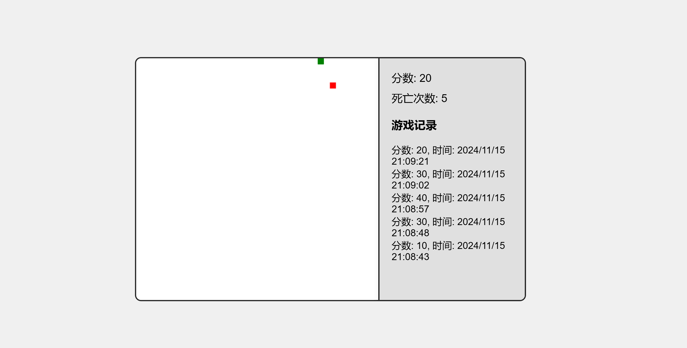

### 1 实验目的

本实验旨在实现一个贪吃蛇小游戏，通过该项目提高以下技能：

- **深入理解JavaScript编程**：
  - 通过实际编写代码，深入理解JavaScript的核心概念，如变量、数据结构、函数和事件驱动编程，尤其是DOM操作和事件处理的应用。这将为后续更复杂的编程任务奠定基础。

- **掌握HTML5和CSS3**：
  - 学习如何使用HTML5构建语义化的网页结构，并利用CSS3进行样式设计，创建一个具有现代感和响应式布局的游戏界面。同时，理解如何利用Canvas API绘制游戏元素，从而实现动态效果。

- **掌握游戏开发的基本逻辑**：
  - 通过项目实践，学习游戏开发中的核心概念，包括游戏循环、状态管理、事件监听和用户交互设计。通过实现贪吃蛇游戏，理解如何将游戏逻辑转化为可运行的代码。

- **培养项目管理和团队合作能力**：
  - 在项目中与同学进行合作，学习如何进行有效的沟通和协作，分享各自的见解和反馈，以促进项目的顺利进行。这不仅提高了技术能力，也增强了团队合作意识。

### 2. 实验要求

- **使用HTML5和CSS3搭建游戏界面**：
  - 创建一个结构清晰、层次分明的HTML文档，合理组织游戏的各个部分（如游戏区域、得分显示、操作说明等）。利用CSS3实现视觉效果，如动画、渐变和响应式设计，确保在不同设备上都能良好展示。

- **通过JavaScript实现游戏逻辑**：
  - 编写JavaScript代码实现核心游戏机制，包括蛇的移动逻辑、食物的随机生成和碰撞检测。同时，确保代码结构清晰，逻辑严谨，以便后续的维护和扩展。

- **实现游戏得分、死亡次数的统计**：
  - 设计一个有效的得分系统，实时更新玩家得分，并在游戏结束时显示最终得分和死亡次数。实现游戏记录的保存功能，允许玩家在下次游戏中查看自己的历史记录和最佳成绩。

- **界面友好，用户体验良好**：
  - 确保游戏界面简洁、直观，易于操作。通过合理的布局和设计，使得玩家能够快速上手，并享受游戏过程。重视用户反馈，在游戏测试阶段收集意见，并据此进行优化改进。

### 3. 实验步骤

#### 3.1. 环境搭建
选择文本编辑器VS Code和浏览器Chrome。接着，创建一个项目文件夹，并在其中建立以下文件：

- `index.html`：游戏的主页面。
- `styles.css`：用于游戏界面的样式。
- `script.js`：游戏的主要逻辑代码。

**index.html** 文件的基本结构如下：

```html
<!DOCTYPE html>
<html lang="zh">
<head>
    <meta charset="UTF-8">
    <meta name="viewport" content="width=device-width, initial-scale=1.0">
    <title>贪吃蛇游戏</title>
    <link rel="stylesheet" href="styles.css">
</head>
<body>
    <div id="gameContainer">
        <canvas id="gameCanvas" width="400" height="400"></canvas>
        <div id="info">
            <h2>游戏信息</h2>
            <div id="scoreDisplay">分数: 0</div>
            <div id="deathDisplay">死亡次数: 0</div>
            <div id="recordDisplay"></div>
        </div>
    </div>
    <script src="script.js"></script>
</body>
</html>
```

**styles.css** 文件用于设置游戏的样式，例如：

```css
body {
    display: flex;
    justify-content: center;
    align-items: center;
    height: 100vh;
    margin: 0;
    background-color: #f0f0f0;
}

#gameContainer {
    display: flex;
}

canvas {
    border: 2px solid black;
}

#info {
    margin-left: 20px;
    font-family: Arial, sans-serif;
}
```

#### 3.2. 实现基本游戏逻辑
接下来，编写JavaScript代码，实现基本的游戏逻辑，包括蛇的移动、食物生成和碰撞检测。

在 **script.js** 文件中，首先定义蛇和食物的初始状态：

```javascript
const canvas = document.getElementById('gameCanvas');
const ctx = canvas.getContext('2d');

let snake = [{ x: 50, y: 50 }];
let direction = { x: 0, y: 0 };
let food = { x: 0, y: 0 };
let score = 0; // 初始化得分
let deathCount = 0; // 初始化死亡次数

function generateFood() {
    food.x = Math.floor(Math.random() * (canvas.width / 10)) * 10;
    food.y = Math.floor(Math.random() * (canvas.height / 10)) * 10;

    // 确保食物不在蛇身上
    for (let segment of snake) {
        if (segment.x === food.x && segment.y === food.y) {
            generateFood(); // 重新生成
            return; // 直接返回，避免继续执行
        }
    }
}
```

接下来，定义游戏循环和键盘事件处理：

```javascript
function changeDirection(event) {
    switch (event.key) {
        case 'ArrowUp':
            if (direction.y === 0) {
                direction = { x: 0, y: -10 };
            }
            break;
        case 'ArrowDown':
            if (direction.y === 0) {
                direction = { x: 0, y: 10 };
            }
            break;
        case 'ArrowLeft':
            if (direction.x === 0) {
                direction = { x: -10, y: 0 };
            }
            break;
        case 'ArrowRight':
            if (direction.x === 0) {
                direction = { x: 10, y: 0 };
            }
            break;
    }
}

document.addEventListener('keydown', changeDirection);
```

**游戏循环** 用于更新游戏状态并进行绘制：

```javascript
function gameLoop() {
    if (direction.x === 0 && direction.y === 0) return; // 如果蛇没有移动则不更新

    let newHead = { x: snake[0].x + direction.x, y: snake[0].y + direction.y };

    // 碰撞检测
    if (checkCollision(newHead)) {
        alert("游戏结束！");
        resetGame(); // 重置游戏
        return;
    }

    snake.unshift(newHead); // 将新头部加入蛇身
    if (newHead.x === food.x && newHead.y === food.y) {
        score += 10; // 增加分数
        generateFood(); // 生成新食物
    } else {
        snake.pop(); // 去掉尾部
    }

    draw(); // 重绘游戏
}

function checkCollision(head) {
    // 撞墙检测
    if (head.x < 0 || head.x >= canvas.width || head.y < 0 || head.y >= canvas.height) {
        return true;
    }
    // 撞到自身检测
    for (let segment of snake) {
        if (head.x === segment.x && head.y === segment.y) {
            return true;
        }
    }
    return false;
}
```

#### 3.3. 逐步完善游戏功能
添加新的功能，例如得分机制、死亡次数统计、游戏记录保存等。

在游戏结束时记录得分和时间，可以在 `resetGame` 函数中实现：

```javascript
function resetGame() {
    deathCount++;
    score = 0; // 重置分数
    snake = [{ x: 50, y: 50 }];
    direction = { x: 0, y: 0 };
    generateFood();
    document.getElementById('deathDisplay').innerText = `死亡次数: ${deathCount}`;
}
```

### 4. 实验结果
经过多次迭代与改进，贪吃蛇小游戏已实现预期功能，达到了实验的需求。游戏界面设计简洁明了，用户可以在游戏过程中实时查看自己的游戏状态。

#### 功能展示

1. **实时得分与死亡次数显示**  
   在游戏界面右侧面板中，实时展示当前得分和死亡次数。玩家无需暂停游戏即可随时了解游戏状态。

2. **游戏记录存储与展示**  
   游戏界面右侧记录了玩家的游戏历史记录，包括分数和完成时间。每局游戏结束后，系统会自动将当前分数和时间戳保存至数据库中，方便用户查看历史数据。

3. **游戏交互**  
   玩家可以通过键盘的方向键来控制蛇的移动，获得良好的交互体验。蛇的移动响应快速流畅，能够即时反映玩家的指令。

#### 界面截图

  
*图1：贪吃蛇游戏的界面，展示了实时得分、死亡次数和历史记录。*


[[../../../图书馆/11152116talkPR]]

### 5. 实验分析与讨论

本实验的成功实现不仅依赖于扎实的技术基础，还需要细致的分析与反思。在项目过程中，我们遇到了一系列问题，并通过不断的调试与优化逐步完善了游戏功能。

- **逻辑错误的识别与修复**：
  - 在初期阶段，游戏的碰撞检测和食物生成存在逻辑错误，导致游戏频繁无故结束，严重影响了用户体验。经过逐步调试，我们对代码进行了深入分析，发现了条件判断中的不当之处，并进行了及时修复。这一过程不仅提高了代码的稳定性，也加深了对逻辑思维的理解，培养了我们解决复杂问题的能力。

- **性能优化**：
  - 游戏速度的设定也是一个关键因素。初始速度过快使玩家难以适应游戏的节奏。通过与用户的互动和测试，我们意识到需要调整定时器的间隔。优化后，游戏变得更加平衡，玩家能够更好地享受游戏过程。这让我更加认识到用户体验在游戏设计中的重要性。

- **用户反馈的价值**：
  - 在开发过程中，与同学和用户的交流让我意识到界面设计需更为直观。基于这些反馈，我们添加了分数和死亡次数的展示功能，显著提升了游戏的信息反馈。这种反馈机制让我理解了在设计中考虑用户需求的重要性，也促进了后续功能的完善。

### 6. 实验结论

通过本实验，我们成功实现了贪吃蛇小游戏的基本功能，包括蛇的移动、食物生成、碰撞检测以及用户得分和死亡次数的记录。项目的每一个阶段都经过反复的测试与优化，最终达成了预期目标。通过这一过程，我的编程能力和项目管理能力得到了显著提升，对游戏开发的各个环节有了更深入的理解。

在功能的实现上，我们不仅关注了技术细节，还重视了用户体验的提升。与用户的互动和反馈使我们能够及时调整游戏的设计，确保最终产品能够满足玩家的需求。

### 7. 心得体会

此次实验让我深入理解了游戏开发的复杂性，尤其是在逻辑设计、用户体验和性能优化等方面。面对问题时，我学会了如何进行有效的调试和修复，逐渐掌握了问题解决的思路。同时，这次经历也让我意识到与用户沟通的重要性，用户的需求和反馈在项目中起到了至关重要的作用。

通过不断的调整和优化，我不仅提高了自己的技术能力，还增强了对项目管理的认识，为今后的学习和项目打下了坚实的基础。这次实验将成为我今后在游戏开发和编程学习中不可或缺的宝贵经验，激励我在未来的项目中继续探索和创新。
